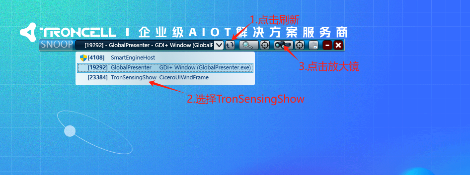
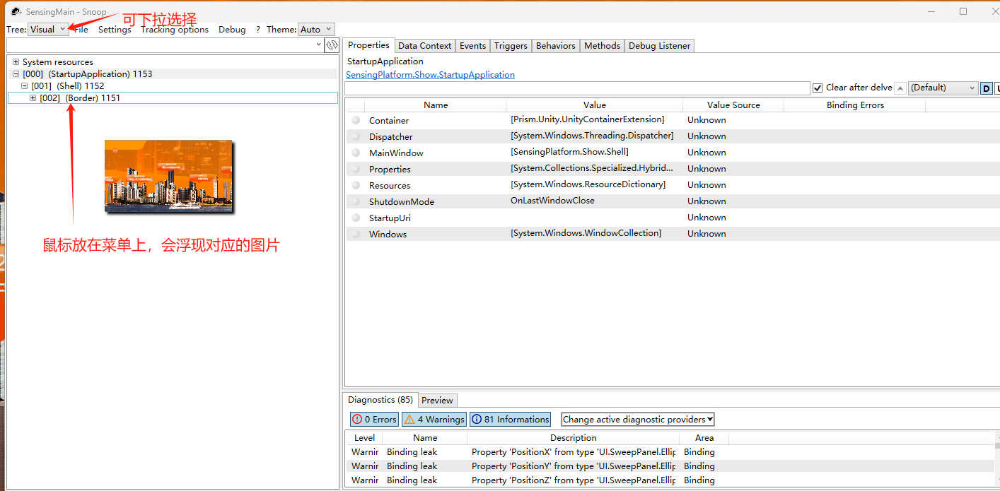

# 产品部署文档

## 软件环境要求

V7 版本及以下，系统基于.Net Framewor 版本

1. 推荐安装 win10 64 位，正确安装显卡驱动，声卡驱动等常用驱动程序
2. 安装.Net Framework 4.6
3. 安装 Vcredist（根据安装的操作系统选择，64 位系统请安装 64 位，32 位请安装 32 位）
4. 安装 VC++（根据安装的操作系统选择，64 位系统请安装 64 位，32 位请安装 32 位）

V8 版本及以下，系统基于.Net Core 版本

1. 推荐安装 win10/win11 64 位，正确安装显卡驱动，声卡驱动等常用驱动程序
2. 安装.Net SDK 7.0 最新版 (http://dot.net/)
3. 安装或解码对应版本的程序，如 publish-8.0.7z 是带 demo 的程序，Dlls-8.0.7z 只有对应的启动文件，没有程序的配置以及 CEF 浏览器等的，是一个最小的程序块；
4. 需要支持 Chrome 浏览器的，需要在 NAS 的产品发布下找到 V8 及以上的 cef-broswer-runtimes-102.100.7z， 内容发到版本对应的 runtime 目录下，进行替换或覆盖；
5. 需要支持 ffmpeg 的视频支持的控件，需要把对应的 ffmpeg 版本拷贝到 c:\\ffmpeg 目录下, 如 NAS 下的 ffmpeg-4.4.7z

## 系统配置要求

1. CPU：建议 Core i5 四代及以上，最低 Core i5 三代(使用 Kinect 二代的程序须配备 i7 四代及以上，若配有独立显卡的机器则建议 Core i5 四代及以上)；
2. 显卡：intel 核心显卡 HD4000 及以上，独立显卡效果更佳；
3. 内存：4GB 及以上；
4. 配备可以支持 win7/win8/win8.1/win10/win11 的触摸屏；

## 部署方法

1. 使用 HID 生成软件，在需要部署 Sensing Platform V*.* 的机器上生成 HID 码；
2. 将 HID 发送给惠总(18051589958)，申请适用于本机的 License；
3. 将申请的 License 放到 Sensing Platform v2.0 的根目录，若已有 License 则替换原有的；
4. 双击“TronSensingShow.exe”启动程序；

## 协助工具 snoop

下载地址：[Releases · snoopwpf/snoopwpf (github.com)](https://github.com/snoopwpf/snoopwpf/releases)

双击打开 snoop,运行 TronSensingShow.exe

