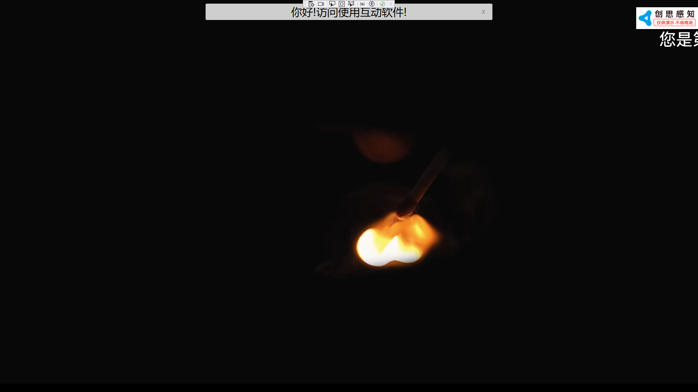

# 播控控件（BoKongElement）

## 1.控件作用

播控控件用于通过远程服务器控制指定设备播放内容。通常应用于展厅、会议室、多屏联播等场景，页面端配置目标服务器和设备信息后，可向远端播控系统下发播放指令。

> 当前版本限制：仅支持一个播放区域，资源类型仅支持视频和图片。

## 2.适用场景

- 需要通过页面控制远端屏幕播放指定视频或图片
- 展厅中由中控页面统一控制多个播放节点
- 需要与第三方播控服务器对接的项目

## 3.前置依赖

使用播控控件前，必须满足以下条件：

1. 项目目录中存在 `UI.BoKong.dll`；
2. 在 `SysConfig/UIControlDict.xml` 中注册 `BoKongElement`；
3. 启用 `SensingData` 模块（具体模块名称以实际项目为准）；
4. 通过 AppPod 配置软件完成远端设备、区域、模式等基础信息配置。

## 4.控件 UI 效果



## 5.配置文件样例

```xml
<BoKongElement>
      <UIDisplay Left="0" Top="0" Width="1920" Height="1080" IsShow="True" ZIndex="1" UsePercent="False" />
      <CustomerConfig>
        <BoKong Host = "http://192.168.3.101:8080" DeviceId="22" AreaDeviceId="43" ShowModelId="23">
        </BoKong>

      </CustomerConfig>
</BoKongElement>

```

## 6.UIDisplay 说明

`UIDisplay` 用法参考 [CommonElement.md](CommonElement.md)。针对播控控件：

- `Width` / `Height`：决定播控控件在页面上的占位区域；
- `IsShow`：控制控件是否可见；
- `ZIndex`：若页面上有悬浮按钮或弹窗，注意层级关系；
- `UsePercent`：若需要按百分比布局，可设为 `True`。

## 7.CustomerConfig 参数说明

### 7.1BoKong 节点

| 属性           | 必填 | 说明                                                | 示例                        |
| -------------- | ---- | --------------------------------------------------- | --------------------------- |
| `Host`         | 是   | 播控服务器地址，通常为 `http://IP:端口` 格式        | `http://192.168.3.101:8080` |
| `DeviceId`     | 是   | 目标设备 ID，对应 AppPod 或后台管理系统中注册的设备 | `22`                        |
| `AreaDeviceId` | 是   | 区域设备 ID，用于指定设备上的某个播放区域           | `43`                        |
| `ShowModelId`  | 是   | 显示模式 ID，对应后台配置的播放模式或节目单         | `23`                        |

### 7.2属性说明

- **Host**：播控服务的服务器地址。请确保运行客户端的电脑能够访问该地址，若服务器启用了认证或 Token，需要按实际接口要求补充配置。
- **DeviceId**：被控设备的唯一标识，通常在 AppPod 配置软件或管理后台中查看。
- **AreaDeviceId**：设备上的区域标识。当前版本仅支持一个区域，填写该区域对应的 ID 即可。
- **ShowModelId**：需要远端设备播放的节目或模式 ID，由播控后台生成。

## 8.UIControlDict.xml 添加播控控件

如果使用播控控件，则需要在 `UIControlDict.xml` 中添加注册节点，并启用 `SensingData` 模块及 AppPod 配置软件。

```xml
<!-- 播控 -->
<Element ViewType="BoKongElement" AssemblyFile="UI.BoKong.dll" TypeName="UI.BoKong.BoKongControl, UI.BoKong, Version=1.0.0.0, Culture=neutral, PublicKeyToken=null">
  <DataContext AssemblyFile="UI.BoKong.dll" TypeName="UI.BoKong.BoKongViewModel, UI.BoKong, Version=1.0.0.0, Culture=neutral, PublicKeyToken=null" />
</Element>
```

## 9.SensingData 模块配置

播控控件通常依赖 `SensingData` 模块与远端服务器通信。请在 `TronSensingShow.dll.config` 的 `modules` 节点中确保该模块已启用：

```xml
<modules>
  <!-- 其他模块 -->
  <module name="SensingData" assembly="Module.SensingData.dll" />
</modules>
```

> 模块的 exact 名称和 DLL 名称以实际项目或产品文档为准。

## 10.AppPod 配置软件

AppPod 用于配置远端播控系统的设备、区域、模式等基础信息。通常配置流程如下：

1. 打开 AppPod 配置软件；
2. 添加或导入目标设备，记录其 `DeviceId`；
3. 在设备下创建播放区域，记录其 `AreaDeviceId`；
4. 创建显示模式或节目单，记录其 `ShowModelId`；
5. 将上述 ID 填入页面 XML 的 `BoKong` 节点对应属性中。

## 11.部署说明

1. 将 `UI.BoKong.dll` 复制到应用根目录（与 `TronSensingShow.exe` 同级）；
2. 在 `SysConfig/UIControlDict.xml` 中添加上方注册节点；
3. 在 `TronSensingShow.dll.config` 中启用 `SensingData` 模块；
4. 通过 AppPod 完成远端设备、区域、模式配置；
5. 在页面 XML 中使用 `<BoKongElement>` 并正确填写 `Host`、`DeviceId`、`AreaDeviceId`、`ShowModelId`。

## 12.常见问题

### 无法连接播控服务器

- 检查 `Host` 地址是否正确，IP 和端口是否与服务器实际监听一致；
- 确认运行客户端的电脑可以访问该地址（可尝试在浏览器中打开 `http://IP:端口` 验证）；
- 检查服务器是否已启动，防火墙是否放行对应端口。

### 远端设备不响应播放指令

- 确认 `DeviceId`、`AreaDeviceId`、`ShowModelId` 与 AppPod 或后台配置一致；
- 确认设备端播控客户端已启动并在线；
- 检查 `SensingData` 模块是否已正确加载。

### 只能播放一个区域

当前版本 `BoKongElement` 仅支持单区域播放。如需多区域控制，需要拆分为多个 `BoKongElement` 或等待后续版本支持。

### 支持哪些资源格式

当前版本仅支持视频和图片资源。具体支持的编码和格式取决于远端播控系统的解码能力，常见格式如 `.mp4`、`.jpg`、`.png` 通常可用。

## 13.版本限制

- 当前仅支持一个播放区域；
- 资源类型仅支持视频和图片；
- 具体通信协议和参数格式可能因服务器版本不同而有所差异。
