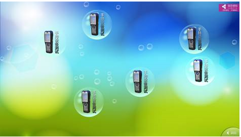

# 气泡控件（BubbleElement）

## 1.控件作用

气泡控件以气泡漂浮的交互方式展示一系列内容。支持两种数据模式：

- **连接数据库动态生成**：通过 `DataProvider` 绑定数据源，根据数据行数自动生成气泡；
- **用户自定义气泡个数**：通过修改 `Items` 中的节点手动配置固定数量的气泡。

适用于动态信息展示、互动墙、标签云、产品特性展示等场景。

## 2.适用场景

- 展厅中的互动气泡墙
- 产品卖点、关键词浮动展示
- 根据数据库内容动态生成的信息气泡
- 需要点击气泡弹出详情的页面

## 3.前置依赖

使用气泡控件前，必须满足以下条件：

1. 项目目录中存在 `UI.Bubble.dll`；
2. 在 `SysConfig/UIControlDict.xml` 中注册 `BubbleElement`；
3. 如需动态加载内容，需在 `Shell/Data/Data.xml` 中配置数据源并在页面中使用 `DataProvider`。

## 4.控件 UI 效果



## 5.配置文件样例

```xml
<!--Name 为控件在页面中的名字，为可选项-->
<BubbleElement Name="BubbleElement">
<!--参考控件公用片段CommonElement.md讲解中UIDisplay片段讲解-->
	<UIDisplay Left="0" Top="0" Width="1920" Height="1080" IsShow="True" ZIndex="1" UsePercent="False" />
	<!--参考控件公用片段CommonElement.md讲解中DataProvide片段讲解-->
	<DataProvider>BubbleData?CSTable=Bubble</DataProvider>
	<Items>
		<Template TemplateID="10001">
		  <!-- 放置简单的控件ImageButton，如何配置控件请参考基本控件配置中ImageButton控件的配置方法 -->
			 <ImageButton>
            <UIDisplay Left="100" Top="100" Width="127" Height="207" IsShow="True" ZIndex="1" UsePercent="False"/>
            <ImageSource UriKind="Application">Shell\Pages\BubbleElement\resource\{$Bubble}</ImageSource>
            <ClickEvent>PopupEvent?TargetPageName=BubbleElement&TargetControlName=PopItems&X=0&Y=0&Height=841&Width=1604&EventID={$EventID}&UriKind=Application&EventPath=Shell\Pages\BubbleElement\tck</ClickEvent>
          </ImageButton>
		</Template>
<Item>
	</Items>
	<!-- 放置CustomerConfig片段 -->
	<CustomerConfig>
		<!-- 放置BubbleConfig片段 -->
		<BubbleConfig>
			<!-- 放置NoiseBubble片段，进行没有信息显示的小泡泡的配置，Count是小泡泡的数量，Image为小泡泡的显示图案，MinRadius是小泡泡的最小半径，MaxRadius是小泡泡的最大半径 -->
			<NoiseBubble Count="10" Image="" MinRadius="10" MaxRadius="40">
			</NoiseBubble>
		</BubbleConfig>
	</CustomerConfig>
</BubbleElement>

```

## 6.UIDisplay 说明

`UIDisplay` 用法参考 [CommonElement.md](CommonElement.md)。针对气泡控件：

- `Width` / `Height`：定义气泡漂浮的活动区域；
- `ZIndex`：若页面上有悬浮按钮或弹出层，注意层级关系；
- `UsePercent`：若需要按父容器百分比布局，可设为 `True`。

## 7.DataProvider 与 Items

### 7.1动态数据源模式

通过 `DataProvider` 绑定数据源，数据源中的每一行会生成一个气泡。

```xml
<DataProvider>BubbleData?CSTable=Bubble</DataProvider>
```

- `BubbleData`：数据源实例名称，需在 `Shell/Data/Data.xml` 中定义；
- `CSTable=Bubble`：数据表/集合名称；
- `Template` 中的 `{$Bubble}`、`{$EventID}` 等变量需与数据源中的列名一致。

### 7.2自定义固定模式

如果不配置 `DataProvider`，可以在 `Items` 中直接放置多个 `Template` 或固定子控件，手动定义气泡个数和内容。

### 7.3Template

| 属性         | 必填 | 说明                         | 示例    |
| ------------ | ---- | ---------------------------- | ------- |
| `TemplateID` | 否   | 模板标识，可用于条件模板匹配 | `10001` |

`Template` 内部可以放置 `ImageButton`、`ImageElement`、`TextElement` 等控件，通常使用 `ImageButton` 实现气泡点击交互。

## 8.CustomerConfig 参数说明

### 8.1BubbleConfig 节点

`BubbleConfig` 用于配置气泡控件自身的特殊效果。

### 8.2NoiseBubble 节点

`NoiseBubble` 用于配置没有信息内容显示的小装饰泡泡。

| 属性        | 必填 | 说明                                       | 示例 |
| ----------- | ---- | ------------------------------------------ | ---- |
| `Count`     | 否   | 小泡泡的数量                               | `10` |
| `Image`     | 否   | 小泡泡的显示图案路径，留空表示使用默认样式 | `""` |
| `MinRadius` | 否   | 小泡泡的最小半径                           | `10` |
| `MaxRadius` | 否   | 小泡泡的最大半径                           | `40` |

### 8.3属性说明

- **Count**：装饰性小泡泡的数量。设为 `0` 表示不显示小泡泡。
- **Image**：小泡泡使用的图片资源。建议为空时使用默认气泡样式；若需自定义，填写相对于 `UriKind` 的图片路径。
- **MinRadius / MaxRadius**：小泡泡的半径会在最小值和最大值之间随机生成，形成大小不一的漂浮效果。

## 9.UIControlDict.xml 添加气泡控件

如果使用气泡控件，需要在 `UIControlDict.xml` 中添加注册节点：

```xml
<!--UI.Bubble 控件包-->
<Element ViewType="BubbleElement" AssemblyFile="UI.Bubble.dll" TypeName="UI.Bubble.BubbleControl, UI.Bubble, Version=1.0.0.0, Culture=neutral, PublicKeyToken=null">
  <DataContext AssemblyFile="UI.Bubble.dll" TypeName="UI.Bubble.BubbleControlViewModel, UI.Bubble, Version=1.0.0.0, Culture=neutral, PublicKeyToken=null" />
</Element>
<!--UI.Bubble End-->
```

## 10.部署说明

1. 将 `UI.Bubble.dll` 复制到应用根目录（与 `TronSensingShow.exe` 同级）；
2. 在 `SysConfig/UIControlDict.xml` 中添加上方注册节点；
3. 如需动态数据，在 `Shell/Data/Data.xml` 中配置数据源，并在页面中使用 `DataProvider`；
4. 在页面 XML 中使用 `BubbleElement`，配置 `UIDisplay`、`DataProvider`、`Items` 和 `CustomerConfig`。

## 11.常见问题

### 气泡不显示

- 检查 `UIDisplay` 的 `IsShow` 是否为 `True`；
- 检查 `DataProvider` 中的数据源名称和表名是否正确；
- 检查 `ImageSource` 的 `UriKind` 和路径是否正确。

### 点击气泡没有反应

- 检查 `ClickEvent` 中的 `&` 是否已转义为 `&amp;`；
- 检查 `TargetPageName`、`TargetControlName`、`EventID` 是否正确；
- 检查目标页面和弹出控件是否已正确配置。

### 小装饰泡泡不显示

- 检查 `NoiseBubble` 的 `Count` 是否大于 `0`；
- 检查 `Image` 路径是否正确，若留空应使用默认样式；
- 检查 `MinRadius` 和 `MaxRadius` 是否合理（如 `MaxRadius` 不应小于 `MinRadius`）。

### 气泡位置或大小异常

- 检查 `UIDisplay` 的 `Width` / `Height` 是否足够容纳所有气泡；
- 检查 `Template` 内部控件的 `Left` / `Top` / `Width` / `Height` 是否合理。

### 数据绑定变量不生效

- 确认数据源中存在对应的列名（如 `Bubble`、`EventID`）；
- 确认变量写法为 `{$列名}`，且只在 `Template` 内部有效。

```

```
