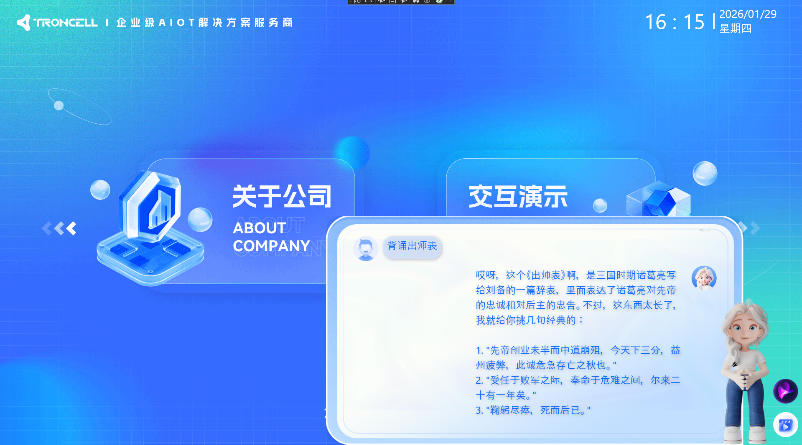

# 智能助手控件（CopilotElement）

## 控件作用
一个智能AI助手，可以用于对话、导航、导演等功能（初版，有待优化）

## 控件 UI 效果



## 配置文件样例

```
<CopilotElement>
	<UIDisplay Left="270" Top="400" Width="1000" Height="580" IsShow="True" ZIndex="1" UsePercent="False" />
	<Items>
		<!-- AI模型序列帧-->
		<AIAnimationElement Name="DigitalMan">
			<UIDisplay Left="460" Top="-55" Width="1200" Height="580" IsShow="True" ZIndex="8"/>
			<AnimationConfig>
				<AnimationState Name="Idle" FrameInterval="100" Loop="True">
					<Folder>Shell\Pages\AIPage\Idle</Folder>
				</AnimationState>
				<AnimationState Name="Greeting" FrameInterval="100" Loop="False">
					<Folder>Shell\Pages\AIPage\Greeting</Folder>
				</AnimationState>
				<AnimationState Name="Talking" FrameInterval="100" Loop="True">
					<Folder>Shell\Pages\AIPage\Talking</Folder>
				</AnimationState>
			</AnimationConfig>
		</AIAnimationElement>
		
		<!-- 开启对话按钮 -->
		<AIAnimationElement Name="VoiceControlButton">
			<UIDisplay Left="1120" Top="270" Width="60" Height="60" IsShow="True" ZIndex="11"/>
			<AnimationConfig>
				<AnimationState Name="Microphone" FrameInterval="1000" Loop="True" TargetState="Listening" ActionType="StartRecording">
					<Folder>Shell\Pages\AIPage\Macrophone</Folder>
				</AnimationState>
				<AnimationState Name="Listening" FrameInterval="100" Loop="True" TargetState="Microphone" ActionType="StopRecordingAndSend">
					<Folder>Shell\Pages\AIPage\Listening</Folder>
				</AnimationState>
				<AnimationState Name="Speaking" FrameInterval="100" Loop="True" TargetState="Microphone" ActionType="StopSpeech">
					<Folder>Shell\Pages\AIPage\Speaking</Folder>
				</AnimationState>
			</AnimationConfig>
		</AIAnimationElement>

		<!-- 导演 -->
		<AIAnimationElement Name="DirectorButton">
			<UIDisplay Left="1120" Top="350" Width="60" Height="60" IsShow="True" ZIndex="11"/>
			<AnimationConfig>
				<AnimationState Name="Director" FrameInterval="1000" Loop="True" TargetState="Directoring" ActionType="StartDirector">
					<Folder>Shell\Pages\AIPage\Director</Folder>
				</AnimationState>
				<AnimationState Name="Directoring" FrameInterval="100" Loop="True" TargetState="Director" ActionType="StopDirector">
					<Folder>Shell\Pages\AIPage\Directoring</Folder>
				</AnimationState>
			</AnimationConfig>
		</AIAnimationElement>

		<!-- AI对话窗口-->
		<ChatElement Name="CopilotChat">
			<UIDisplay Left="50" Top="-120" Width="1000" Height="549" IsShow="True" ZIndex="7"/>
			<Items>
				<ImageElement>
					<UIDisplay Left="0" Top="0" Width="1000" Height="549" IsShow="True" ZIndex="4"/>
					<ImageSource UriKind="Project">Pages\AIPage\Resource\background.png</ImageSource>
				</ImageElement>
			</Items>
			<CustomerConfig>
				<MaxMessages Count="20"/>
				<AIAnimationControl>
					<AIControlName>DigitalMan</AIControlName>
					<VoiceControlName>VoiceControlButton</VoiceControlName>
					<DirectorButtonName>DirectorButton</DirectorButtonName>
				</AIAnimationControl>
				<AIChatStyle   UriKind="Project" BubbleImage="" Avatar="Pages\AIPage\Resource\AIAvatar.png"/>
				<UserChatStyle UriKind="Project" BubbleImage="Pages\AIPage\Resource\UserBu.png" Avatar="Pages\AIPage\Resource\UserAvatar.png"/>
				<ChatRegion Width="920" Height="490" Left="40" Top="30" FontFamily="Alibaba PuHuiTi" FontSize="24" FontColor="#0864fe"></ChatRegion>
				<AIConfig>
					<LLMs Enabled="True">
						<LLM Source="DeepSeek" IsUsed="False">
							<ApiKey>sk-782e0f4011e7433489f08958bd45a7ac</ApiKey>
							<Model>deepseek-chat</Model>
							<BaseUrl>https://api.deepseek.com/v1</BaseUrl>
							<MaxTokens>1024</MaxTokens>
						</LLM>

						<LLM Source="Zhipu" IsUsed="True">
							<ApiKey>67b69a54de9e439bae9f65fd0041ada5.XwCsV5zgY58PRxxJ</ApiKey>
							<Model>glm-4-flash</Model>
							<BaseUrl>https://open.bigmodel.cn/api/paas/v4/</BaseUrl>
							<MaxTokens>2048</MaxTokens>
						</LLM>
					</LLMs>

					<McpServer Enabled="True">
						<Url>http://127.0.0.1:8000/mcp</Url>
						<Model>glm-4-flash</Model>
					</McpServer>

					<SpeechRecognition Enabled="True">
						<Engine>doubao</Engine>
						<Language>zh_cn</Language>
						<SilenceTimeout>4000</SilenceTimeout>
						<SampleRate>16000</SampleRate>
						<ApiKey>oNYNUdn3NybZtO74vNDW8ywXpqR_S3FM</ApiKey>
						<AppId>3160518724</AppId>
						<ModelPath>wss://openspeech.bytedance.com/api/v3/sauc/bigmodel_async</ModelPath>
						<Model>O2.0</Model>
						<Sound>1000</Sound>
					</SpeechRecognition>

					<!--<SpeechRecognition Enabled="False">
						<Engine>Vosk</Engine>
						<Language>zh</Language>
						<SilenceTimeout>1500</SilenceTimeout>
						<SampleRate>16000</SampleRate>
						<ModelPath>Vosk/zh-CN-small</ModelPath>
					</SpeechRecognition>-->


					<SpeechSynthesis Enabled="True" Rate="4" Volume="50" VoiceName="4196" Provider="Baidu" ApiKey="5nkgUqq8xv4c3N13XQYocWsl" SecretKey="cI9yectOgi0ZeRFpLvsKcXSKhow6Rbdi" AppId="" />
				</AIConfig>
			</CustomerConfig>
		</ChatElement>
	</Items>
	<CustomerConfig>
		<Director Id="001" Name="页面切换" Enable="True" IsLoop="False" IsAutoPlay="False">
			<Chapter Type="Prepare" Id="001-001" WaitTime="00:00:00 000"  Name="首页" >
				<Event Name="回零" WaitTime="00:00:00 000" Duration="00:00:03 000" EndTriggerEvent="">
					Navigate?Page=jjfaPage
				</Event>
				<Event Name="读描述" WaitTime="00:00:05 000" Duration="00:00:30 000" EndTriggerEvent="">
					SpeakEvent?StartText=欢迎来到AI页面，这里有智能数字人和语音交互功能，点击右下角的导演图标可以控制页面跳转和机械臂运动&amp;EndText=下面我们进行下一段内容
				</Event>
			</Chapter>
			<Chapter Type="Perform" Id="001-002"  Name="跳转" >
				<Event Name="向前运动" WaitTime="00:00:10 000" Duration="00:00:02 000" EndTriggerEvent="">
					Navigate?Page=HomePage
				</Event>
				<Event Name="读描述" WaitTime="00:00:10 000" Duration="00:00:02 000" EndTriggerEvent="">
					SpeakEvent?StartText=欢迎来到AI页面，这里有智能数字人和语音交互功能，点击右下角的导演图标可以控制页面跳转和机械臂运动&amp;EndText=下面我们进行下一段内容
				</Event>
			</Chapter>
		</Director>
	</CustomerConfig>
</CopilotElement>

```

## 配置说明

## AIAnimationElement
	Name：名称

### AnimationConfig(容器)

#### AnimationState(序列帧)
	Name：名称
	FrameInterval：多长时间切图一次，单位为毫秒
	Loop：是否循环。如果为true，则代表打断前一直执行；如果为false，则代表只执行一次。比如，在数字人说话期间，Talking这个序列帧就要设置为True，因为无法确认说话的长短，所以一直循环；而Greeting序列帧打招呼一次就够了。
	Folder：序列帧图片存放路径

	数字人序列帧的Name有"Idle"、"Greeting"以及"Talking"三种状态，分别代表空闲、打招呼以及讲话（目前不可配置，后续可以优化）
	对话按钮的Name有"Microphone"、"Listening"以及"Speaking"三种状态，分别代表未开始对话，数字人正在听和数字人正在说话（目前不可配置，后续可以优化）
	导演按钮的Name有"Director"和"Directoring"两种状态，分别代表未开始导演和正在导演（目前不可配置，后续可以优化）

## ChatElement
	Name：名称

### CustomerConfig
#### MaxMessages
	Count：最大聊天数量（目前没有实现）

#### AIAnimationControl
	AIControlName：数字人序列帧的名称，与上面配置保持一致
	VoiceControlName：对话按钮序列帧的名称，与上面配置保持一致
	DirectorButtonName：导演按钮序列帧的名称，与上面配置保持一致

#### AIChatStyle
	BubbleImage：数字人的聊天气泡路径，无配置则是透明
	Avatar：数字人的头像路径

#### UserChatStyle
	BubbleImage：用户的聊天气泡路径，无配置则回归纯色
	Avatar：用户的头像路径

#### ChatRegion(固定聊天的区域)
	Width、Height：区域大小
	Left、Top：区域位置
	FontFamily：字体样式
	FontSize：字体大小
	FontColor：字体颜色

#### AIConfig
    LLM Source：对接的AI模型，目前支持Zhipu和DeepSeek
	IsUsed：是否使用
	ApiKey：对应的密钥
	Model：AI的模型名称
	BaseUrl：Api路径
	MaxTokens：最大Token数量

#### McpServer(未对接)
	Url：McpServer的url
	Model：对接的AI模型

#### SpeechRecognition(语音转文字)
	Engine：目前支持doubao和Vosk，doubao是在线模型，Vosk是本地模型，Vosk体验和识别不太好
	Language：目前只支持zh-cn，其他语言未对接
	SilenceTimeout：静默时间，到时间之后停止录音
	SampleRate：语音流的传输参数，默认是16000
	AppId：创建的在线应用的Id
	ApiKey：密钥
	ModelPath：豆包是wss://openspeech.bytedance.com/api/v3/sauc/bigmodel_async，Vosk则是本地的Vosk/zh-CN-small路径
	Model：模型名
	Sound：接收声音的最低阈值，正常聊天的阈值大概在1300-2500之间

#### SpeechSynthesis(语音播报)
	Enabled：是否启用
	Rate：播报的速度（0-10，其中0也会播报）
	Volume：音量（0-100）
	VoiceName：声音类型，参考https://cloud.baidu.com/doc/SPEECH/s/Rluv3uq3d
	Provider：技术来源（目前使用百度的语音合成，后续可以添加其他的）
	ApiKey：接口密钥
	SecretKey：私密凭证
	AppId：预留字段


## CustomerConfig参数具体详解
```
    

    属性说明
    Id  = 唯一标识符
    Name =名称
    WaitTime = 结束这个章节后的等待时间
    IsLoop = 这个章节是否要循环
    IsAutoPlay = 是否自动运行
    Type = 有两种选择Prepare  Perform  Prepare开始时只运行一次，Perform 如果循环则一直运行
    Duration = 这个程序运行时间
    WaitTime = 运行结束后等待时间
    EndTriggerEvent = 后期被动触发运行
ToDeviceDataEvent?Id=COM2&amp;Protocol=SerialPort&amp;Data=3f 08 a0 04 02 00 00 11 87  = 命令
	可以绑定新的事件让导演时播报一些内容：SpeakEvent?StartText=欢迎来到AI页面，这里有智能数字人和语音交互功能，点击右下角的导演图标可以控制页面跳转和机械臂运动&amp;EndText=下面我们进行下一段内容
	StartText：开场语
	EndText：结束语
	如果是导航，开场语和结束语之间会播报页面描述（Descriptions的内容：<SysPage Name="AIPage" Descriptions="AI页面"></SysPage>）


```	
    
## UIControlDict.xml 添加Copilot控件

如果使用Copilot控件则需要在 UIControlDict.xml 中添加Copilot控件

```
<!--UI.Copilot 控件包-->
<Element ViewType="CopilotElement" AssemblyFile="UI.Copilot.dll" TypeName="UI.Copilot.CopilotControl, UI.Copilot, Version=1.0.0.0, Culture=neutral, PublicKeyToken=null">
	<DataContext AssemblyFile="UI.Copilot.dll" TypeName="UI.Copilot.CopilotControlViewModel, UI.Copilot, Version=1.0.0.0, Culture=neutral, PublicKeyToken=null" />
</Element>

<Element ViewType="ChatElement" 
    AssemblyFile="UI.Copilot.dll" 
    TypeName="UI.Copilot.Chat.ChatElementControl, UI.Copilot, Version=1.0.0.0, Culture=neutral, PublicKeyToken=null">
   	<DataContext AssemblyFile="UI.Copilot.dll" TypeName="UI.Copilot.Chat.ChatElementViewModel, UI.Copilot, Version=1.0.0.0, Culture=neutral, PublicKeyToken=null" />
</Element>

<Element ViewType="AIAnimationElement"
    AssemblyFile="UI.Copilot.dll"
    TypeName="UI.Copilot.AIAnimation.AIAnimationControl, UI.Copilot, Version=1.0.0.0, Culture=neutral, PublicKeyToken=null">
	<DataContext AssemblyFile="UI.Copilot.dll" TypeName="UI.Copilot.AIAnimation.AIAnimationViewModel, UI.Copilot, Version=1.0.0.0, Culture=neutral, PublicKeyToken=null" />
</Element>
```
