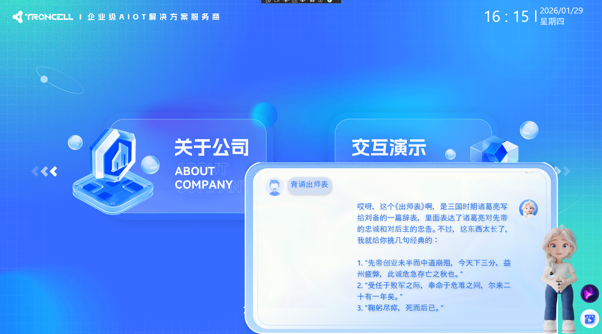

# 智能助手控件（CopilotElement）

## 1.控件作用

智能助手控件是一个集成 AI 对话、数字人动画、语音交互和导演控制能力的复合控件。它通常由数字人序列帧、语音对话按钮、导演按钮和聊天窗口等子元素组成，可用于展厅导览、智能问答、场景切换等场景。

> 初版控件，部分功能仍在持续优化中。

## 2.适用场景

- 展厅智能问答与导览
- AI 数字人讲解
- 语音控制页面切换
- 导演模式自动演示

## 3.前置依赖

使用智能助手控件前，必须满足以下条件：

1. 项目目录中存在 `UI.Copilot.dll`；
2. 在 `SysConfig/UIControlDict.xml` 中注册 `CopilotElement`、`ChatElement` 和 `AIAnimationElement`；
3. 配置有效的 LLM、语音识别、语音合成服务密钥；
4. 准备好数字人序列帧图片、对话按钮动画、导演按钮动画等资源。

## 4.安全提示

CopilotElement 的配置中需要填写 LLM、语音识别、语音合成等服务的 `ApiKey`、`SecretKey` 等敏感信息。请妥善保管这些密钥，避免将其提交到公共代码仓库或共享给未授权人员。本文档示例中的密钥已替换为占位符，实际使用时请填写自己的密钥。

## 5.控件 UI 效果



## 6.整体结构

`CopilotElement` 内部通常包含三类子元素：

| 子元素               | 作用                                       | 必需 |
| -------------------- | ------------------------------------------ | ---- |
| `AIAnimationElement` | 数字人、对话按钮、导演按钮的序列帧动画     | 是   |
| `ChatElement`        | AI 对话窗口，包含聊天样式和 AI 配置        | 是   |
| `Director`           | 导演模式，按章节自动控制页面切换和语音播报 | 否   |

## 7.配置文件样例

```xml
<CopilotElement>
	<UIDisplay Left="270" Top="400" Width="1000" Height="580" IsShow="True" ZIndex="1" UsePercent="False" />
	<Items>
		<!-- AI模型序列帧：数字人-->
		<AIAnimationElement Name="DigitalMan">
			<UIDisplay Left="460" Top="-55" Width="1200" Height="580" IsShow="True" ZIndex="8"/>
			<AnimationConfig>
				<AnimationState Name="Idle" FrameInterval="100" Loop="True">
					<Folder>Shell\Pages\AIPage\Idle</Folder>
				</AnimationState>
				<AnimationState Name="Greeting" FrameInterval="100" Loop="False">
					<Folder>Shell\Pages\AIPage\Greeting</Folder>
				</AnimationState>
				<AnimationState Name="Talking" FrameInterval="100" Loop="True">
					<Folder>Shell\Pages\AIPage\Talking</Folder>
				</AnimationState>
			</AnimationConfig>
		</AIAnimationElement>

		<!-- 开启对话按钮 -->
		<AIAnimationElement Name="VoiceControlButton">
			<UIDisplay Left="1120" Top="270" Width="60" Height="60" IsShow="True" ZIndex="11"/>
			<AnimationConfig>
				<AnimationState Name="Microphone" FrameInterval="1000" Loop="True" TargetState="Listening" ActionType="StartRecording">
					<Folder>Shell\Pages\AIPage\Macrophone</Folder>
				</AnimationState>
				<AnimationState Name="Listening" FrameInterval="100" Loop="True" TargetState="Microphone" ActionType="StopRecordingAndSend">
					<Folder>Shell\Pages\AIPage\Listening</Folder>
				</AnimationState>
				<AnimationState Name="Speaking" FrameInterval="100" Loop="True" TargetState="Microphone" ActionType="StopSpeech">
					<Folder>Shell\Pages\AIPage\Speaking</Folder>
				</AnimationState>
			</AnimationConfig>
		</AIAnimationElement>

		<!-- 导演 -->
		<AIAnimationElement Name="DirectorButton">
			<UIDisplay Left="1120" Top="350" Width="60" Height="60" IsShow="True" ZIndex="11"/>
			<AnimationConfig>
				<AnimationState Name="Director" FrameInterval="1000" Loop="True" TargetState="Directoring" ActionType="StartDirector">
					<Folder>Shell\Pages\AIPage\Director</Folder>
				</AnimationState>
				<AnimationState Name="Directoring" FrameInterval="100" Loop="True" TargetState="Director" ActionType="StopDirector">
					<Folder>Shell\Pages\AIPage\Directoring</Folder>
				</AnimationState>
			</AnimationConfig>
		</AIAnimationElement>

		<!-- AI对话窗口-->
		<ChatElement Name="CopilotChat">
			<UIDisplay Left="50" Top="-120" Width="1000" Height="549" IsShow="True" ZIndex="7"/>
			<Items>
				<ImageElement>
					<UIDisplay Left="0" Top="0" Width="1000" Height="549" IsShow="True" ZIndex="4"/>
					<ImageSource UriKind="Project">Pages\AIPage\Resource\background.png</ImageSource>
				</ImageElement>
			</Items>
			<CustomerConfig>
				<MaxMessages Count="20"/>
				<AIAnimationControl>
					<AIControlName>DigitalMan</AIControlName>
					<VoiceControlName>VoiceControlButton</VoiceControlName>
					<DirectorButtonName>DirectorButton</DirectorButtonName>
				</AIAnimationControl>
				<AIChatStyle   UriKind="Project" BubbleImage="" Avatar="Pages\AIPage\Resource\AIAvatar.png"/>
				<UserChatStyle UriKind="Project" BubbleImage="Pages\AIPage\Resource\UserBu.png" Avatar="Pages\AIPage\Resource\UserAvatar.png"/>
				<ChatRegion Width="920" Height="490" Left="40" Top="30" FontFamily="Alibaba PuHuiTi" FontSize="24" FontColor="#0864fe"></ChatRegion>
				<AIConfig>
					<LLMs Enabled="True">
						<LLM Source="DeepSeek" IsUsed="False">
							<ApiKey>sk-782e0f4011e7433489f08958bd45a7ac</ApiKey>
							<Model>deepseek-chat</Model>
							<BaseUrl>https://api.deepseek.com/v1</BaseUrl>
							<MaxTokens>1024</MaxTokens>
						</LLM>

						<LLM Source="Zhipu" IsUsed="True">
							<ApiKey>67b69a54de9e439bae9f65fd0041ada5.XwCsV5zgY58PRxxJ</ApiKey>
							<Model>glm-4-flash</Model>
							<BaseUrl>https://open.bigmodel.cn/api/paas/v4/</BaseUrl>
							<MaxTokens>2048</MaxTokens>
						</LLM>
					</LLMs>

					<McpServer Enabled="True">
						<Url>http://127.0.0.1:8000/mcp</Url>
						<Model>glm-4-flash</Model>
					</McpServer>

					<SpeechRecognition Enabled="True">
						<Engine>doubao</Engine>
						<Language>zh_cn</Language>
						<SilenceTimeout>4000</SilenceTimeout>
						<SampleRate>16000</SampleRate>
						<ApiKey>oNYNUdn3NybZtO74vNDW8ywXpqR_S3FM</ApiKey>
						<AppId>3160518724</AppId>
						<ModelPath>wss://openspeech.bytedance.com/api/v3/sauc/bigmodel_async</ModelPath>
						<Model>O2.0</Model>
						<Sound>1000</Sound>
					</SpeechRecognition>

					<!--<SpeechRecognition Enabled="False">
						<Engine>Vosk</Engine>
						<Language>zh</Language>
						<SilenceTimeout>1500</SilenceTimeout>
						<SampleRate>16000</SampleRate>
						<ModelPath>Vosk/zh-CN-small</ModelPath>
					</SpeechRecognition>-->


					<SpeechSynthesis Enabled="True" Rate="4" Volume="50" VoiceName="4196" Provider="Baidu" ApiKey="5nkgUqq8xv4c3N13XQYocWsl" SecretKey="cI9yectOgi0ZeRFpLvsKcXSKhow6Rbdi" AppId="" />
				</AIConfig>
			</CustomerConfig>
		</ChatElement>
	</Items>
	<CustomerConfig>
		<Director Id="001" Name="页面切换" Enable="True" IsLoop="False" IsAutoPlay="False">
			<Chapter Type="Prepare" Id="001-001" WaitTime="00:00:00 000"  Name="首页" >
				<Event Name="回零" WaitTime="00:00:00 000" Duration="00:00:03 000" EndTriggerEvent="">
					Navigate?Page=jjfaPage
				</Event>
				<Event Name="读描述" WaitTime="00:00:05 000" Duration="00:00:30 000" EndTriggerEvent="">
					SpeakEvent?StartText=欢迎来到AI页面，这里有智能数字人和语音交互功能，点击右下角的导演图标可以控制页面跳转和机械臂运动&EndText=下面我们进行下一段内容
				</Event>
			</Chapter>
			<Chapter Type="Perform" Id="001-002"  Name="跳转" >
				<Event Name="向前运动" WaitTime="00:00:10 000" Duration="00:00:02 000" EndTriggerEvent="">
					Navigate?Page=HomePage
				</Event>
				<Event Name="读描述" WaitTime="00:00:10 000" Duration="00:00:02 000" EndTriggerEvent="">
					SpeakEvent?StartText=欢迎来到AI页面，这里有智能数字人和语音交互功能，点击右下角的导演图标可以控制页面跳转和机械臂运动&EndText=下面我们进行下一段内容
				</Event>
			</Chapter>
		</Director>
	</CustomerConfig>
</CopilotElement>

```

## 8.UIDisplay 说明

`UIDisplay` 用法参考 [CommonElement.md](CommonElement.md)。针对智能助手控件：

- `Width` / `Height`：定义控件整体显示区域；
- `ZIndex`：注意数字人、按钮、聊天窗口的层级关系，通常按钮和聊天窗口需要较高层级；
- `UsePercent`：若需要按父容器百分比布局，可设为 `True`。

## 9.AIAnimationElement配置

`AIAnimationElement` 用于播放序列帧动画，可实现数字人、对话按钮、导演按钮等动态效果。

| 属性   | 必填 | 说明                                                              | 示例         |
| ------ | ---- | ----------------------------------------------------------------- | ------------ |
| `Name` | 是   | 动画控件的名称，需在 `ChatElement` 的 `AIAnimationControl` 中引用 | `DigitalMan` |

## 10.AnimationConfig(容器)

`AnimationConfig` 是 `AnimationState` 的容器。

#### 10.1AnimationState(序列帧)

以下状态名称目前为内置固定值，后续版本可能支持自定义。

| 属性            | 必填 | 说明                                           | 示例                      |
| --------------- | ---- | ---------------------------------------------- | ------------------------- |
| `Name`          | 是   | 状态名称                                       | `Idle`、`Talking`         |
| `FrameInterval` | 是   | 帧切换间隔，单位毫秒                           | `100`                     |
| `Loop`          | 是   | 是否循环播放。`True` 循环，`False` 只播放一次  | `True`                    |
| `Folder`        | 是   | 序列帧图片文件夹路径                           | `Shell\Pages\AIPage\Idle` |
| `TargetState`   | 否   | 点击后切换到的目标状态                         | `Listening`               |
| `ActionType`    | 否   | 触发动作类型，如开始录音、停止录音、开始导演等 | `StartRecording`          |

    Name：名称
    FrameInterval：多长时间切图一次，单位为毫秒
    Loop：是否循环。如果为true，则代表打断前一直执行；如果为false，则代表只执行一次。比如，在数字人说话期间，Talking这个序列帧就要设置为True，因为无法确认说话的长短，所以一直循环；而Greeting序列帧打招呼一次就够了。
    Folder：序列帧图片存放路径

### 10.2内置状态名称

| 控件     | 状态名称      | 含义                     |
| -------- | ------------- | ------------------------ |
| 数字人   | `Idle`        | 空闲状态                 |
| 数字人   | `Greeting`    | 打招呼状态，通常播放一次 |
| 数字人   | `Talking`     | 说话状态，循环播放       |
| 对话按钮 | `Microphone`  | 未开始对话               |
| 对话按钮 | `Listening`   | 正在听用户说话           |
| 对话按钮 | `Speaking`    | 数字人正在说话           |
| 导演按钮 | `Director`    | 未开始导演               |
| 导演按钮 | `Directoring` | 正在导演                 |

    数字人序列帧的Name有"Idle"、"Greeting"以及"Talking"三种状态，分别代表空闲、打招呼以及讲话（目前不可配置，后续可以优化）
    对话按钮的Name有"Microphone"、"Listening"以及"Speaking"三种状态，分别代表未开始对话，数字人正在听和数字人正在说话（目前不可配置，后续可以优化）
    导演按钮的Name有"Director"和"Directoring"两种状态，分别代表未开始导演和正在导演（目前不可配置，后续可以优化）

## 12ChatElement

`ChatElement` 是 AI 对话窗口，负责展示对话内容、管理 AI 配置和关联动画控件。

### 12.1CustomerConfig

#### MaxMessages

| 属性    | 必填 | 说明                               | 示例 |
| ------- | ---- | ---------------------------------- | ---- |
| `Count` | 否   | 最大聊天消息数量限制（目前未实现） | `20` |

#### AIAnimationControl

| 节点                 | 说明                     | 示例                 |
| -------------------- | ------------------------ | -------------------- |
| `AIControlName`      | 数字人序列帧控件的名称   | `DigitalMan`         |
| `VoiceControlName`   | 对话按钮序列帧控件的名称 | `VoiceControlButton` |
| `DirectorButtonName` | 导演按钮序列帧控件的名称 | `DirectorButton`     |

#### AIChatStyle

    BubbleImage：数字人的聊天气泡路径，无配置则是透明
    Avatar：数字人的头像路径

| 属性          | 必填 | 说明                                   | 示例                                 |
| ------------- | ---- | -------------------------------------- | ------------------------------------ |
| `UriKind`     | 是   | 资源路径解析方式                       | `Project`                            |
| `BubbleImage` | 否   | 聊天气泡背景图片路径，留空使用默认样式 | `Pages\AIPage\Resource\UserBu.png`   |
| `Avatar`      | 否   | 头像图片路径                           | `Pages\AIPage\Resource\AIAvatar.png` |

#### UserChatStyle

    BubbleImage：用户的聊天气泡路径，无配置则回归纯色
    Avatar：用户的头像路径

| 属性          | 必填 | 说明                                   | 示例                                 |
| ------------- | ---- | -------------------------------------- | ------------------------------------ |
| `UriKind`     | 是   | 资源路径解析方式                       | `Project`                            |
| `BubbleImage` | 否   | 聊天气泡背景图片路径，留空使用默认样式 | `Pages\AIPage\Resource\UserBu.png`   |
| `Avatar`      | 否   | 头像图片路径                           | `Pages\AIPage\Resource\AIAvatar.png` |

#### ChatRegion(固定聊天的区域)

| 属性               | 必填 | 说明                 | 示例              |
| ------------------ | ---- | -------------------- | ----------------- |
| `Width` / `Height` | 否   | 聊天内容显示区域大小 | `920` / `490`     |
| `Left` / `Top`     | 否   | 聊天内容显示区域位置 | `40` / `30`       |
| `FontFamily`       | 否   | 字体                 | `Alibaba PuHuiTi` |
| `FontSize`         | 否   | 字体大小             | `24`              |
| `FontColor`        | 否   | 字体颜色             | `#0864fe`         |

#### AIConfig

    LLM Source：对接的AI模型，目前支持Zhipu和DeepSeek

| 属性        | 必填 | 说明                                  | 示例                           |
| ----------- | ---- | ------------------------------------- | ------------------------------ |
| `Enabled`   | 否   | 是否启用 LLM                          | `True`                         |
| `Source`    | 是   | LLM 提供商                            | `DeepSeek`、`Zhipu`            |
| `IsUsed`    | 是   | 是否使用该模型，通常只有一个为 `True` | `True`                         |
| `ApiKey`    | 是   | 对应平台的 API 密钥                   | `your-api-key`                 |
| `Model`     | 是   | 模型名称                              | `deepseek-chat`、`glm-4-flash` |
| `BaseUrl`   | 是   | API 基础地址                          | `https://api.deepseek.com/v1`  |
| `MaxTokens` | 否   | 最大 Token 数量                       | `1024`                         |

#### McpServer(未对接)

| 属性      | 必填 | 说明                   | 示例                        |
| --------- | ---- | ---------------------- | --------------------------- |
| `Enabled` | 否   | 是否启用（目前未对接） | `True`                      |
| `Url`     | 否   | MCP Server 地址        | `http://127.0.0.1:8000/mcp` |
| `Model`   | 否   | 对接的 AI 模型         | `glm-4-flash`               |

#### SpeechRecognition(语音转文字)

| 属性             | 必填         | 说明                                                                                                                            | 示例                              |
| ---------------- | ------------ | ------------------------------------------------------------------------------------------------------------------------------- | --------------------------------- |
| `Enabled`        | 否           | 是否启用                                                                                                                        | `True`                            |
| `Engine`         | 是           | 语音识别引擎，支持 `doubao`（在线）和 `Vosk`（本地），Vosk体验和识别不太好                                                      | `doubao`                          |
| `Language`       | 是           | 语言，目前仅支持 `zh_cn`                                                                                                        | `zh_cn`                           |
| `SilenceTimeout` | 否           | 静默时间，超时后停止录音，单位毫秒                                                                                              | `4000`                            |
| `SampleRate`     | 否           | 音频采样率，语音流的传输参数，默认是16000                                                                                       | `16000`                           |
| `ApiKey`         | 在线引擎需要 | 平台 API 密钥                                                                                                                   | `your-api-key`                    |
| `AppId`          | 在线引擎需要 | 应用 ID                                                                                                                         | `your-app-id`                     |
| `ModelPath`      | 是           | 模型路径或 WebSocket 地址 ，豆包是wss://openspeech.bytedance.com/api/v3/sauc/bigmodel_async，Vosk则是本地的Vosk/zh-CN-small路径 | `wss://...` 或 `Vosk/zh-CN-small` |
| `Model`          | 否           | 模型名称                                                                                                                        | `O2.0`                            |
| `Sound`          | 否           | 接收声音的最小阈值，正常聊天阈值约在 `1300` ~ `2500` 之间                                                                       | `1500`                            |

#### SpeechSynthesis(语音播报)

| 属性        | 必填 | 说明                                                                         | 示例              |
| ----------- | ---- | ---------------------------------------------------------------------------- | ----------------- |
| `Enabled`   | 否   | 是否启用                                                                     | `True`            |
| `Rate`      | 否   | 播报速度，`0` ~ `10` ，其中0也会播报                                         | `4`               |
| `Volume`    | 否   | 音量，`0` ~ `100`                                                            | `50`              |
| `VoiceName` | 否   | 声音类型，参考百度语音https://cloud.baidu.com/doc/SPEECH/s/Rluv3uq3d合成文档 | `4196`            |
| `Provider`  | 否   | 技术来源，目前使用 `Baidu`                                                   | `Baidu`           |
| `ApiKey`    | 是   | 接口密钥                                                                     | `your-api-key`    |
| `SecretKey` | 是   | 私密凭证                                                                     | `your-secret-key` |
| `AppId`     | 否   | 预留字段                                                                     | `""`              |

## 13.Director 导演模式

`Director` 用于按章节自动执行页面切换、语音播报、发送指令等操作。

### Director 属性

| 属性         | 必填 | 说明           | 示例       |
| ------------ | ---- | -------------- | ---------- |
| `Id`         | 是   | 导演唯一标识符 | `001`      |
| `Name`       | 否   | 导演名称       | `页面切换` |
| `Enable`     | 否   | 是否启用       | `True`     |
| `IsLoop`     | 否   | 是否循环执行   | `False`    |
| `IsAutoPlay` | 否   | 是否自动运行   | `False`    |

### Chapter 属性

| 属性       | 必填 | 说明                                                             | 示例           |
| ---------- | ---- | ---------------------------------------------------------------- | -------------- |
| `Type`     | 是   | 章节类型。`Prepare` 开始时只运行一次，`Perform` 若循环则一直运行 | `Prepare`      |
| `Id`       | 是   | 章节唯一标识符                                                   | `001-001`      |
| `Name`     | 否   | 章节名称                                                         | `首页`         |
| `WaitTime` | 否   | 章节结束后的等待时间                                             | `00:00:00 000` |

### Event 属性

| 属性              | 必填 | 说明                   | 示例           |
| ----------------- | ---- | ---------------------- | -------------- |
| `Name`            | 否   | 事件名称               | `回零`         |
| `WaitTime`        | 否   | 运行前等待时间         | `00:00:05 000` |
| `Duration`        | 否   | 事件运行时间           | `00:00:30 000` |
| `EndTriggerEvent` | 否   | 后期被动触发运行的事件 | `""`           |

### Event 内容

Event 节点内可以配置事件 URL，常见事件：

- `Navigate?Page=HomePage`：页面切换
- `SpeakEvent?StartText=...&amp;EndText=...`：语音播报
- `ToDeviceDataEvent?Id=COM2&amp;Protocol=SerialPort&amp;Data=...`：向设备发送指令

#### SpeakEvent 说明

- `StartText`：开场语
- `EndText`：结束语
- 如果是导航，开场语和结束语之间会自动播报页面描述（`SysPage` 的 `Descriptions` 属性）

示例：

```xml
<SysPage Name="AIPage" Descriptions="AI页面">
```

```


    属性说明
    Id  = 唯一标识符
    Name =名称
    WaitTime = 结束这个章节后的等待时间
    IsLoop = 这个章节是否要循环
    IsAutoPlay = 是否自动运行
    Type = 有两种选择Prepare  Perform  Prepare开始时只运行一次，Perform 如果循环则一直运行
    Duration = 这个程序运行时间
    WaitTime = 运行结束后等待时间
    EndTriggerEvent = 后期被动触发运行
ToDeviceDataEvent?Id=COM2&Protocol=SerialPort&Data=3f 08 a0 04 02 00 00 11 87  = 命令
	可以绑定新的事件让导演时播报一些内容：SpeakEvent?StartText=欢迎来到AI页面，这里有智能数字人和语音交互功能，点击右下角的导演图标可以控制页面跳转和机械臂运动&EndText=下面我们进行下一段内容
	StartText：开场语
	EndText：结束语
	如果是导航，开场语和结束语之间会播报页面描述（Descriptions的内容：<SysPage Name="AIPage" Descriptions="AI页面"></SysPage>）


```

## UIControlDict.xml 添加Copilot控件

如果使用 Copilot 控件，需要在 `UIControlDict.xml` 中注册以下三个控件：

```XML
<!--UI.Copilot 控件包-->
<Element ViewType="CopilotElement" AssemblyFile="UI.Copilot.dll" TypeName="UI.Copilot.CopilotControl, UI.Copilot, Version=1.0.0.0, Culture=neutral, PublicKeyToken=null">
	<DataContext AssemblyFile="UI.Copilot.dll" TypeName="UI.Copilot.CopilotControlViewModel, UI.Copilot, Version=1.0.0.0, Culture=neutral, PublicKeyToken=null" />
</Element>

<Element ViewType="ChatElement"
    AssemblyFile="UI.Copilot.dll"
    TypeName="UI.Copilot.Chat.ChatElementControl, UI.Copilot, Version=1.0.0.0, Culture=neutral, PublicKeyToken=null">
   	<DataContext AssemblyFile="UI.Copilot.dll" TypeName="UI.Copilot.Chat.ChatElementViewModel, UI.Copilot, Version=1.0.0.0, Culture=neutral, PublicKeyToken=null" />
</Element>

<Element ViewType="AIAnimationElement"
    AssemblyFile="UI.Copilot.dll"
    TypeName="UI.Copilot.AIAnimation.AIAnimationControl, UI.Copilot, Version=1.0.0.0, Culture=neutral, PublicKeyToken=null">
	<DataContext AssemblyFile="UI.Copilot.dll" TypeName="UI.Copilot.AIAnimation.AIAnimationViewModel, UI.Copilot, Version=1.0.0.0, Culture=neutral, PublicKeyToken=null" />
</Element>
```

## 部署说明

1. 将 `UI.Copilot.dll` 复制到应用根目录（与 `TronSensingShow.exe` 同级）；
2. 在 `SysConfig/UIControlDict.xml` 中注册 `CopilotElement`、`ChatElement`、`AIAnimationElement`；
3. 准备数字人、对话按钮、导演按钮的序列帧图片资源；
4. 在 `ChatElement` 的 `AIConfig` 中配置 LLM、语音识别、语音合成的有效密钥；
5. 在页面 XML 中使用 `CopilotElement` 并按需配置 `Director`。

## 常见问题

### 数字人不显示或动画不切换

- 检查 `AIAnimationElement` 的 `Name` 是否与 `ChatElement` 的 `AIAnimationControl` 中配置一致；
- 检查序列帧文件夹路径是否正确；
- 检查 `AnimationState` 的 `Name` 是否使用了内置固定值。

### 语音识别不工作

- 检查 `ApiKey`、`AppId` 是否正确；
- 检查麦克风权限和硬件是否正常；
- 调整 `Sound` 阈值，避免环境噪音影响；
- 检查网络连接（在线引擎如豆包需要联网）。

### AI 不回复

- 检查 `LLM` 配置中 `IsUsed="True"` 的模型 `ApiKey` 是否有效；
- 检查 `BaseUrl` 是否正确；
- 检查网络是否能访问对应 API 地址。

### 语音播报没声音

- 检查 `SpeechSynthesis` 的 `Enabled` 是否为 `True`；
- 检查 `ApiKey`、`SecretKey` 是否正确；
- 检查系统音量和播放器是否正常。

### 导演模式不自动运行

- 检查 `Director` 的 `Enable` 和 `IsAutoPlay` 是否为 `True`；
- 检查 `Chapter` 和 `Event` 的 `WaitTime`、`Duration` 格式是否正确；
- 检查事件 URL 中的 `&` 是否已转义为 `&amp;`。

### 密钥泄露风险

- 请勿将包含真实 `ApiKey`、`SecretKey` 的配置文件提交到公共仓库；
- 生产环境建议使用环境变量或安全密钥管理服务。
