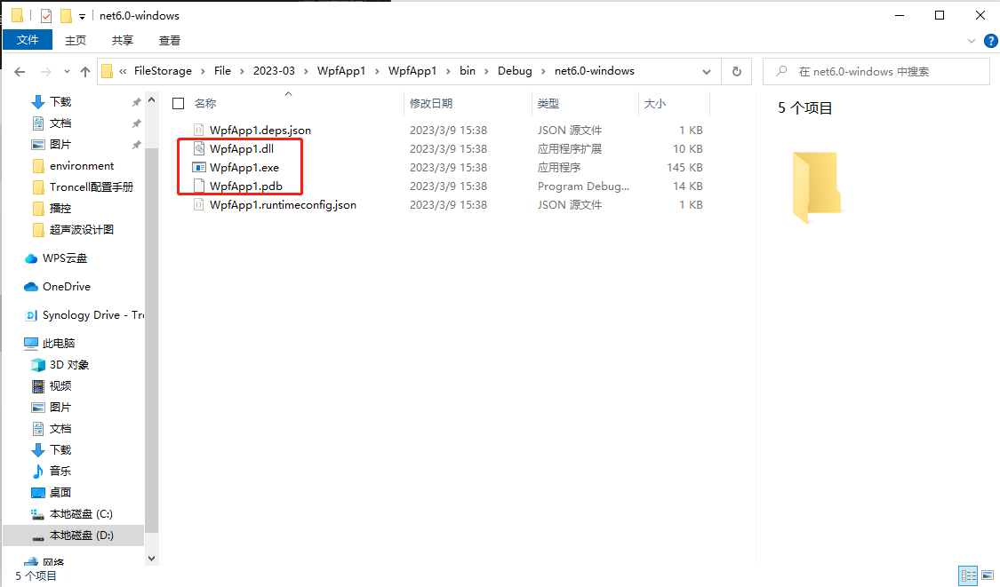
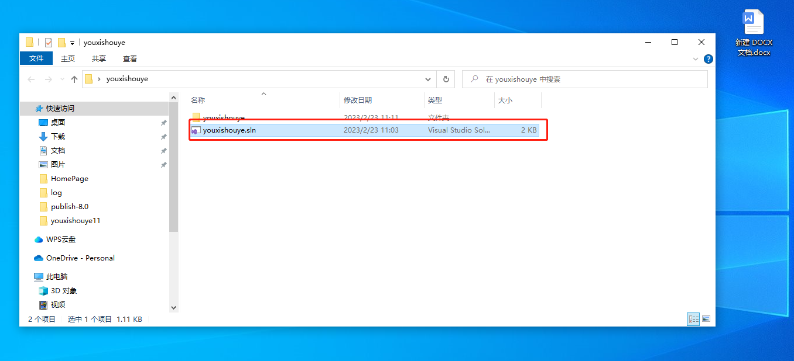
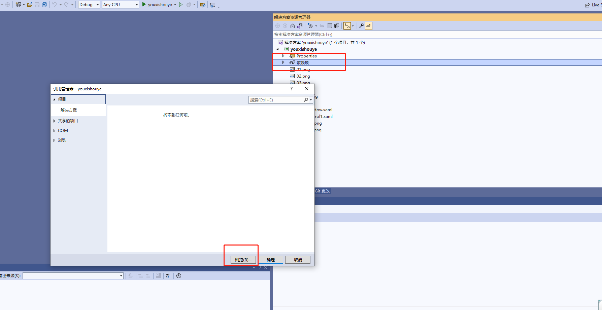
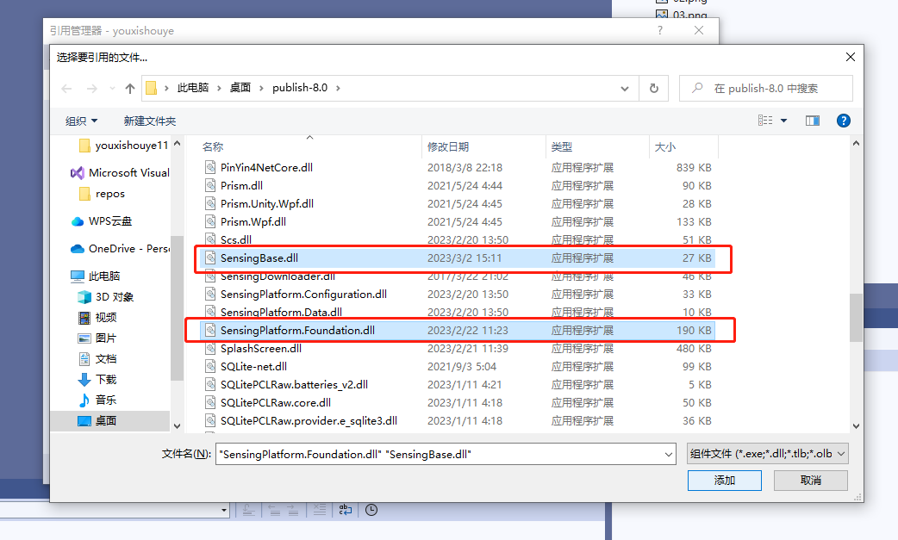
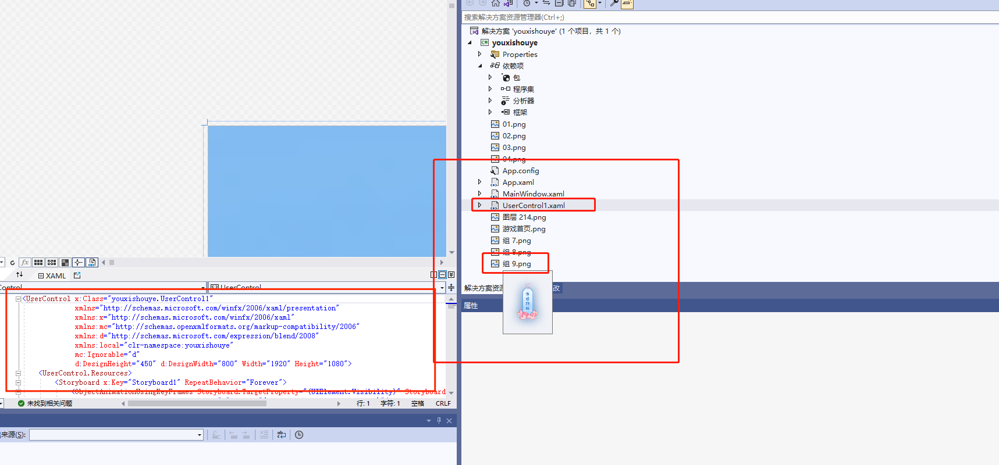
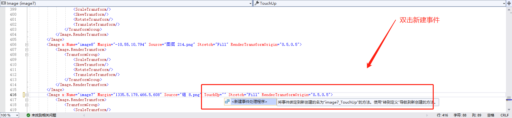
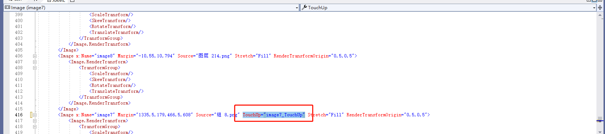
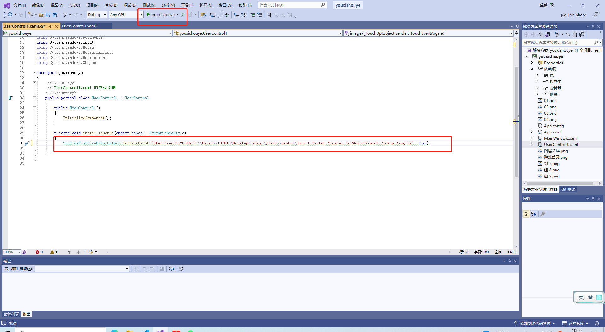
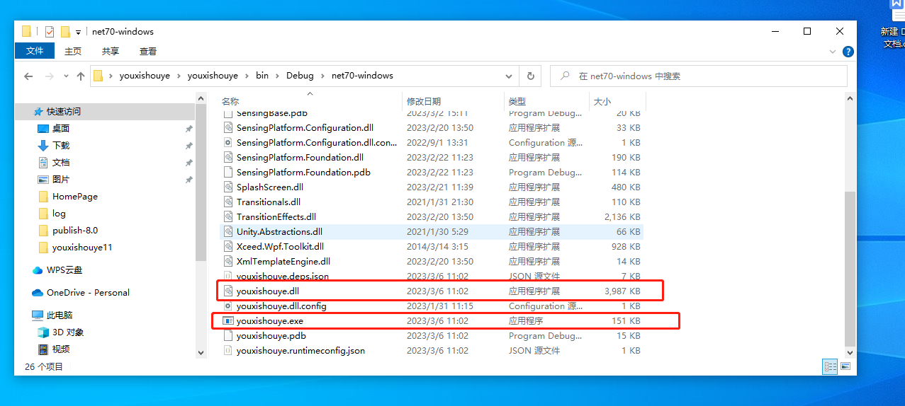

# 自定义控件（CustomerElement）

## 1.控件作用

`CustomerElement` 是一个容器，用于承载用户自定义的 .NET WPF 控件。开发者可以根据项目需求，使用 Blend 或 Visual Studio 开发特定的动画效果或交互功能，然后将编译好的 DLL 通过 `CustomerElement` 加载到页面中。

它与 `XYContainerElement` 一样是一个容器，但不同的是 `CustomerElement` 内部加载的是外部自定义控件，而不是平台内置控件。

## 2.整体结构

```
CustomerElement
├── UIDisplay        # 控件位置、大小、层级
└── Activator        # 指定自定义控件的 DLL 和类型
```

`CustomerElement` 本身不直接包含 `Items` 或 `Controls` 子节点，子元素的渲染完全由自定义控件内部实现。

## 3.适用场景

- 需要实现平台内置控件无法满足的特殊效果
- 需要集成第三方 WPF 控件
- 需要高度定制化的动画或交互组件
- 需要将现有 WPF 项目复用到 SensingPlatform 中

## 4.前置依赖

使用自定义控件前，必须满足以下条件：

1. 项目目录中存在 `UI.Common.dll`；
2. 在 `SysConfig/UIControlDict.xml` 中注册 `CustomerElement`；
3. 自定义控件已编译为 DLL，并放置在应用根目录或可被加载的位置；
4. 自定义控件基于 WPF 开发，符合 SensingPlatform 的加载要求。

## 5.配置文件样例

```XML
<CustomerElement>
<!-- 参考控件公用片段的讲解中UIDisplay片段讲解 -->
<UIDisplay Left="1300" Top="400" Width="27" Height="33" IsShow="True" ZIndex="1" UsePercent="False" />
<!-- AssemblyFile是使用到程序集(dll)的文件名称，TypeName是控件类名的全称 -->
<Activator AssemblyFile="DancingBubbles" TypeName="DancingBubbles.BlueBubble" />
</CustomerElement>
```

## 6.UIDisplay 说明

`UIDisplay` 用法参考 [CommonElement.md](CommonElement.md)。针对自定义控件：

- `Width` / `Height`：定义自定义控件的显示区域大小；
- `ZIndex`：注意自定义控件与其他平台控件的层级关系；
- `UsePercent`：若需要按父容器百分比布局，可设为 `True`。

## 7.配置说明

### 7.1节点 Activator

`Activator` 用于指定要加载的自定义控件所在的程序集和类型

1.UI 设计通过 Blend 制作动画，打包后提供文件可供使用

2.将文件加里的 exe、dll、pdb 文件复制到程序中



3.配置里引用使用到的程序集(dll)的文件名称

决定了该特殊效果具体为哪种效果，确定该效果所使用到的程序集（dll）。

`Activator` 用于指定要加载的自定义控件所在的程序集和类型。

| 属性           | 必填 | 说明                                              | 示例                        |
| -------------- | ---- | ------------------------------------------------- | --------------------------- |
| `AssemblyFile` | 是   | 自定义控件所在的 DLL 文件名，不需要写 `.dll` 后缀 | `DancingBubbles`            |
| `TypeName`     | 是   | 自定义控件类的完整名称，通常包含命名空间          | `DancingBubbles.BlueBubble` |

### 7.2属性说明

- **AssemblyFile**：决定使用哪个 DLL 文件。该 DLL 需要放在应用根目录（与 `TronSensingShow.exe` 同级）或系统可搜索的路径中。
- **TypeName**：决定加载 DLL 中的哪个类。必须是包含完整命名空间的类名。

### 7.3DLL 加载说明

- 如果 DLL 文件名与 `AssemblyFile` 不一致，会导致加载失败；
- DLL 应放在与 `TronSensingShow.exe` 同级的目录，便于运行时查找；
- 如果自定义控件依赖其他 DLL，也需要一并复制到应用根目录；
- 自定义控件的目标框架需要与 SensingPlatform 运行时兼容。

### 7.4如何在动画中添加事件

1.用 VisualStudio 打开 ui 提供的文件里的.sln 文件
 2.选中依赖项右键添加项目引用 点击浏览
 3.添加 Sensingplatform 中的两个依赖项，点击添加
 4.双击打开 Usercontrol1.xaml 在左侧找到你所需要添加事件按钮的图片位置
 5.在圈中添加事件 MouseUp TouchUp 两种事件
 6.选中添加的事件 按 F12 跳转到添加事件路径的页面
 7.在代码中添加事件（跳转页面或打开应用程序），添加完成之后点击启动即可

**注释：**
(1)添加应用程序打开的方法：

SensingPlatformEventHelper.TriggerEvent("StartProcess?Path=C:\\Users\\13754\\Desktop\\ying\\games\\KinectShot\\KinectShot.exe&Name=KinectShot", this);

(2)添加跳转页面的方法：

SensingPlatformEventHelper.TriggerEvent("Navigate?Page=APage&amp", this);



8.复制 exe 和 dll 进入程序中即可 具体案例可参考山东英才学院体感项目



## 8.自定义控件开发流程

### 1. 使用 Blend 制作动画

可以使用 Microsoft Blend 设计自定义控件的 UI 和动画效果。

### 2. 编译并复制文件

将项目编译后，把生成的 `exe`、`dll`、`pdb` 文件复制到 SensingPlatform 应用根目录中。

### 3. 在页面中引用

在页面 XML 中使用 `CustomerElement` 并通过 `Activator` 指定 DLL 和类型。

### 4. 在自定义控件中添加事件

如果需要在自定义控件中触发 SensingPlatform 的事件（如跳转页面、打开应用），可以按照以下步骤操作：

1. 使用 Visual Studio 打开自定义控件项目（`.sln`）；
2. 添加对 SensingPlatform 相关程序集的引用（通常需要引用平台提供的事件帮助类所在的 DLL）；
3. 打开自定义控件的 XAML 文件，找到需要添加事件的图片或按钮；
4. 添加 `MouseUp`、`TouchUp` 等事件；
5. 按 `F12` 跳转到事件处理代码；
6. 在事件处理方法中调用 `SensingPlatformEventHelper.TriggerEvent` 触发平台事件；
7. 重新编译并复制新的 `exe` 和 `dll` 到 SensingPlatform 目录中。

### 引用 SensingPlatform 程序集

自定义控件项目通常需要引用以下程序集之一（具体以实际项目为准）：

- `SensingPlatform.Foundation.dll`
- `SensingPlatform.Common.dll`
- 或其他包含 `SensingPlatformEventHelper` 的 DLL

引用方式：在 Visual Studio 中右键项目 → **添加** → **项目引用** → **浏览**，选择对应的 DLL 文件。

### 事件触发示例

#### 打开外部应用程序

```csharp
SensingPlatformEventHelper.TriggerEvent(
    "StartProcess?Path=C:\\Users\\13754\\Desktop\\ying\\games\\KinectShot\\KinectShot.exe&Name=KinectShot",
    this);
```

#### 跳转到指定页面

```csharp
SensingPlatformEventHelper.TriggerEvent(
    "Navigate?Page=APage",
    this);
```

> 注意：事件 URL 中的 `&` 在 C# 字符串中应写成 `&amp;`，具体取决于 `TriggerEvent` 的解析方式。如果方法内部会自动处理转义，则可以直接写 `&`。

## 9.UIControlDict.xml 添加自定义控件

如果使用自定义控件，需要在 `UIControlDict.xml` 中注册 `CustomerElement`：

```XML

  <Element ViewType="CustomerElement" AssemblyFile="UI.Common.dll" TypeName="UI.Common.SensingControl.CustomerControl, UI.Common, Version=1.0.0.0, Culture=neutral, PublicKeyToken=null">
    <DataContext AssemblyFile="UI.Common.dll" TypeName="UI.Common.SensingView.CustomerControlViewModel, UI.Common, Version=1.0.0.0, Culture=neutral, PublicKeyToken=null" />
  </Element>
```

## 10.部署说明

1. 在 `SysConfig/UIControlDict.xml` 中注册 `CustomerElement`；
2. 将自定义控件编译生成的 `exe`、`dll`、`pdb` 文件复制到应用根目录；
3. 如果自定义控件依赖其他第三方 DLL，也需要一并复制；
4. 在页面 XML 中使用 `CustomerElement` 并配置 `Activator`；
5. 如果需要事件交互，确保自定义控件引用了 SensingPlatform 的事件帮助类。

## 11.调试技巧

### 如何确认 DLL 被正确加载

- 启动 SensingPlatform 应用，检查 `Log/` 目录下的日志文件；
- 搜索 `CustomerElement` 或自定义控件的 `TypeName`，查看是否有加载失败的异常；
- 常见问题包括：`TypeName` 拼写错误、DLL 不存在、目标框架不兼容。

### 如何确认自定义控件已初始化

- 在自定义控件的构造函数或 `Loaded` 事件中添加日志或断点；
- 如果构造函数未被调用，通常是 `Activator` 配置或 DLL 加载问题。

### 如何确认事件已触发

- 在自定义控件的事件处理方法中添加日志输出；
- 检查 `SensingPlatformEventHelper.TriggerEvent` 是否返回异常或错误信息。

## 12.更多事件示例

### 打开外部网页

```csharp
SensingPlatformEventHelper.TriggerEvent(
    "Web?Url=https://www.example.com",
    this);
```

### 发送数据到外部设备

```csharp
SensingPlatformEventHelper.TriggerEvent(
    "ToDeviceDataEvent?Id=COM2&Protocol=SerialPort&Data=3f 08 a0 04 02 00 00 11 87",
    this);
```

### 触发弹出层

```csharp
SensingPlatformEventHelper.TriggerEvent(
    "PopupEvent?TargetPageName=HomePage&TargetControlName=PopItems&EventID=ShowDetail",
    this);
```

## 13.常见问题

### 自定义控件不显示

- 检查 `AssemblyFile` 是否正确，且 DLL 文件是否存在于应用根目录；
- 检查 `TypeName` 是否包含完整命名空间，且拼写正确；
- 检查 `UIDisplay` 的 `IsShow` 是否为 `True`；
- 检查自定义控件是否有未处理的异常导致加载失败。

### 自定义控件中的事件不触发

- 检查事件是否已正确绑定到控件元素；
- 检查 `SensingPlatformEventHelper.TriggerEvent` 的事件 URL 是否正确；
- 检查事件 URL 中的特殊字符是否已正确转义。

### 自定义控件显示位置或大小不对

- 检查 `CustomerElement` 的 `UIDisplay` 的 `Left`、`Top`、`Width`、`Height`；
- 检查自定义控件内部是否使用了绝对布局或固定尺寸；
- 如需自适应，建议在自定义控件中使用相对布局或绑定到父容器尺寸。

### 自定义控件与其他控件重叠

- 调整 `CustomerElement` 的 `ZIndex`；
- 检查自定义控件是否设置了背景透明或 `IsHitTestVisible`。

### 自定义控件更新后没有生效

- 确保已将最新的 `dll` 和 `exe` 复制到应用根目录并覆盖旧文件；
- 检查是否有文件被占用，必要时重启 SensingPlatform 应用。

## 14.注意事项

- 自定义控件需要基于 WPF 开发，且目标框架与 SensingPlatform 运行时兼容（如 .NET 10）；
- 自定义控件中的依赖项也需要一并复制到应用根目录；
- 建议在自定义控件项目中添加对平台事件帮助类的引用，以便触发页面跳转等交互；
- `Activator` 的属性名大小写敏感，请确保 `AssemblyFile` 和 `TypeName` 拼写正确；
- 自定义控件内部可以通过构造函数参数、依赖属性或事件与平台进行数据交互，具体实现方式取决于自定义控件的设计。

## 15.常见问题补充

### 加载自定义控件时报“找不到类型”错误

- 检查 `TypeName` 是否包含完整命名空间；
- 检查 DLL 是否已复制到应用根目录；
- 检查自定义控件类是否为 `public`。

### 自定义控件内部无法触发平台事件

- 检查是否正确引用了包含 `SensingPlatformEventHelper` 的程序集；
- 检查事件 URL 是否符合平台事件语法；
- 检查自定义控件是否在 UI 线程上调用 `TriggerEvent`。

### 自定义控件显示为空白

- 检查自定义控件的 XAML 根元素是否有实际内容；
- 检查自定义控件是否依赖未加载的资源或 DLL；
- 检查 `CustomerElement` 的 `Width` 和 `Height` 是否足够显示自定义控件内容。
