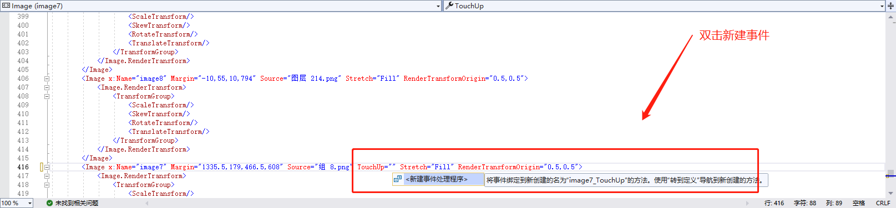

# 自定义控件（CustomerElement）

## 控件作用

可以根据自身需要，自定义一些特定的功能，它与相对布局控件一样，是个容器。

## 配置文件样例

```
<CustomerElement>
<!-- 参考控件公用片段的讲解中UIDisplay片段讲解 -->
<UIDisplay Left="1300" Top="400" Width="27" Height="33" IsShow="True" ZIndex="1" UsePercent="False" />
<!-- AssemblyFile是使用到程序集(dll)的文件名称，TypeName是控件类名的全称 -->
<Activator AssemblyFile="DancingBubbles" TypeName="DancingBubbles.BlueBubble" />
</CustomerElement>
```

## 配置说明

### 节点 Activator

1.UI 设计通过 Blend 制作动画，打包后提供文件可供使用

2.将文件加里的 exe、dll、pdb 文件复制到程序中


3.配置里引用使用到的程序集(dll)的文件名称

决定了该特殊效果具体为哪种效果，确定该效果所使用到的程序集（dll）。

    属性说明

    AssemblyFile：使用到程序集(dll)的文件名称

    TypeName：控件类名的全称

### 如何在动画中添加事件

1.用 VisualStudio 打开 ui 提供的文件里的.sln 文件
 2.选中依赖项右键添加项目引用 点击浏览
 3.添加 Sensingplatform 中的两个依赖项，点击添加
 4.双击打开 Usercontrol1.xaml 在左侧找到你所需要添加事件按钮的图片位置
 5.在圈中添加事件 MouseUp TouchUp 两种事件
 6.选中添加的事件 按 F12 跳转到添加事件路径的页面
 7.在代码中添加事件（跳转页面或打开应用程序），添加完成之后点击启动即可

**注释：**
(1)添加应用程序打开的方法：

SensingPlatformEventHelper.TriggerEvent("StartProcess?Path=C:\\Users\\13754\\Desktop\\ying\\games\\KinectShot\\KinectShot.exe&Name=KinectShot", this);

(2)添加跳转页面的方法：

SensingPlatformEventHelper.TriggerEvent("Navigate?Page=APage&amp", this);


8.复制 exe 和 dll 进入程序中即可 具体案例可参考山东英才学院体感项目


# UIControlDict.xml 添加自定义控件

如果使用自定义控件则需要在 UIControlDict.xml 中添加自定义控件

```

  <Element ViewType="CustomerElement" AssemblyFile="UI.Common.dll" TypeName="UI.Common.SensingControl.CustomerControl, UI.Common, Version=1.0.0.0, Culture=neutral, PublicKeyToken=null">
    <DataContext AssemblyFile="UI.Common.dll" TypeName="UI.Common.SensingView.CustomerControlViewModel, UI.Common, Version=1.0.0.0, Culture=neutral, PublicKeyToken=null" />
  </Element>
```
