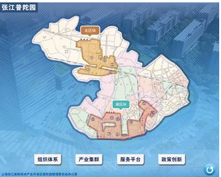

# 跳动的图片控件（DanceingBubbleElement）

## 1.控件作用

跳动的图片控件用于以跳动动画的方式突出显示某个按钮或图片，吸引用户注意。常用于首页入口、重点功能引导、活动推广等场景。

> 注意：当前代码库中并不存在独立的 `DancingBubbleControl` / `DanceingBubbleControl` 实现。文档中保留的 `DanceingBubbleElement` / `DancingBubbleElement` 视图类型，实际应注册到 `UI.Bubble.dll` 中的 [`BubbleControl`](../../Product/UI/UI.Bubble/BubbleControl.cs)。也就是说，该控件现在走的是气泡漂浮控件的能力，配置方式与 `BubbleElement` 一致。

## 2.适用场景

- 首页重点功能入口突出显示
- 需要吸引用户点击的按钮
- 活动推广、新功能引导
- 展厅互动页面中的提示按钮

## 3.前置依赖

使用跳动的图片控件前，必须满足以下条件：

1. 项目目录中存在 `UI.Common.dll`；
2. 在 `SysConfig/UIControlDict.xml` 中注册 `DanceingBubbleElement`（或 `DancingBubbleElement`，以实际注册为准）；，并指向 `UI.Bubble.BubbleControl`；
3. 准备好需要显示并跳动的图片资源。

## 4.控件UI效果



## 5.配置文件样例

```XML
<DancingBubbleElement>
	<UIDisplay Left="500" Top="600" Width="600" Height="400" IsShow="True" ZIndex="10" UsePercent="False" />
	<CustomerConfig>
		<ImageSource UriKind="Application">
			Shell\Pages\HomePage\resource\try.png
		</ImageSource>
	</CustomerConfig>
</DancingBubbleElement>

```

注：若项目注册的是 `DanceingBubbleElement`，则 XML 标签也应使用 `<DanceingBubbleElement>`。

## 6.UIDisplay 说明

`UIDisplay` 用法参考 [CommonElement.md](CommonElement.md)。针对跳动的图片控件：

- `Width` / `Height`：定义跳动图片的显示区域大小；
- `ZIndex`：通常需要设置较高层级，确保跳动效果不会被其他控件遮挡；
- `UsePercent`：若需要按父容器百分比布局，可设为 `True`。

## 7.CustomerConfig 参数说明

| 参数          | 必填 | 说明           | 示例                                    |
| ------------- | ---- | -------------- | --------------------------------------- |
| `ImageSource` | 是   | 跳动的图片路径 | `Shell\Pages\HomePage\resource\try.png` |

### 7.1ImageSource 说明

- `UriKind`：图片路径解析方式，常用 `Application`（相对于应用根目录）或 `Relative`（相对于当前 XML 文件）。
- 路径中应避免多余空格。

### 7.2其他可能的动画参数

部分版本的跳动的图片控件可能支持以下参数，具体以实际运行时和 DLL 版本为准：

| 参数        | 说明                 | 示例       |
| ----------- | -------------------- | ---------- |
| `Duration`  | 单次跳动动画持续时间 | `00:00:01` |
| `Amplitude` | 跳动幅度             | `20`       |
| `Interval`  | 跳动间隔             | `00:00:02` |

若需要配置这些参数，请参考对应版本的 DLL 文档或向技术支持确认。

## 8.UIControlDict.xml 添加跳动的图片控件

如果使用跳动的图片控件，需要在 `UIControlDict.xml` 中添加注册节点。注册信息可能因拼写差异而不同，请选择与实际 DLL 匹配的一项：

### 8.1注册方式一（DancingBubbleElement）

```xml
<Element ViewType="DancingBubbleElement" AssemblyFile="UI.Common.dll" TypeName="UI.Common.SensingControl.DancingBubbleControl, UI.Common, Version=1.0.0.0, Culture=neutral, PublicKeyToken=null">
    <DataContext AssemblyFile="UI.Common.dll" TypeName="UI.Common.SensingView.DancingBubbleViewModel, UI.Common, Version=1.0.0.0, Culture=neutral, PublicKeyToken=null" />
</Element>
```

### 8.2注册方式二（DanceingBubbleElement）

```xml
<Element ViewType="DanceingBubbleElement" AssemblyFile="UI.Common.dll" TypeName="UI.Common.SensingControl.DanceingBubbleControl, UI.Common, Version=1.0.0.0, Culture=neutral, PublicKeyToken=null">
    <DataContext AssemblyFile="UI.Common.dll" TypeName="UI.Common.SensingView.DanceingBubbleViewModel, UI.Common, Version=1.0.0.0, Culture=neutral, PublicKeyToken=null" />
</Element>
```

> 注：TypeName 中的具体类名以实际 DLL 中的类型为准。

## 9.部署说明

1. 确认项目目录中存在 `UI.Common.dll`；
2. 在 `SysConfig/UIControlDict.xml` 中添加上方注册节点；
3. 将需要跳动的图片资源放置到正确的路径；
4. 在页面 XML 中使用 `DanceingBubbleElement` 或 `DancingBubbleElement`（与注册一致），配置 `UIDisplay` 和 `CustomerConfig`。

## 10.常见问题

### 图片不显示

- 检查 `ImageSource` 的 `UriKind` 和路径是否正确；
- 确认图片文件真实存在；
- 检查 `UIDisplay` 的 `IsShow` 是否为 `True`。

### 图片不跳动

- 检查 `UI.Common.dll` 中是否包含跳动的图片控件实现；
- 检查 `UIControlDict.xml` 中 `ViewType` 是否与 XML 标签一致；
- 检查是否存在未处理的异常导致动画未启动。

### 注册后运行时找不到控件

- 确认 `ViewType` 与 XML 标签拼写一致；
- 确认 `AssemblyFile` 和 `TypeName` 正确；
- 检查 `UI.Common.dll` 是否存在于应用根目录。

### 跳动效果被其他控件遮挡

- 调高 `UIDisplay` 的 `ZIndex`；
- 检查是否有其他控件覆盖了该区域。

## 11.版本说明

- 该控件在不同版本中可能存在拼写差异，常见为 `DanceingBubbleElement` 和 `DancingBubbleElement`；
- 配置时请保持 `UIControlDict.xml` 中的 `ViewType`、XML 标签和文档描述一致；
- 若发现拼写不一致导致运行时错误，请以实际 DLL 中的类型名和项目注册信息为准。
