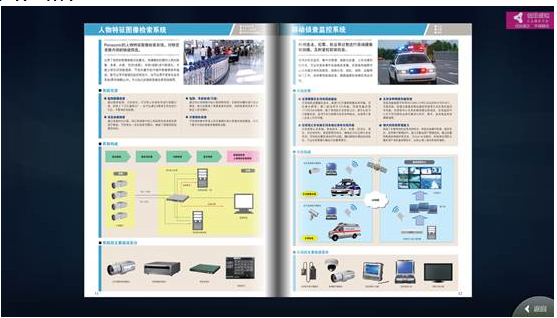
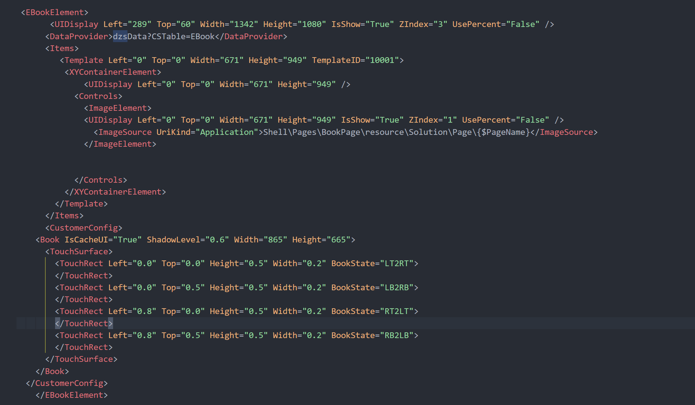

# 电子书控件（EBookElement）

## 控件作用

电子书控件以翻书的交互方式展示一系列图片。

## 控件 UI 效果



## 配置文件样例

```xml
<EBookElement>
	<UIDisplay Left="165" Top="280" Width="1396" Height="588" IsShow="True" ZIndex="3" UsePercent="False" />
	<DataProvider>
		EBookData?CSTable=TEduBook5
	</DataProvider>
	<Items>
		<Item>
			<ImageButton>
				<UIDisplay Left="100" Top="100" Width="392" Height="390" IsShow="True" ZIndex="1" UsePercent="False" />
				<ImageSource UriKind="Application">
					Shell\Data\KPIRedA.png
				</ImageSource>
				<ClickEvent>
					Navigate?Page=HomePage&Args=imageButton
				</ClickEvent>
			</ImageButton>
		</Item>
	</Items>
	<CustomerConfig>
		<Book IsCacheUI="True" ShadowLevel="0.6" Width="865" Height="665">
			<TouchSurface>
				<TouchRect Left="0.0" Top="0.0" Height="0.5" Width="0.2" BookState="LT2RT">
				</TouchRect>
				<TouchRect Left="0.0" Top="0.5" Height="0.5" Width="0.2" BookState="LB2RB">
				</TouchRect>
				<TouchRect Left="0.8" Top="0.0" Height="0.5" Width="0.2" BookState="RT2LT">
				</TouchRect>
				<TouchRect Left="0.8" Top="0.5" Height="0.5" Width="0.2" BookState="RB2LB">
				</TouchRect>
			</TouchSurface>
		</Book>
	</CustomerConfig>
</EBookElement>

```



## 配置说明

### 节点 Book

#### 属性说明

      IsCaCheUI:  是否预加载，就是是否在刚进入放电子书的页面时就加载所有页面，True为是，False为否；

      ShadowLevel：给电子书增加阴影的宽度；

      这里的Width、Height指的是书本的大小；

      TouchSurface：定义点击范围的边界。

## UIControlDict.xml 添加电子书控件

如果使用电子书控件则需要在 UIControlDict.xml 中添加电子书控件

```
  <!--UI.EBook 控件包-->
  <Element ViewType="EBookElement" AssemblyFile="UI.EBook.dll" TypeName="UI.EBook.EBookControl, UI.EBook, Version=1.0.0.0, Culture=neutral, PublicKeyToken=null">
    <DataContext AssemblyFile="UI.EBook.dll" TypeName="UI.EBook.EBookControlViewModel, UI.EBook, Version=1.0.0.0, Culture=neutral, PublicKeyToken=null" />
  </Element>
  <!--UI.Book End-->
```
