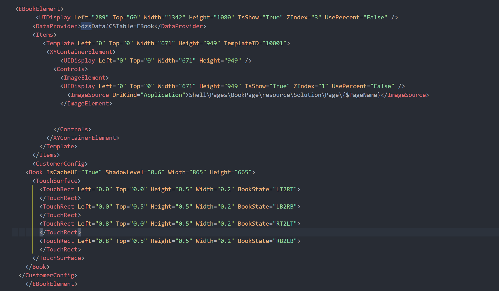

# 电子书控件（EBookElement）

## 1.控件作用

电子书控件以翻书的交互方式展示一系列图片或页面内容。用户可以通过点击页面边缘实现翻页效果，常用于电子画册、产品手册、宣传册、图书展示等场景。

## 2.适用场景

- 产品画册、企业宣传册翻页展示
- 电子图书、杂志阅读
- 相册集、荣誉证书翻页浏览
- 需要左右翻页交互的图文展示页面

## 3.前置依赖

使用电子书控件前，必须满足以下条件：

1. 项目目录中存在 `UI.EBook.dll`；
2. 在 `SysConfig/UIControlDict.xml` 中注册 `EBookElement`；
3. 如需动态加载内容，需在 `Shell/Data/Data.xml` 中配置数据源并在页面中使用 `DataProvider`。


## 4.配置文件样例

```xml
<EBookElement>
	<UIDisplay Left="165" Top="280" Width="1396" Height="588" IsShow="True" ZIndex="3" UsePercent="False" />
	<DataProvider>
		EBookData?CSTable=TEduBook5
	</DataProvider>
	<Items>
		<Item>
<!--Item 内可放置 ImageButton 等简单控件，具体参考 ImageButton 控件配置-->
			<ImageButton>
				<UIDisplay Left="100" Top="100" Width="392" Height="390" IsShow="True" ZIndex="1" UsePercent="False" />
				<ImageSource UriKind="Application">
					Shell\Data\KPIRedA.png
				</ImageSource>
				<ClickEvent>
					Navigate?Page=HomePage&Args=imageButton
				</ClickEvent>
			</ImageButton>
		</Item>
	</Items>
	<CustomerConfig>
	  <!--Book 节点：IsCacheUI 是否预加载；IsLoop 是否循环；ShadowLevel 阴影宽度；Width/Height 为书本大小-->
		<Book IsCacheUI="True" ShadowLevel="0.6" Width="865" Height="665">
			<TouchSurface>
				<TouchRect Left="0.0" Top="0.0" Height="0.5" Width="0.2" BookState="LT2RT">
				</TouchRect>
				<TouchRect Left="0.0" Top="0.5" Height="0.5" Width="0.2" BookState="LB2RB">
				</TouchRect>
				<TouchRect Left="0.8" Top="0.0" Height="0.5" Width="0.2" BookState="RT2LT">
				</TouchRect>
				<TouchRect Left="0.8" Top="0.5" Height="0.5" Width="0.2" BookState="RB2LB">
				</TouchRect>
			</TouchSurface>
		</Book>
	</CustomerConfig>
</EBookElement>

```



## 5.UIDisplay 说明

`UIDisplay` 用法参考 [CommonElement.md](CommonElement.md)。针对电子书控件：

- `Width` / `Height`：控件在页面上的整体显示区域，书本会按 `Book` 节点中的 `Width` / `Height` 渲染，并在此区域内居中或按实际位置摆放；
- `ZIndex`：如果页面上有按钮、弹窗等覆盖层，注意层级关系；
- `UsePercent`：若需要按父容器百分比布局，可设为 `True`。

## 6.DataProvider 与 Items

### 6.1动态数据源模式

通过 `DataProvider` 绑定数据源，数据源中的每一行会生成一个书页。

```xml
<DataProvider>EBookData?CSTable=TEduBook5</DataProvider>
```

- `EBookData`：数据源实例名称，需在 `Shell/Data/Data.xml` 中定义；
- `CSTable=TEduBook5`：数据表/集合名称；
- `Item` 中的控件可以通过 `{$变量名}` 绑定数据源中的列。

### 6.2自定义固定模式

如果不配置 `DataProvider`，可以在 `Items` 中直接放置多个 `Item` 节点，手动定义每一页的内容。

### 6.3Item

每个 `Item` 代表一个书页内容。与 `BookElement` 使用 `Template` 不同，`EBookElement` 使用 `Item` 组织页面：

- 当使用 `DataProvider` 时，`Item` 作为模板，运行时根据数据行数重复生成页面；
- 当不使用 `DataProvider` 时，每个 `Item` 对应一个固定页面。

`Item` 内部可以放置 `ImageButton`、`ImageElement`、`TextElement` 等简单控件。

## 7.CustomerConfig 参数说明

### 7.1Book 节点

| 属性          | 必填 | 说明                                                                            | 示例   |
| ------------- | ---- | ------------------------------------------------------------------------------- | ------ |
| `IsCacheUI`   | 否   | 是否在页面加载时预加载所有页面。`True` 翻页流畅但占用更多内存；`False` 按需加载 | `True` |
| `IsLoop`      | 否   | 是否循环翻页。`true` 翻到最后一页后回到第一页，`false` 翻到边界停止             | `true` |
| `ShadowLevel` | 否   | 翻页时阴影效果的强度或宽度，取值范围通常为 `0` ~ `1`                            | `0.6`  |
| `Width`       | 否   | 书本的宽度                                                                      | `865`  |
| `Height`      | 否   | 书本的高度                                                                      | `665`  |

### 7.2属性说明

- **IsCacheUI**：设为 `True` 时，进入页面后会预先把所有页面加载到内存，翻页动画更流畅；页面内容较多时建议评估内存占用。设为 `False` 时延迟加载，可节省内存。
- **IsLoop**：控制翻页边界行为。`true` 表示最后一页之后继续翻回到第一页，形成循环；`false` 表示翻到有边界时停止，无法继续同方向翻页。
- **ShadowLevel**：翻页过程中书页下方阴影的深浅或宽度。数值越大阴影越明显，`0` 表示无阴影。
- **Width / Height**：定义电子书显示区域的书本大小，建议与背景图、页面内容尺寸匹配。

## 8.TouchSurface 与 TouchRect

`TouchSurface` 用于定义书本四周的点击热区，用户点击这些区域时触发翻页。

### 8.1TouchRect 属性

| 属性        | 必填 | 说明                                      | 示例    |
| ----------- | ---- | ----------------------------------------- | ------- |
| `Left`      | 是   | 热区左边距，取值为 `0.0` ~ `1.0` 的相对值 | `0.0`   |
| `Top`       | 是   | 热区上边距，取值为 `0.0` ~ `1.0` 的相对值 | `0.0`   |
| `Width`     | 是   | 热区宽度，取值为 `0.0` ~ `1.0` 的相对值   | `0.2`   |
| `Height`    | 是   | 热区高度，取值为 `0.0` ~ `1.0` 的相对值   | `0.5`   |
| `BookState` | 是   | 翻页方向状态                              | `LT2RT` |

### 8.2BookState 取值说明

| 取值    | 含义                     | 典型位置     |
| ------- | ------------------------ | ------------ |
| `LT2RT` | 从左上区域触发，向右翻页 | 左侧上半部分 |
| `LB2RB` | 从左下区域触发，向右翻页 | 左侧下半部分 |
| `RT2LT` | 从右上区域触发，向左翻页 | 右侧上半部分 |
| `RB2LB` | 从右下区域触发，向左翻页 | 右侧下半部分 |

> 热区坐标是相对书本区域（`0,0` 到 `1,1`）的百分比。例如 `Left="0.8" Width="0.2"` 表示右侧 20% 的宽度范围。

## 9.UIControlDict.xml 添加电子书控件

如果使用电子书控件，需要在 `UIControlDict.xml` 中添加注册节点：

```xml
<!--UI.EBook 控件包-->
<Element ViewType="EBookElement" AssemblyFile="UI.EBook.dll" TypeName="UI.EBook.EBookControl, UI.EBook, Version=1.0.0.0, Culture=neutral, PublicKeyToken=null">
  <DataContext AssemblyFile="UI.EBook.dll" TypeName="UI.EBook.EBookControlViewModel, UI.EBook, Version=1.0.0.0, Culture=neutral, PublicKeyToken=null" />
</Element>
<!--UI.EBook End-->
```

## 10.部署说明

1. 将 `UI.EBook.dll` 复制到应用根目录（与 `TronSensingShow.exe` 同级）；
2. 在 `SysConfig/UIControlDict.xml` 中添加上方注册节点；
3. 如需动态数据，在 `Shell/Data/Data.xml` 中配置数据源，并在页面中使用 `DataProvider`；
4. 在页面 XML 中使用 `EBookElement`，配置 `UIDisplay`、`DataProvider`、`Items` 和 `CustomerConfig`。

## 11.常见问题

### 翻页没反应

- 检查 `TouchSurface` 中 `TouchRect` 的 `BookState` 是否配置正确；
- 确认热区范围没有重叠或被上层控件遮挡；
- 检查 `UIDisplay` 的 `IsShow` 是否为 `True`。

### 图片不显示

- 检查 `ImageSource` 的 `UriKind` 和路径是否正确；
- 图片路径中的 `&` 在 XML 中应写成 `&amp;`；
- 确认图片文件真实存在。

### 翻页到最后一页后无法继续

- 检查 `IsLoop` 是否为 `true`，`false` 时翻到边界会停止。

### 阴影效果不明显

- 调整 `ShadowLevel` 数值，通常 `0.5` 以上效果较明显；
- 若设为 `0`，则完全无阴影。

### 数据源内容没有生成多页

- 确认 `DataProvider` 中的数据源名称和表名正确；
- 确认数据源中有多条数据；
- 确认 `Item` 模板中使用了正确的 `{$变量名}` 绑定。

## 12.BookElement 与 EBookElement 的区别

两者都是以翻书交互方式展示内容的控件，主要区别如下：

| 对比项        | BookElement           | EBookElement            |
| ------------- | --------------------- | ----------------------- |
| 控件类型      | `BookElement`         | `EBookElement`          |
| 所属 DLL      | `UI.Book.dll`         | `UI.EBook.dll`          |
| Items 子节点  | 使用 `Template`       | 使用 `Item`             |
| 注册 ViewType | `BookElement`         | `EBookElement`          |
| 注册 TypeName | `UI.Book.BookControl` | `UI.EBook.EBookControl` |

### 选择建议

- **BookElement**：适合数据源驱动的翻书场景，`Items` 中使用 `Template` 绑定数据列。
- **EBookElement**：适合固定页面或按 `Item` 单独配置每一页的场景，结构上使用 `Item` 组织页面内容。

> 注：两者 `CustomerConfig` 中的 `Book` 节点属性基本一致，新版本两者均可能支持 `IsLoop` 属性，具体以运行时版本为准。

## 13.版本说明

- `IsLoop` 为较新版本新增属性，用于控制翻页循环行为。
- 若使用旧版本运行时，`IsLoop` 可能不被识别，建议升级到支持该属性的版本。
