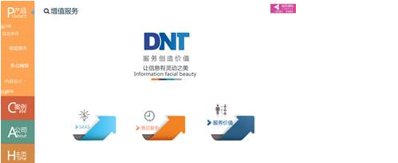

# 鱼眼控件（FishEyeElement）

## 1.控件作用

鱼眼控件以鱼眼放大效果展示图片集合。支持两种数据模式：

- **连接数据库动态生成**：通过 `DataProvider` 绑定数据源，根据数据行数自动生成鱼眼项；
- **用户自定义鱼眼个数**：通过手动配置 `Items` 中的节点定义固定数量的鱼眼项。

常用于图片墙、功能导航、产品展示等场景。

## 2.适用场景

- 图片集合的交互展示
- 功能入口的鱼眼导航
- 产品缩略图放大预览
- 展厅互动图片墙

## 3.前置依赖

使用鱼眼控件前，必须满足以下条件：

1. 项目目录中存在 `UI.FishEye.dll`；
2. 在 `SysConfig/UIControlDict.xml` 中注册 `FishEyeElement`；
3. 如需动态加载内容，需在 `Shell/Data/Data.xml` 中配置数据源并在页面中使用 `DataProvider`。

## 4.控件 UI 效果



## 4.配置文件样例

```XML
<!-- Name为鱼眼控件在页面中的名字，为可选项 -->
<FishEyeElement Name="FishEye">
	<UIDisplay Left="200" Top="300" Width="1000" Height="500" IsShow="True" ZIndex="1" UsePercent="False" />
	<DataProvider>
		FishEyeData?CSTable=FishEye
	</DataProvider>
	<Items>
		<Template>
			<ImageElement>
				<UIDisplay Left="100" Top="100" Width="392" Height="390" IsShow="True" ZIndex="1" UsePercent="False" />
				<ImageSource UriKind="Application">
					{$IconPath}
				</ImageSource>
				<ClickEvent>
					{$EventAction}?Page={$NavigatePage}&Args=imageButton
				</ClickEvent>
			</ImageElement>
			<!-- 放置CustomerConfig片段 -->
			<CustomerConfig>
				<!-- 放置FishEys片段，ItemGap是上面配置的各个Items中节点直接的间隙 -->
				<FishEye ItemGap="100">
				</FishEye>
				<!-- 放置AutoPlay片段，是自动播放，IdleTime等待在指定的时间内没有操作将会执行自动播放，单位是毫秒，Step是移动的速度 -->
				<AutoPlay IdleTime="10000" Step="3">
				</AutoPlay>
			</CustomerConfig>
		</Template>
	</Items>
</FishEyeElement>
```

## 5.UIDisplay 说明

`UIDisplay` 用法参考 [CommonElement.md](CommonElement.md)。针对鱼眼控件：

- `Width` / `Height`：定义鱼眼控件的活动显示区域；
- `ZIndex`：若页面上有悬浮按钮或弹出层，注意层级关系；
- `UsePercent`：若需要按父容器百分比布局，可设为 `True`。

## 6.DataProvider 与 Items

### 6.1动态数据源模式

通过 `DataProvider` 绑定数据源，数据源中的每一行会生成一个鱼眼项。

```xml
<DataProvider>FishEyeData?CSTable=FishEye</DataProvider>
```

- `FishEyeData`：数据源实例名称，需在 `Shell/Data/Data.xml` 中定义；
- `CSTable=FishEye`：数据表/集合名称；
- `Template` 中的 `{$IconPath}`、`{$EventAction}`、`{$NavigatePage}` 等变量需与数据源中的列名一致。

### 6.2自定义固定模式

如果不配置 `DataProvider`，可以在 `Items` 中直接放置多个 `ImageElement` 或 `ImageButton`，手动定义鱼眼项个数和内容。

### 6.3Template

`Items` 内使用 `Template` 作为鱼眼项模板。`Template` 内部通常放置 `ImageElement` 或 `ImageButton`，用于显示图片并响应点击事件。

## 7.CustomerConfig 参数说明

### 7.1FishEye 节点

| 属性      | 必填 | 说明                         | 示例  |
| --------- | ---- | ---------------------------- | ----- |
| `ItemGap` | 否   | 各鱼眼项之间的间隙，单位像素 | `100` |

### 7.2AutoPlay 节点

| 属性       | 必填 | 说明                                     | 示例    |
| ---------- | ---- | ---------------------------------------- | ------- |
| `IdleTime` | 否   | 用户无操作后自动播放的等待时间，单位毫秒 | `10000` |
| `Step`     | 否   | 自动播放时每次移动的速度或步长           | `3`     |

### 7.3属性说明

- **ItemGap**：控制鱼眼项之间的间距。数值越大，项与项之间距离越远。
- **IdleTime**：用户没有交互操作后，等待多长时间开始自动播放。若不需要自动播放，可移除 `AutoPlay` 节点。
- **Step**：自动播放时鱼眼项移动的速度。数值越大移动越快。

# 8.UIControlDict.xml 添加鱼眼控件

如果使用鱼眼控件则需要在 `UIControlDict.xml`中添加注册节点

```XML
 <!--UI.FishEye控件包-->
  <Element ViewType="FishEyeElement" AssemblyFile="UI.FishEye.dll" TypeName="UI.FishEye.FishEyeControl, UI.FishEye, Version=1.0.0.0, Culture=neutral, PublicKeyToken=null">
    <DataContext AssemblyFile="UI.FishEye.dll" TypeName="UI.FishEye.FishEyeViewModel, UI.FishEye, Version=1.0.0.0, Culture=neutral, PublicKeyToken=null" />
  </Element>
  <!--UI.FishEye End-->
```

## 9.部署说明

1. 将 `UI.FishEye.dll` 复制到应用根目录（与 `TronSensingShow.exe` 同级）；
2. 在 `SysConfig/UIControlDict.xml` 中添加上方注册节点；
3. 如需动态数据，在 `Shell/Data/Data.xml` 中配置数据源，并在页面中使用 `DataProvider`；
4. 在页面 XML 中使用 `FishEyeElement`，配置 `UIDisplay`、`DataProvider`、`Items` 和 `CustomerConfig`。

## 10.常见问题

### 鱼眼项不显示

- 检查 `DataProvider` 中的数据源名称和表名是否正确；
- 检查 `ImageSource` 的 `UriKind` 和路径是否正确；
- 检查 `UIDisplay` 的 `IsShow` 是否为 `True`。

### 点击鱼眼项没有反应

- 检查 `ClickEvent` 中的 `&` 是否已转义为 `&amp;`；
- 检查事件 URL 是否正确；
- 检查目标页面是否存在。

### 鱼眼项重叠或间距不对

- 调整 `FishEye` 的 `ItemGap` 数值；
- 检查 `Template` 内部控件的 `Width` / `Height` 是否合适。

### 自动播放不生效

- 检查 `AutoPlay` 节点是否存在；
- 检查 `IdleTime` 是否设置合理；
- 检查 `Step` 是否大于 `0`。

### 数据源内容没有生成多个鱼眼项

- 确认 `DataProvider` 中的数据源名称和表名正确；
- 确认数据源中有多条数据；
- 确认 `Template` 中使用了正确的 `{$变量名}` 绑定。
