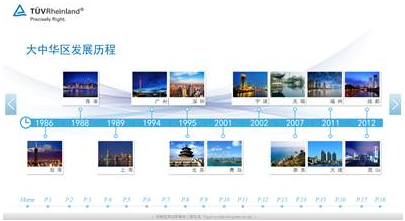

# 卡片型滑块控件（FlipViewElement）

## 1.控件作用

卡片型滑块控件以翻日历的交互方式展示一系列图片或页面内容。用户可以通过左右滑动、点击翻页按钮或自动播放的方式切换卡片。控件支持 `IndexChanged` 事件，可在切换时触发导航或其他动作。

## 2.适用场景

- 图片轮播展示
- 产品卡片翻页
- 企业介绍、新闻资讯滑动浏览
- 需要左右/上下滑动切换内容的页面

## 3.前置依赖

使用卡片型滑块控件前，必须满足以下条件：

1. 项目目录中存在 `UI.FlipView.dll`；
2. 在 `SysConfig/UIControlDict.xml` 中注册 `FlipViewElement`；
3. 如需动态加载内容，需在 `Shell/Data/Data.xml` 中配置数据源并在页面中使用 `DataProvider`。

## 4.控件 UI 效果



## 5.配置文件样例

### 5.1样例一：带左右翻页按钮

```XML
<FlipViewElement Name="resource">
	<UIDisplay Left="0" Top="0" Width="1920" Height="1080" IsShow="True" ZIndex="2" UsePercent="False" />
	<DataProvider>
		AboutServiceData?CSTable=AboutService
	</DataProvider>
	<Items IsCacheUI="True">
		<Template Left="0" Top="0" Width="1920" Height="1080" TemplateID="10001">
			<XYContainerElement>
				<UIDisplay Left="0" Top="0" Width="1920" Height="1080" />
				<Controls>
					<ImageElement Name="resource">
						<UIDisplay Left="0" Top="0" Width="1920" Height="1080" IsShow="True" ZIndex="2" UsePercent="False" Opacity="1" IsHitTestVisible="True" IsUseCache="True" />
						<ImageSource UriKind="Application">Shell\Pages\AboutServicePage\resource\{$ImageName}</ImageSource>
					</ImageElement>
					<ImageButton Name="resource">
						<UIDisplay Left="7" Top="474" Width="61" Height="102" IsShow="True" ZIndex="2" UsePercent="False" Opacity="1" IsHitTestVisible="True" IsUseCache="True" />
						<ImageSource UriKind="Application">Shell\Pages\AboutServicePage\resource\2.png</ImageSource>
						<ClickEvent>IndexChanged?Index={$LeftImage}&Args=imageButton</ClickEvent>
					</ImageButton>
					<ImageButton Name="resource">
						<UIDisplay Left="1852" Top="474" Width="61" Height="102" IsShow="True" ZIndex="2" UsePercent="False" Opacity="1" IsHitTestVisible="True" IsUseCache="True" />
						<ImageSource UriKind="Application">Shell\Pages\AboutServicePage\resource\1.png</ImageSource>
						<ClickEvent>IndexChanged?Index={$RightImage}</ClickEvent>
					</ImageButton>
				</Controls>
			</XYContainerElement>
		</Template>
	</Items>
	<CustomerConfig>
		<FlipView SliderFactor="0.2" Orientation="Horizontal">
		</FlipView>
	</CustomerConfig>
</FlipViewElement>

```

### 5.2样例二：基础图片轮播

```XML
     <FlipViewElement Name="FlipView">
        <UIDisplay Left="228" Top="265" Width="1466" Height="499" IsShow="True" ZIndex="1" UsePercent="False" />
        <DataProvider>qiyechanpinData?CSTable=zhinengyingjian</DataProvider>
        <Items IsCacheUI="True">
          <Template Left="0" Top="0" Width="1466" Height="499" TemplateID="10003">
            <ImageElement>
              <UIDisplay Left="30" Top="10" Width="1466" Height="499" IsShow="True" ZIndex="1" UsePercent="False" />
              <ImageSource UriKind="Application">Shell\Pages\qiyePage\resource\xinxifabu\智能硬件\{$TP}</ImageSource>
            </ImageElement>
          </Template>
        </Items>
        <CustomerConfig>
          <FlipView SliderFactor="0.2"></FlipView>
        </CustomerConfig>
      </FlipViewElement>
```

## 6.UIDisplay 说明

`UIDisplay` 用法参考 [CommonElement.md](CommonElement.md)。针对卡片型滑块控件：

- `Width` / `Height`：定义滑块控件的显示区域大小；
- `ZIndex`：注意滑块内容与翻页按钮、指示器等元素的层级关系；
- `UsePercent`：若需要按父容器百分比布局，可设为 `True`。

## 7.DataProvider 与 Items

### 7.1动态数据源模式

通过 `DataProvider` 绑定数据源，数据源中的每一行会生成一个滑块卡片。

```xml
<DataProvider>AboutServiceData?CSTable=AboutService</DataProvider>
```

- `AboutServiceData`：数据源实例名称，需在 `Shell/Data/Data.xml` 中定义；
- `CSTable=AboutService`：数据表/集合名称；
- `Template` 中的 `{$ImageName}`、`{$LeftImage}`、`{$RightImage}`、`{$TP}` 等变量需与数据源中的列名一致。

### 7.2Items 属性

| 属性        | 必填 | 说明                                                     | 示例   |
| ----------- | ---- | -------------------------------------------------------- | ------ |
| `IsCacheUI` | 否   | 是否缓存卡片 UI。`True` 提升翻页流畅度，`False` 节省内存 | `True` |

### 7.3Template 属性

| 属性         | 必填 | 说明                         | 示例    |
| ------------ | ---- | ---------------------------- | ------- |
| `Left`       | 否   | 模板左上角位置               | `0`     |
| `Top`        | 否   | 模板左上角位置               | `0`     |
| `Width`      | 否   | 模板宽度                     | `1920`  |
| `Height`     | 否   | 模板高度                     | `1080`  |
| `TemplateID` | 否   | 模板标识，可用于条件模板匹配 | `10001` |

## 8.CustomerConfig 参数说明

### 8.1FlipView节点

| 属性            | 必填 | 说明                                                            | 示例         |
| --------------- | ---- | --------------------------------------------------------------- | ------------ |
| `SliderFactor`  | 否   | 滑动触发翻页的灵敏度。值越小灵敏度越高，默认 `0.5`              | `0.2`        |
| `Orientation`   | 否   | 滑动方向。`Horizontal` 水平，`Vertical` 垂直                    | `Horizontal` |
| `IsLoop`        | 否   | 是否循环播放。`True` 循环，`False` 不循环                       | `False`      |
| `SelectedIndex` | 否   | 默认选中项的索引，默认 `0`                                      | `0`          |
| `CanAutoPlay`   | 否   | 是否自动播放                                                    | `False`      |
| `IdleTime`      | 否   | 自动播放时间间隔，单位毫秒，默认 `10000`10秒                    | `10000`      |
| `PageReload`    | 否   | 翻页时是否重新加载页面内容。`True` 重新加载，`False` 不重新加载 | `False`      |

### 8.2属性说明

- **SliderFactor**：当用户滑动距离超过卡片尺寸的该比例时，自动切换到下一页。例如 `0.2` 表示滑动超过 20% 即翻页，`0.5` 表示需要滑动超过 50% 才翻页。
- **Orientation**：控制滑动方向。`Horizontal` 为左右滑动，`Vertical` 为上下滑动。
- **IsLoop**：控制是否循环播放。`True` 时翻到最后一页后回到第一页。
- **SelectedIndex**：初始显示第几张卡片，从 `0` 开始计数。
- **CanAutoPlay**：是否启用自动轮播。
- **IdleTime**：自动轮播的时间间隔。
- **PageReload**：翻页时是否重新加载卡片内容。若卡片内容动态变化可设为 `True`。

## 9.IndexChanged 事件

`IndexChanged` 事件用于在切换卡片时触发动作，常用于左右翻页按钮。

```xml
<ClickEvent>IndexChanged?Index={$LeftImage}</ClickEvent>
```

| 参数    | 说明         | 示例                            |
| ------- | ------------ | ------------------------------- |
| `Index` | 目标卡片索引 | `{$LeftImage}`、`{$RightImage}` |

> 注意：事件 URL 中的 `&` 需要转义为 `&amp;`。

## 10.UIControlDict.xml 添加卡片型滑块控件

如果使用卡片型滑块控件,则需要在 `UIControlDict.xml` 中添加注册节点

````xml

<!--UI.FlipView 控件包-->
  <Element ViewType="FlipViewElement" AssemblyFile="UI.FlipView.dll" TypeName="UI.FlipView.FlipViewControl, UI.FlipView, Version=1.0.0.0, Culture=neutral, PublicKeyToken=null">
    <DataContext AssemblyFile="UI.FlipView.dll" TypeName="UI.FlipView.FlipViewViewModel, UI.FlipView, Version=1.0.0.0, Culture=neutral, PublicKeyToken=null" />
  </Element>
  <!--UI.FlipView End-->
```
````

## 11.部署说明

1. 将 `UI.FlipView.dll` 复制到应用根目录（与 `TronSensingShow.exe` 同级）；
2. 在 `SysConfig/UIControlDict.xml` 中添加上方注册节点；
3. 如需动态数据，在 `Shell/Data/Data.xml` 中配置数据源，并在页面中使用 `DataProvider`；
4. 在页面 XML 中使用 `FlipViewElement`，配置 `UIDisplay`、`DataProvider`、`Items` 和 `CustomerConfig`。

## 12.常见问题

### 卡片不显示

- 检查 `DataProvider` 中的数据源名称和表名是否正确；
- 检查 `ImageSource` 的 `UriKind` 和路径是否正确；
- 检查 `UIDisplay` 的 `IsShow` 是否为 `True`。

### 无法滑动翻页

- 检查 `SliderFactor` 是否设置合理，值过大可能需要滑动很长距离才能翻页；
- 检查 `Orientation` 是否与滑动方向一致；
- 检查是否有上层控件拦截了触摸事件。

### 点击翻页按钮没有反应

- 检查 `ClickEvent` 是否为 `IndexChanged`；
- 检查 `Index` 参数是否正确；
- 检查事件 URL 中的 `&` 是否已转义为 `&amp;`。

### 自动播放不生效

- 检查 `CanAutoPlay` 是否为 `True`；
- 检查 `IdleTime` 是否设置合理；
- 检查用户交互后是否会暂停自动播放（部分控件有此逻辑）。

### 翻到最后一页后无法继续

- 检查 `IsLoop` 是否为 `True`，`False` 时翻到最后一页会停止。

### 数据源内容没有生成多个卡片

- 确认 `DataProvider` 中的数据源名称和表名正确；
- 确认数据源中有多条数据；
- 确认 `Template` 中使用了正确的 `{$变量名}` 绑定。
