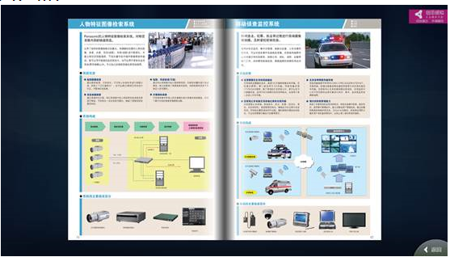

网页渲染控件（HtmlRenderElement）

## 控件作用

通过加载静态网页,并自动下载网页里的地址中的图片，并显示到屏幕上。需要在后台配置，然后通过AppPod下载相关数据，再利用SensingData获取数据。

## 控件 UI 效果



## 配置文件样例

```xml

<HtmlRenderElement>
	<UIDisplay Left="910" Top="623" Width="720" Height="324" IsShow="True" ZIndex="6" UsePercent="False"/>

	<CustomerConfig>
		<HtmlRender UriKind="Project">{$Description}</HtmlRender>
	</CustomerConfig>

</HtmlRenderElement>

```

## 配置说明

### 节点 HtmlRender

#### 属性说明
<HtmlRender UriKind="Project">{$Description}</HtmlRender> 
这个节点的值是静态网页的代码，需要配置在后台的描述里配置图片的资源地址


## UIControlDict.xml 添加网页渲染控件

如果使用控件则需要在 UIControlDict.xml 中添加控件

```
  <!-- HtmlRender -->
  <Element ViewType="HtmlRenderElement" AssemblyFile="UI.HtmlRenderControl.dll" TypeName="UI.HtmlRenderControl.HtmlRenderControl, UI.HtmlRenderControl, Version=1.0.0.0, Culture=neutral, PublicKeyToken=null">
    <DataContext AssemblyFile="UI.HtmlRenderControl.dll" TypeName="UI.HtmlRenderControl.HtmlRenderViewModel, UI.HtmlRenderControl, Version=1.0.0.0, Culture=neutral, PublicKeyToken=null" />
  </Element>
```
