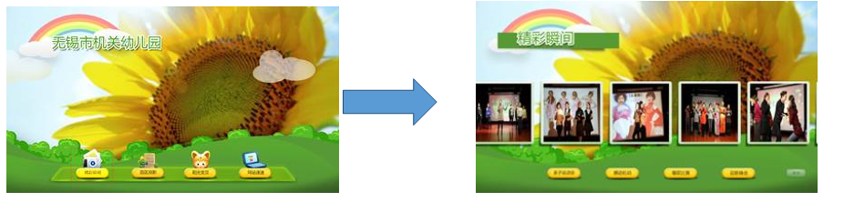

# **图片按钮控件（** **ImageButton** **）**

## 控件作用

在页面或控件中，处理用户的点击交互逻辑(如弹出框，导航页面等，具体可参照事件一览中的相关事件), 具有点击效果。

## 控件 UI 效果



## 配置文件样例

```xml
<!-- 示例: 跳弹出框-->
<ImageButton>
    <UIDisplay Left="100" Top="150" Width="180" Height="180" IsShow="True"  ZIndex="1" UsePercent="False"/>
    <!--ImageSource若不配，相当于透明按钮，程序不会出错，也不会出现加载动画 -->
    <ImageSource UriKind="Relative">NavIcons\lianliankan.png</ImageSource>
    <!--ClickEvent支持触发多个事件, 增加Event配置就行，如只有一个事件，可省略Event节点，直接配置在ClickEvent上 -->
    <ClickEvent>
        <Event>
PopupEvent?TargetPageName=BriefingPage&TargetControlName=PageLeftSecondShow&X=0&Y=0&Height=841&Width=1604&EventID=PageHotBigBookShow&UriKind=Application&EventPath=Shell\Pages\BriefingPage\Items\PopupItems\SecondSho&PageName={$PageName}
    </Event>
    </ClickEvent>
    <CustomerConfig>
        <!-- AutoClick: 表示页面加载后会自动触发点击事件，执行一次 -->
        <Button AutoClick="True" />
    </CustomerConfig>
</ImageButton>
```

## 配置说明

详细配置说参照xml里面的注释

## 本组件可接受的Event

1. SourceChanged , 能处理SourceChanged事件，作用是变更此Button展示的图片


## 全局配置加载ImageButton

# UIControlDict.xml 添加图片按钮控件

如果使用图片按钮控件则需要在 UIControlDict.xml 中添加图片按钮控件

```

<Element ViewType="ImageButton" AssemblyFile="UI.Common.dll" TypeName="UI.Common.SensingControl.ImageButtonControl, UI.Common, Version=1.0.0.0, Culture=neutral, PublicKeyToken=null">
    <DataContext AssemblyFile="UI.Common.dll" TypeName="UI.Common.SensingView.EventButtonViewModel, UI.Common, Version=1.0.0.0, Culture=neutral, PublicKeyToken=null" />
  </Element>
```
