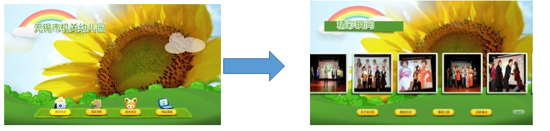

# **图片按钮控件（** **ImageButton** **）**

## 1.控件作用

图片按钮控件用于处理用户的点击交互逻辑，如弹出窗口、页面导航、触发事件等。按钮可以显示一张图片作为视觉反馈，也可以不配置图片作为透明按钮使用。控件支持点击效果，并可通过 `ClickEvent` 触发一个或多个事件。

## 2.适用场景

- 页面导航按钮
- 弹出窗口触发按钮
- 功能入口图标按钮
- 需要点击反馈的交互元素
- 需要动态切换图片的按钮

## 3.前置依赖

使用图片按钮控件前，必须满足以下条件：

1. 项目目录中存在 `UI.Common.dll`；
2. 在 `SysConfig/UIControlDict.xml` 中注册 `ImageButton`。

## 4.控件 UI 效果



## 5.配置文件样例

### 5.1单事件触发

```xml
<ImageButton>
    <UIDisplay Left="100" Top="150" Width="180" Height="180" IsShow="True" ZIndex="1" UsePercent="False" />

    <!--ImageSource 若不配置，相当于透明按钮，程序不会出错，也不会出现加载动画-->
    <ImageSource UriKind="Relative">NavIcons\lianliankan.png</ImageSource>

    <ClickEvent>Navigate?Page=HomePage</ClickEvent>
</ImageButton>
```

### 5.2多事件触发

```xml
<!-- 示例: 跳弹出框-->
<ImageButton>
    <UIDisplay Left="100" Top="150" Width="180" Height="180" IsShow="True"  ZIndex="1" UsePercent="False"/>
    <!--ImageSource若不配，相当于透明按钮，程序不会出错，也不会出现加载动画 -->
    <ImageSource UriKind="Relative">NavIcons\lianliankan.png</ImageSource>
    <!--ClickEvent支持触发多个事件, 增加Event配置就行，如只有一个事件，可省略Event节点，直接配置在ClickEvent上 -->
    <ClickEvent>
        <Event>
PopupEvent?TargetPageName=BriefingPage&TargetControlName=PageLeftSecondShow&X=0&Y=0&Height=841&Width=1604&EventID=PageHotBigBookShow&UriKind=Application&EventPath=Shell\Pages\BriefingPage\Items\PopupItems\SecondSho&PageName={$PageName}
    </Event>
    </ClickEvent>
    <CustomerConfig>
        <!-- AutoClick: 表示页面加载后会自动触发点击事件，执行一次 -->
        <Button AutoClick="True" />
        <!-- ElapsedTime 防抖动，两次点击时间超过这个时间才能触发事件，单位毫秒 MobileThreshold移动距离，超过此距离，则不触发触发点击事件 -->
        <Image ElapsedTime="300" MobileThreshold="600">
        </Image>
    </CustomerConfig>
</ImageButton>
```

## 6.UIDisplay 说明

`UIDisplay` 用法参考 [CommonElement.md](CommonElement.md)。针对图片按钮控件：

- `Width` / `Height`：定义按钮的点击区域大小；
- `ZIndex`：注意按钮与其他控件的层级关系，确保按钮可被点击；
- `UsePercent`：若需要按父容器百分比布局，可设为 `True`；
- `IsHitTestVisible`：若需要按钮可穿透，设为 `True`。

## 7.ImageSource 说明

| 属性      | 必填 | 说明             | 示例                                             |
| --------- | ---- | ---------------- | ------------------------------------------------ |
| `UriKind` | 是   | 图片路径解析方式 | `Relative`、`Application`、`Project`、`Absolute` |

- `ImageSource` 是可选的。如果不配置，按钮为透明按钮，仍然可以响应点击事件；
- 图片路径中的 `&` 在 XML 中需要转义为 `&amp;`。

## 8.ClickEvent 说明

`ClickEvent` 用于配置按钮点击时触发的事件。

### 8.1单事件写法

当只有一个事件时，可以直接将事件 URL 写在 `ClickEvent` 节点上：

```xml
<ClickEvent>Navigate?Page=HomePage</ClickEvent>
```

### 8.2多事件写法

当有多个事件时，需要使用 `Event` 节点逐个包裹：

```xml
<ClickEvent>
    <Event>PopupEvent?TargetPageName=HomePage&TargetControlName=PopItems</Event>
    <Event>Navigate?Page=DetailPage</Event>
</ClickEvent>
```

### 8.3事件 URL 转义

事件 URL 中的 `&` 必须转义为 `&amp;`：

```xml
<!--正确-->
<ClickEvent>Navigate?Page=HomePage&Args=imageButton</ClickEvent>

<!--错误-->
<ClickEvent>Navigate?Page=HomePage&Args=imageButton</ClickEvent>
```

## 9.CustomerConfig 参数说明

### 9.1Button 节点

| 属性        | 必填 | 说明                               | 示例            |
| ----------- | ---- | ---------------------------------- | --------------- |
| `AutoClick` | 否   | 页面加载后是否自动触发一次点击事件 | `True`、`False` |

### 9.2Image 节点

| 属性              | 必填 | 说明                                                   | 示例  |
| ----------------- | ---- | ------------------------------------------------------ | ----- |
| `ElapsedTime`     | 否   | 防抖动时间，两次点击间隔小于该值时不触发事件，单位毫秒 | `300` |
| `MobileThreshold` | 否   | 移动距离阈值，手指或鼠标移动超过该值时不触发点击事件   | `600` |

### 9.3属性说明

- **AutoClick**：设为 `True` 时，页面加载完成后会自动触发一次按钮的点击事件，常用于进入页面后自动打开弹窗或导航。
- **ElapsedTime**：用于防止用户快速连续点击导致事件重复触发。
- **MobileThreshold**：用于区分点击和拖拽。如果按下后移动距离超过该阈值，则视为拖拽，不触发点击事件。

## 10.支持的事件

### 10.1SourceChanged 事件

`SourceChanged` 事件用于动态变更按钮显示的图片。

```xml
<ClickEvent>SourceChanged?TargetControlName=MyButton&ImageSource=Shell\Pages\HomePage\resource\newIcon.png</ClickEvent>
```

| 参数                | 说明         | 示例                                        |
| ------------------- | ------------ | ------------------------------------------- |
| `TargetControlName` | 目标按钮名称 | `MyButton`                                  |
| `ImageSource`       | 新的图片路径 | `Shell\Pages\HomePage\resource\newIcon.png` |

### 10.2Control 事件

图片按钮控件也支持 `Control` 事件，用于控制按钮状态。具体可用值请参考事件一览文档。

## 11.UIControlDict.xml 添加图片按钮控件

如果使用图片按钮控件，需要在 `UIControlDict.xml` 中添加注册节点：

```xml
<Element ViewType="ImageButton" AssemblyFile="UI.Common.dll" TypeName="UI.Common.SensingControl.ImageButtonControl, UI.Common, Version=1.0.0.0, Culture=neutral, PublicKeyToken=null">
    <DataContext AssemblyFile="UI.Common.dll" TypeName="UI.Common.SensingView.EventButtonViewModel, UI.Common, Version=1.0.0.0, Culture=neutral, PublicKeyToken=null" />
</Element>
```

## 12.部署说明

1. 确认项目目录中存在 `UI.Common.dll`；
2. 在 `SysConfig/UIControlDict.xml` 中添加上方注册节点；
3. 准备按钮图片资源（可选）；
4. 在页面 XML 中使用 `ImageButton`，配置 `UIDisplay`、`ImageSource`、`ClickEvent` 和可选的 `CustomerConfig`。

## 13.常见问题

### 按钮不显示

- 检查 `ImageSource` 的 `UriKind` 和路径是否正确；
- 检查 `UIDisplay` 的 `IsShow` 是否为 `True`；
- 如果不配置 `ImageSource`，按钮为透明按钮，可能看不到但可点击。

### 点击按钮没有反应

- 检查 `ClickEvent` 是否正确；
- 检查事件 URL 中的 `&` 是否已转义为 `&amp;`；
- 检查 `ZIndex` 是否过低，按钮可能被上层控件遮挡；
- 检查 `ElapsedTime` 是否设置过大，导致连续点击被忽略。

### 按钮被拖拽时误触发点击

- 增大 `MobileThreshold` 的值，使拖拽操作不易触发点击；
- 检查按钮区域是否过小，导致轻微移动就超出阈值。

### 页面加载后没有自动触发点击

- 检查 `CustomerConfig` 中 `Button` 节点的 `AutoClick` 是否为 `True`；
- 检查 `ClickEvent` 是否配置正确。

### 图片切换不生效

- 检查 `SourceChanged` 事件中的 `TargetControlName` 是否与目标按钮的 `Name` 一致；
- 检查新的图片路径是否正确；
- 检查目标按钮是否配置了 `Name` 属性。

## 14.注意事项

- `ImageButton` 是最常用的交互控件之一，建议为按钮配置合适的 `Name`，方便事件引用；
- 透明按钮在某些场景下很有用，但要注意用户可能无法看到点击区域；
- 事件 URL 中的特殊字符必须正确转义，否则会导致 XML 解析错误；
- 多个事件按 `Event` 节点顺序依次触发。
