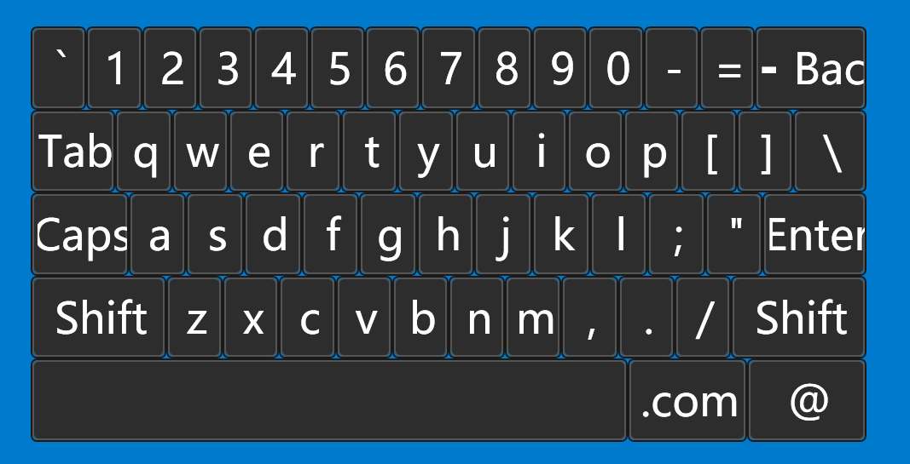

虚拟键盘控件（KeyBoardElement）

## 控件作用

加载自定义虚拟键盘

## 控件 UI 效果



## 配置文件样例

```xml
<KeyBoardElement>
	<UIDisplay Left="0" Top="0" Width="500" Height="254" IsShow="True" ZIndex="5" UsePercent="false" />
	<CustomerConfig>
		<KeyBrush Foreground = "#FFFFFFFF" Background = "#FF2D2D2D" BorderBrush = "#FF555555" MouseOverBackground = "#FF3A3A3A" />
	</CustomerConfig>
</KeyBoardElement>

```

## 配置说明

## KeyBrush

    Foreground：键盘按键颜色
    Background：按键背景
    BorderBrush：按键边框
    MouseOverBackground：按下按键的颜色


## UIControlDict.xml 添加虚拟键盘控件

如果使用虚拟键盘控件则需要在 UIControlDict.xml 中添加虚拟键盘控件，并且启用SensingData模块，并且通过AppPod配置软件

```
    <!-- 虚拟键盘 -->
    <Element ViewType="KeyBoardElement" AssemblyFile="UI.Keyboard.dll" TypeName="UI.Keyboard.KeyboardControl, UI.Keyboard, Version=1.0.0.0, Culture=neutral, PublicKeyToken=null">
        <DataContext AssemblyFile="UI.Keyboard.dll" TypeName="UI.Keyboard.KeyboardControlViewModel, UI.Keyboard, Version=1.0.0.0, Culture=neutral, PublicKeyToken=null" />
    </Element>
```


