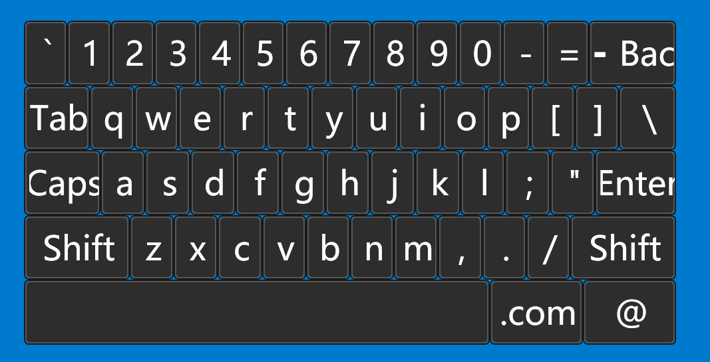

# 虚拟键盘控件（KeyBoardElement）

## 1.控件作用

虚拟键盘控件用于在页面上加载和显示自定义虚拟键盘，用户可以通过点击屏幕上的按键输入文字。常用于触摸屏设备、查询机、信息录入页面等没有物理键盘的场景。

## 2.适用场景

- 触摸屏设备的信息录入
- 查询机、自助终端的搜索页面
- 需要用户输入文字或数字的页面
- 替代物理键盘的虚拟输入方案

## 3.前置依赖

使用虚拟键盘控件前，必须满足以下条件：

1. 项目目录中存在 `UI.Keyboard.dll`；
2. 在 `SysConfig/UIControlDict.xml` 中注册 `KeyBoardElement`；
3. 在 `TronSensingShow.dll.config` 中启用 `SensingData` 模块；
4. 通过 AppPod 配置软件完成虚拟键盘的相关配置；
5. 页面中存在需要输入的目标控件（如搜索框、文本框等）。

## 4.控件 UI 效果



## 5.配置文件样例

```xml
<KeyBoardElement>
	<UIDisplay Left="0" Top="0" Width="500" Height="254" IsShow="True" ZIndex="5" UsePercent="false" />
	<CustomerConfig>
		<KeyBrush Foreground = "#FFFFFFFF" Background = "#FF2D2D2D" BorderBrush = "#FF555555" MouseOverBackground = "#FF3A3A3A" />
	</CustomerConfig>
</KeyBoardElement>

```

## 6.UIDisplay 说明

`UIDisplay` 用法参考 [CommonElement.md](CommonElement.md)。针对虚拟键盘控件：

- `Width` / `Height`：定义虚拟键盘的显示区域大小；
- `ZIndex`：虚拟键盘通常需要显示在较高层级，避免被其他控件遮挡；
- `UsePercent`：若需要按父容器百分比布局，可设为 `True`。

## 7.CustomerConfig 参数说明

### 7.1KeyBrush 节点

`KeyBrush` 用于配置虚拟键盘按键的颜色样式。

| 属性                  | 必填 | 说明                       | 示例        |
| --------------------- | ---- | -------------------------- | ----------- |
| `Foreground`          | 否   | 按键文字颜色               | `#FFFFFFFF` |
| `Background`          | 否   | 按键背景颜色               | `#FF2D2D2D` |
| `BorderBrush`         | 否   | 按键边框颜色               | `#FF555555` |
| `MouseOverBackground` | 否   | 鼠标悬停或按下时的背景颜色 | `#FF3A3A3A` |

### 7.2颜色格式

颜色值支持以下格式：

- 十六进制 ARGB：`#FF2D2D2D`
- 十六进制 RGB：`#2D2D2D`
- 颜色名称：`White`、`Black`、`Red` 等

### 7.3其他可能的配置

不同版本的虚拟键盘控件可能还支持以下配置：

| 参数             | 说明                               | 示例                |
| ---------------- | ---------------------------------- | ------------------- |
| `KeyboardLayout` | 键盘布局类型，如全键盘、数字键盘等 | `QWERTY`、`Numeric` |
| `TargetControl`  | 目标输入控件名称                   | `SearchBox`         |
| `FontSize`       | 按键字体大小                       | `20`                |
| `FontFamily`     | 按键字体                           | `微软雅黑`          |

> 以上参数以实际版本为准。

## 8.与输入控件配合使用

虚拟键盘通常需要与输入控件（如 `TextElement`、`KeyboardSearchElement` 等）配合使用：

1. 在页面中放置需要输入的目标控件，并设置 `Name`；
2. 配置 `KeyBoardElement`，使其输入内容关联到目标控件；
3. 用户点击虚拟键盘按键时，内容会自动输入到目标控件中。

示例：

```xml
<!--目标输入框-->
<TextElement Name="SearchBox">
    <UIDisplay Left="100" Top="100" Width="400" Height="50" IsShow="True" ZIndex="1" />
    <TextSource Foreground="#FF000000" Family="微软雅黑" Size="24" />
</TextElement>

<!--虚拟键盘-->
<KeyBoardElement>
    <UIDisplay Left="100" Top="200" Width="500" Height="254" IsShow="True" ZIndex="5" UsePercent="false" />

    <CustomerConfig>
        <KeyBrush Foreground="#FFFFFFFF" Background="#FF2D2D2D" BorderBrush="#FF555555" MouseOverBackground="#FF3A3A3A" />
    </CustomerConfig>
</KeyBoardElement>
```

## 9.SensingData 模块与 AppPod 配置

虚拟键盘控件通常需要 `SensingData` 模块支持，并通过 AppPod 配置软件进行配置。

### 9.1启用 SensingData 模块

在 `TronSensingShow.dll.config` 中添加：

```xml
<modules>
  <!--其他模块-->
  <module name="SensingData" assembly="Module.SensingData.dll" />
</modules>
```

> 模块的 exact 名称和 DLL 名称以实际项目为准。

### 9.2AppPod 配置

通过 AppPod 配置软件可以配置键盘布局、按键映射、皮肤样式等。具体配置方式请参考 AppPod 相关文档。

## 10.UIControlDict.xml 添加虚拟键盘控件

如果使用虚拟键盘控件，需要在 `UIControlDict.xml` 中添加注册节点：

```xml
<!--虚拟键盘-->
<Element ViewType="KeyBoardElement" AssemblyFile="UI.Keyboard.dll" TypeName="UI.Keyboard.KeyboardControl, UI.Keyboard, Version=1.0.0.0, Culture=neutral, PublicKeyToken=null">
    <DataContext AssemblyFile="UI.Keyboard.dll" TypeName="UI.Keyboard.KeyboardControlViewModel, UI.Keyboard, Version=1.0.0.0, Culture=neutral, PublicKeyToken=null" />
</Element>
```

## 11.部署说明

1. 将 `UI.Keyboard.dll` 复制到应用根目录（与 `TronSensingShow.exe` 同级）；
2. 在 `SysConfig/UIControlDict.xml` 中添加上方注册节点；
3. 在 `TronSensingShow.dll.config` 中启用 `SensingData` 模块；
4. 通过 AppPod 配置软件完成虚拟键盘配置；
5. 在页面 XML 中使用 `KeyBoardElement`，配置 `UIDisplay` 和 `CustomerConfig`。

## 12.常见问题

### 虚拟键盘不显示

- 检查 `UIDisplay` 的 `IsShow` 是否为 `True`；
- 检查 `UI.Keyboard.dll` 是否存在于应用根目录；
- 检查 `UIControlDict.xml` 中的注册信息是否正确。

### 点击按键没有输入到目标控件

- 检查目标控件是否配置了 `Name`；
- 检查虚拟键盘是否与目标控件正确关联；
- 检查 `SensingData` 模块是否已启用。

### 按键颜色不生效

- 检查 `KeyBrush` 的 `Foreground`、`Background` 等颜色值格式是否正确；
- 检查颜色值是否为有效的 ARGB 或颜色名称。

### 虚拟键盘被其他控件遮挡

- 调高 `UIDisplay` 的 `ZIndex`；
- 检查是否有弹出层或悬浮按钮覆盖在键盘上方。

### 键盘布局不对

- 检查 AppPod 配置软件中的键盘布局设置；
- 检查是否有 `KeyboardLayout` 等参数需要配置。

## 13.注意事项

- 虚拟键盘控件依赖 `UI.Keyboard.dll` 和 `SensingData` 模块；
- 不同版本的虚拟键盘支持的配置参数可能不同；
- 建议在实际设备上测试触摸点击和输入响应；
- 虚拟键盘的尺寸应根据屏幕分辨率和使用场景合理设置。
