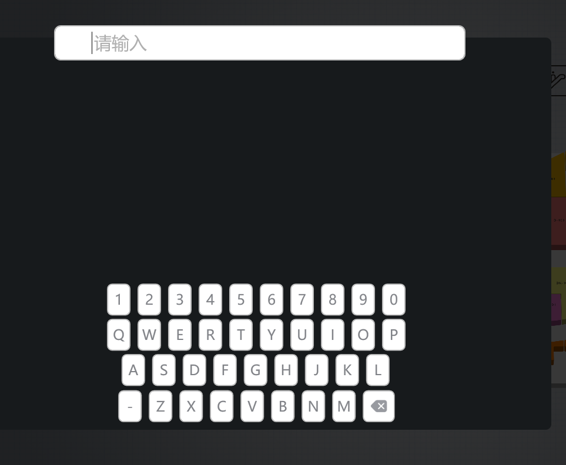

# 搜索控件（KeyboardSearchElement）

## 控件作用

在页面生成可输入的搜索框和键盘


## 控件UI效果



## 配置文件样例

```
      <KeyboardSearchElement>
        <UIDisplay Left="488" Top="176" Width="906" Height="433" IsShow="True" ZIndex="8"
          UsePercent="False" />
        <ClickEvent>
          UITextChanged?NewText={$KeyboardInputText}&amp;Filter=Chinese&amp;TargetPageName=HomePage&amp;TargetControlName=ParkingSearch</ClickEvent>
        <FocusEvent>
          PopupEvent?TargetPageName=SearchPage&amp;TargetControlName=ParkingSearch&amp;EventID=Keyboard&amp;UriKind=Application&amp;EventPath=Shell\Pages\SearchPage\PopItems</FocusEvent>
        <CustomerConfig>
          <Search HintText="请输入" TextBoxX="0" TextBoxY="0" KeyboardX="90" KeyboardY="440"></Search>
        </CustomerConfig>
      </KeyboardSearchElement>

```

## 配置说明

### 节点CustomerConfig

	属性说明

		HintText:输入框在未输入时里的默认文字

		TextBoxX：调整输入框X轴位置；

		TextBoxY：调整输入框Y轴位置；

		KeyboardX：调整键盘X轴位置；

        KeyboardY：调整键盘Y轴位置

