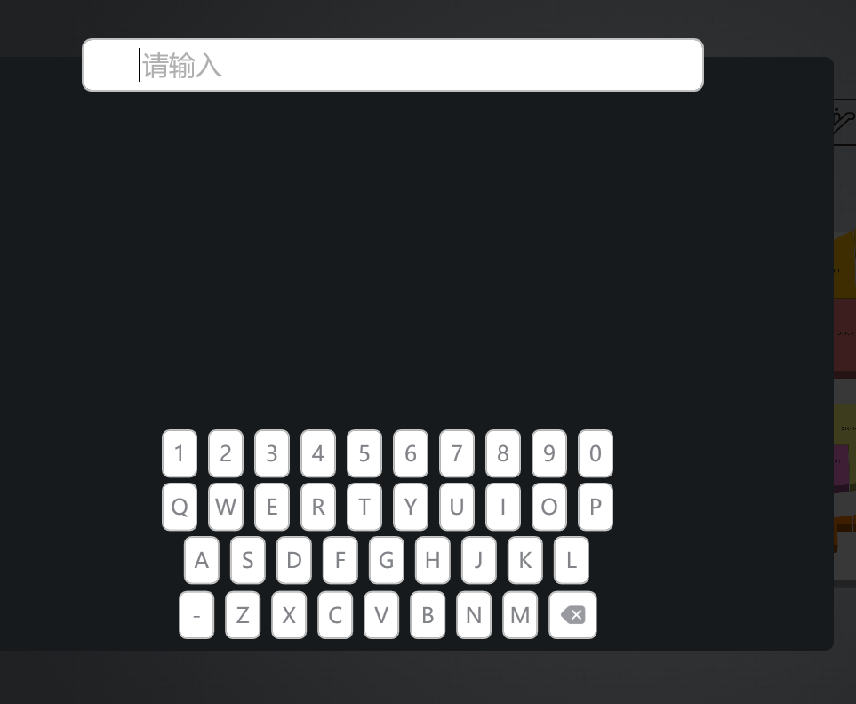

# 搜索控件（KeyboardSearchElement）

## 1.控件作用

搜索控件用于在页面上生成可输入的搜索框和虚拟键盘，用户可以通过虚拟键盘输入文字并触发搜索事件。常用于查询页面、搜索功能、信息检索等场景。

## 2.适用场景

- 展厅查询机搜索页面
- 产品信息检索
- 停车场、地图、人员信息搜索
- 需要用户输入关键词并过滤结果的场景

## 3.前置依赖

使用搜索控件前，必须满足以下条件：

1. 项目目录中存在 `UI.Common.dll`（或 `UI.Keyboard.dll`，以实际项目为准）；
2. 在 `SysConfig/UIControlDict.xml` 中注册 `KeyboardSearchElement`；
3. 页面中存在需要接收搜索结果的控件（如列表、表格等）。

## 4.控件UI效果



## 5.配置文件样例

```xml
      <KeyboardSearchElement>
        <UIDisplay Left="488" Top="176" Width="906" Height="433" IsShow="True" ZIndex="8"
          UsePercent="False" />
           <!--点击搜索或输入变化时触发-->
        <ClickEvent>
          UITextChanged?NewText={$KeyboardInputText}&Filter=Chinese&TargetPageName=HomePage&TargetControlName=ParkingSearch</ClickEvent>
              <!--获取焦点时触发，通常用于弹出搜索页面-->
        <FocusEvent>
          PopupEvent?TargetPageName=SearchPage&TargetControlName=ParkingSearch&EventID=Keyboard&UriKind=Application&EventPath=Shell\Pages\SearchPage\PopItems</FocusEvent>
        <CustomerConfig>
          <Search HintText="请输入" TextBoxX="0" TextBoxY="0" KeyboardX="90" KeyboardY="440"></Search>
        </CustomerConfig>
      </KeyboardSearchElement>

```

## 6.UIDisplay 说明

`UIDisplay` 用法参考 [CommonElement.md](CommonElement.md)。针对搜索控件：

- `Width` / `Height`：定义搜索控件的整体显示区域；
- `ZIndex`：搜索框和键盘通常需要显示在较高层级；
- `UsePercent`：若需要按父容器百分比布局，可设为 `True`。

## 7.事件说明

### 7.1ClickEvent

当用户点击搜索按钮或输入内容发生变化时触发。

```xml
<ClickEvent>UITextChanged?NewText={$KeyboardInputText}&Filter=Chinese&TargetPageName=HomePage&TargetControlName=ParkingSearch</ClickEvent>
```

| 参数                | 说明                                                     | 示例                   |
| ------------------- | -------------------------------------------------------- | ---------------------- | --- |
| `NewText`           | 当前输入框中的文本，通过 `{$KeyboardInputText}` 变量获取 | `{$KeyboardInputText}` |     |
| `Filter`            | 过滤条件或输入类型限制                                   | `Chinese`              |
| `TargetPageName`    | 接收搜索事件的页面名称                                   | `HomePage`             |
| `TargetControlName` | 接收搜索事件的目标控件名称                               | `ParkingSearch`        |

### 7.2FocusEvent

当搜索框获取焦点时触发，常用于弹出搜索页面或展开键盘。

```xml
<FocusEvent>PopupEvent?TargetPageName=SearchPage&TargetControlName=ParkingSearch&EventID=Keyboard&UriKind=Application&EventPath=Shell\Pages\SearchPage\PopItems</FocusEvent>
```

| 参数                | 说明         | 示例                              |
| ------------------- | ------------ | --------------------------------- |
| `TargetPageName`    | 弹出页面名称 | `SearchPage`                      |
| `TargetControlName` | 弹出控件名称 | `ParkingSearch`                   |
| `EventID`           | 事件标识     | `Keyboard`                        |
| `UriKind`           | 路径解析方式 | `Application`                     |
| `EventPath`         | 弹出项路径   | `Shell\Pages\SearchPage\PopItems` |

## 8.CustomerConfig 参数说明

### 8.1Search 节点

| 属性        | 必填 | 说明                         | 示例     |
| ----------- | ---- | ---------------------------- | -------- |
| `HintText`  | 否   | 输入框未输入时的默认提示文字 | `请输入` |
| `TextBoxX`  | 否   | 输入框相对于控件的 X 轴位置  | `0`      |
| `TextBoxY`  | 否   | 输入框相对于控件的 Y 轴位置  | `0`      |
| `KeyboardX` | 否   | 键盘相对于控件的 X 轴位置    | `90`     |
| `KeyboardY` | 否   | 键盘相对于控件的 Y 轴位置    | `440`    |

### 8.2属性说明

- **HintText**：输入框为空时显示的提示文字，用于引导用户输入。
- **TextBoxX / TextBoxY**：调整搜索输入框在控件区域内的位置。
- **KeyboardX / KeyboardY**：调整虚拟键盘在控件区域内的位置。

## 9.UIControlDict.xml 添加搜索控件

如果使用搜索控件，需要在 `UIControlDict.xml` 中添加注册节点。不同版本可能使用不同 DLL：

1.注册方式一（UI.Common.dll）

```xml
<!--UI.Common 控件包-->
<Element ViewType="KeyboardSearchElement" AssemblyFile="UI.Common.dll" TypeName="UI.Common.SensingControl.KeyboardSearchControl, UI.Common, Version=1.0.0.0, Culture=neutral, PublicKeyToken=null">
    <DataContext AssemblyFile="UI.Common.dll" TypeName="UI.Common.SensingView.KeyboardSearchViewModel, UI.Common, Version=1.0.0.0, Culture=neutral, PublicKeyToken=null" />
</Element>
```

2.注册方式二（UI.Keyboard.dll）

```xml
<!--UI.Keyboard 控件包-->
<Element ViewType="KeyboardSearchElement" AssemblyFile="UI.Keyboard.dll" TypeName="UI.Keyboard.KeyboardSearchControl, UI.Keyboard, Version=1.0.0.0, Culture=neutral, PublicKeyToken=null">
    <DataContext AssemblyFile="UI.Keyboard.dll" TypeName="UI.Keyboard.KeyboardSearchViewModel, UI.Keyboard, Version=1.0.0.0, Culture=neutral, PublicKeyToken=null" />
</Element>
```

> 注：`TypeName` 中的具体类名以实际 DLL 中的类型为准。

## 10.部署说明

1. 确认项目目录中存在对应 DLL（`UI.Common.dll` 或 `UI.Keyboard.dll`）；
2. 在 `SysConfig/UIControlDict.xml` 中添加上方注册节点；
3. 在页面 XML 中使用 `KeyboardSearchElement`，配置 `UIDisplay`、`ClickEvent`、`FocusEvent` 和 `CustomerConfig`；
4. 在目标页面或控件中处理 `UITextChanged` 事件，实现搜索过滤逻辑。

## 11.常见问题

### 搜索框不显示

- 检查 `UIDisplay` 的 `IsShow` 是否为 `True`；
- 检查 `UIControlDict.xml` 中的注册信息是否正确；
- 检查对应 DLL 是否存在于应用根目录。

### 虚拟键盘不弹出

- 检查 `FocusEvent` 是否配置正确；
- 检查 `Search` 节点的 `KeyboardX`、`KeyboardY` 是否超出了控件区域；
- 检查 `ZIndex` 是否过低导致键盘被遮挡。

### 输入内容没有触发搜索

- 检查 `ClickEvent` 是否为 `UITextChanged`；
- 检查 `NewText` 参数是否使用了 `{$KeyboardInputText}`；
- 检查 `TargetPageName` 和 `TargetControlName` 是否正确。

### 搜索结果不对

- 检查目标控件是否正确处理了 `UITextChanged` 事件；
- 检查 `Filter` 参数是否配置正确；
- 检查搜索逻辑是否根据 `NewText` 正确过滤数据。

### 键盘位置偏移

- 调整 `Search` 节点的 `KeyboardX` 和 `KeyboardY`；
- 检查 `UIDisplay` 的 `Width` 和 `Height` 是否足够容纳键盘。

## 12.注意事项

- 搜索控件通常与 `KeyBoardElement` 或内置虚拟键盘配合使用；
- `ClickEvent` 和 `FocusEvent` 中的 `&` 必须转义为 `&amp;`；
- 建议为搜索框和目标结果控件配置合适的 `Name`，便于事件关联；
- 不同版本的搜索控件支持的参数可能略有差异。
