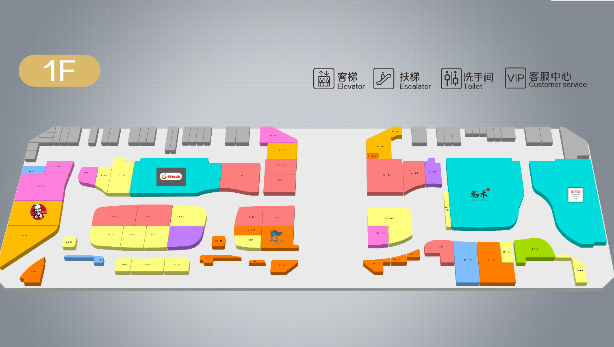

# 楼层Map控件（MapElement）

## 1.控件作用

楼层地图控件用于展示楼宇、商场、园区等场景的楼层平面图，并在地图上标注不同类型的房间或设施（如店铺、洗手间、电梯、扶梯等）。支持根据数据动态生成地图标记，点击标记可触发弹出详情或导航等事件。

地图控件通常与 `FloorsElement` 楼层控件配合使用，通过 `FloorIndexChangedEvent` 事件切换不同楼层的地图内容。

## 2.适用场景

- 商场楼层导览
- 楼宇办公室分布展示
- 园区地图导航
- 展厅空间布局展示

## 3.前置依赖

使用楼层地图控件前，必须满足以下条件：

1. 项目目录中存在 `UI.Common.dll`；
2. 在 `SysConfig/UIControlDict.xml` 中注册 `MapElement`；
3. 如需动态加载内容，需在 `Shell/Data/Data.xml` 中配置数据源并在页面中使用 `DataProvider`；
4. 若使用 `CustomerElement` 作为模板，需确认该控件已注册；
5. 若需要楼层切换，需配合 `FloorsElement` 使用。

## 4.控件UI效果



## 5.配置文件样例

```xml
<MapElement Name="map">
      <UIDisplay Left="376" Top="0" Width="1540" Height="1080" IsShow="True" ZIndex="2"
        UsePercent="False" />
      <DataProvider>wyfData?CSTable=FloorRooms</DataProvider>
      <Items>
  <!--店铺类型模板-->
        <Template TemplateSelection="RoomType=Store">
          <XYContainerElement>
            <UIDisplay Left="20" Top="100" Width="245" Height="205" IsShow="True" ZIndex="1"
              UsePercent="False" />
            <Controls>
              <ImageElement>
                <UIDisplay Left="0" Top="0" Width="245" Height="205" IsShow="True" ZIndex="1"
                  UsePercent="False" />
                <ImageSource UriKind="Application">Shell\Pages\HomePage\resource\logoImg_bg.png</ImageSource>
              </ImageElement>
              <ImageButton>
                <UIDisplay Left="0" Top="0" Width="245" Height="205" IsShow="True" ZIndex="1"
                  UsePercent="False" />
                <ImageSource UriKind="Application">Shell\Data\wyfData\CacheData\{$StoreLogoUrl}</ImageSource>
                <ClickEvent>
                  PopupEvent?TargetPageName=HomePage&TargetControlName=BrandIntroPop&EffectName=ScaleClose&EventID=BrandIntroduce&UriKind=Application&EventPath=Shell\Pages\Common&Tittle={$StoreName}&StoreLogoUrl={$StoreLogoUrl}&ShowImage={$StoreImageUrl}&StoreContent={$StoreContent}&StoreId={$StoreId}&StoreShoppingHours={$StoreShoppingHours}&StoreContact={$StoreContact}&StoreFloorString={$StoreFloorString}&ParentLargeClassName={$ParentLargeClassName}&CategoryName={$CategoryName}&TargetStoreId={$StoreId}</ClickEvent>
              </ImageButton>
            </Controls>
          </XYContainerElement>
        </Template>
        <!--洗手间类型模板-->
        <Template TemplateSelection="RoomType=Toilet">
          <ImageButton>
            <UIDisplay Left="0" Top="170" Width="150" Height="150" IsShow="True" ZIndex="1"
              UsePercent="False" />
            <ImageSource UriKind="Application">Shell\Pages\HomePage\resource\公共设施图标png\洗手间.png</ImageSource>
            <ClickEvent>
              PopupEvent?TargetPageName=HomePage&TargetControlName=BrandIntroPop&EventID=Navigation&UriKind=Application&EventPath=Shell\Pages\HomePage\CategoryPopItems&TargetRoomId={$RoomId}</ClickEvent>
          </ImageButton>
        </Template>
             <!--电梯类型模板-->
        <Template TemplateSelection="RoomType=Elevator">
          <ImageElement>
            <UIDisplay Left="0" Top="200" Width="150" Height="150" IsShow="True" ZIndex="1"
              UsePercent="False" />
            <ImageSource UriKind="Application">Shell\Pages\HomePage\resource\公共设施图标png\直梯.png</ImageSource>
            <ClickEvent>
              PopupEvent?TargetPageName=HomePage&TargetControlName=BrandIntroPop&EventID=Navigation&UriKind=Application&EventPath=Shell\Pages\HomePage\CategoryPopItems&TargetRoomId={$RoomId}</ClickEvent>
          </ImageElement>
        </Template>
         <!--扶梯类型模板-->
        <Template TemplateSelection="RoomType=Ladder">
          <ImageElement>
            <UIDisplay Left="0" Top="200" Width="150" Height="150" IsShow="True" ZIndex="1"
              UsePercent="False" />
            <ImageSource UriKind="Application">Shell\Pages\HomePage\resource\公共设施图标png\扶梯.png</ImageSource>
            <ClickEvent>
              PopupEvent?TargetPageName=HomePage&TargetControlName=BrandIntroPop&EventID=Navigation&UriKind=Application&EventPath=Shell\Pages\HomePage\CategoryPopItems&TargetRoomId={$RoomId}</ClickEvent>
          </ImageElement>
        </Template>
        <Template TemplateSelection="RoomType=VerticalLadder">
          <ImageElement>
            <UIDisplay Left="0" Top="200" Width="150" Height="150" IsShow="True" ZIndex="1"
              UsePercent="False" />
            <ImageSource UriKind="Application">Shell\Pages\HomePage\resource\公共设施图标png\直梯.png</ImageSource>
            <ClickEvent>
              PopupEvent?TargetPageName=HomePage&TargetControlName=BrandIntroPop&EventID=Navigation&UriKind=Application&EventPath=Shell\Pages\HomePage\CategoryPopItems&TargetRoomId={$RoomId}</ClickEvent>
          </ImageElement>
        </Template>
          <!--自定义位置模板-->
        <Template TemplateSelection="RoomId=7">
          <CustomerElement>
            <UIDisplay Left="0" Top="0" Width="300" Height="300" IsShow="True" ZIndex="3"
              UsePercent="False" />
            <Activator AssemblyFile="weizhi" TypeName="weizhi.UserControl1" />
            <CustomerConfig>
              <Customer Scale="2"></Customer>
            </CustomerConfig>
          </CustomerElement>

        </Template>
      </Items>
      <CustomerConfig>
        <IconShell ShellWidth="128" ShellHeight="220"
          ShellImage="Shell\Pages\HomePage\resource\Kong.png" />
        <Map Width="6000" Height="2591" DefaultScale="0.25" MapLeft="0" MapTop="50"
          ShowAllIconScale="0.01" />
      </CustomerConfig>
    </MapElement>
```

## 6.UIDisplay 说明

`UIDisplay` 用法参考 [CommonElement.md](CommonElement.md)。针对楼层地图控件：

- `Width` / `Height`：定义地图在页面上的显示区域大小；
- `ZIndex`：注意地图与楼层按钮、弹出层等控件的层级关系；
- `UsePercent`：若需要按父容器百分比布局，可设为 `True`。

## 7.DataProvider 说明

通过 `DataProvider` 绑定数据源，数据源中的每一行会根据 `TemplateSelection` 条件匹配到对应的模板，生成地图上的一个标记。

```xml
<DataProvider>wyfData?CSTable=FloorRooms</DataProvider>
```

- `wyfData`：数据源实例名称，需在 `Shell/Data/Data.xml` 中定义；
- `CSTable=FloorRooms`：数据表/集合名称；
- 数据源中通常包含 `RoomType`、`RoomId`、`StoreLogoUrl`、`StoreName` 等字段。

## 8.Items 与 Template

### 8.1TemplateSelection

`TemplateSelection` 用于根据数据条件选择不同的模板。格式为 `字段名=值`。

| 示例                | 说明                         |
| ------------------- | ---------------------------- |
| `RoomType=Store`    | 房间类型为店铺时使用该模板   |
| `RoomType=Toilet`   | 房间类型为洗手间时使用该模板 |
| `RoomType=Elevator` | 房间类型为电梯时使用该模板   |
| `RoomId=7`          | 房间 ID 为 7 时使用该模板    |

### 8.2模板内容

模板内部可以放置 `ImageElement`、`ImageButton`、`XYContainerElement`、`CustomerElement` 等控件，用于自定义不同类型房间的显示样式和交互行为。

## 9.CustomerConfig 参数说明

### 9.1IconShell 节点

| 属性          | 必填 | 说明                 | 示例                                     |
| ------------- | ---- | -------------------- | ---------------------------------------- |
| `ShellWidth`  | 否   | 图标外壳宽度         | `128`                                    |
| `ShellHeight` | 否   | 图标外壳高度         | `220`                                    |
| `ShellImage`  | 否   | 图标外壳背景图片路径 | `Shell\Pages\HomePage\resource\Kong.png` |

### 9.2Map 节点

| 属性               | 必填 | 说明                     | 示例   |
| ------------------ | ---- | ------------------------ | ------ |
| `Width`            | 否   | 地图原始宽度             | `6000` |
| `Height`           | 否   | 地图原始高度             | `2591` |
| `DefaultScale`     | 否   | 默认缩放比例             | `0.25` |
| `MapLeft`          | 否   | 地图在显示区域中的左边距 | `0`    |
| `MapTop`           | 否   | 地图在显示区域中的上边距 | `50`   |
| `ShowAllIconScale` | 否   | 显示所有图标时的缩放比例 | `0.01` |

### 9.3属性说明

- **IconShell**：定义地图上标记图标的外壳样式。
- **Map**：定义地图的整体尺寸、默认缩放和位置。
- **DefaultScale**：地图初始显示时的缩放比例，数值越小显示范围越大。
- **ShowAllIconScale**：缩放到该比例时显示所有图标。

## 10.楼层切换事件

地图控件通常接收来自 `FloorsElement` 的 `FloorIndexChangedEvent` 事件来切换楼层。

```xml
<!--FloorsElement 中的楼层切换事件-->
<Event>FloorIndexChangedEvent?TargetPageName=HomePage&TargetControlName=map&FloorId={$Id}</Event>
```

| 参数                | 说明             | 示例       |
| ------------------- | ---------------- | ---------- |
| `TargetPageName`    | 目标页面名称     | `HomePage` |
| `TargetControlName` | 目标地图控件名称 | `map`      |
| `FloorId`           | 楼层 ID          | `{$Id}`    |

## 11.UIControlDict.xml 添加楼层地图控件

如果使用楼层地图控件，需要在 `UIControlDict.xml` 中添加注册节点：

```xml
<!--UI.Common 控件包-->
<Element ViewType="MapElement" AssemblyFile="UI.Common.dll" TypeName="UI.Common.SensingControl.MapControl, UI.Common, Version=1.0.0.0, Culture=neutral, PublicKeyToken=null">
    <DataContext AssemblyFile="UI.Common.dll" TypeName="UI.Common.SensingView.MapViewModel, UI.Common, Version=1.0.0.0, Culture=neutral, PublicKeyToken=null" />
</Element>
```

> 注：`TypeName` 中的具体类名以实际 DLL 中的类型为准。

## 12.部署说明

1. 确认项目目录中存在 `UI.Common.dll`；
2. 在 `SysConfig/UIControlDict.xml` 中注册 `MapElement`；
3. 如需动态数据，在 `Shell/Data/Data.xml` 中配置数据源，并在页面中使用 `DataProvider`；
4. 准备地图底图和各类房间图标资源；
5. 在页面 XML 中使用 `MapElement`，配置 `UIDisplay`、`DataProvider`、`Items` 和 `CustomerConfig`；
6. 如需楼层切换，配合使用 `FloorsElement` 并触发 `FloorIndexChangedEvent`。

## 13.常见问题

### 地图不显示

- 检查 `UIDisplay` 的 `IsShow` 是否为 `True`；
- 检查 `Map` 节点的 `Width`、`Height`、`DefaultScale` 是否配置正确；
- 检查 `UIControlDict.xml` 中的注册信息是否正确。

### 地图标记不显示

- 检查 `DataProvider` 中的数据源名称和表名是否正确；
- 检查 `TemplateSelection` 条件是否与数据匹配；
- 检查模板内部控件的 `ImageSource` 路径是否正确。

### 点击标记没有反应

- 检查 `ClickEvent` 是否正确；
- 检查事件 URL 中的 `&` 是否已转义为 `&amp;`；
- 检查目标页面和弹出控件是否存在。

### 楼层切换后地图内容没变

- 检查 `FloorsElement` 的 `FloorIndexChangedEvent` 是否正确发送到 `MapElement`；
- 检查 `TargetControlName` 是否与 `MapElement` 的 `Name` 一致；
- 检查数据源是否根据 `FloorId` 正确过滤。

### 地图缩放异常

- 调整 `Map` 节点的 `DefaultScale`；
- 检查 `Map` 的 `Width` 和 `Height` 是否与底图实际尺寸匹配；
- 检查 `ShowAllIconScale` 是否设置合理。

## 14.注意事项

- 地图控件通常需要较大的底图资源，注意图片压缩和加载性能；
- `TemplateSelection` 条件需要与数据源中的字段值完全匹配；
- 不同类型的房间建议使用不同的图标和交互方式；
- 楼层切换时需要确保 `FloorId` 与数据源中的楼层标识一致。
