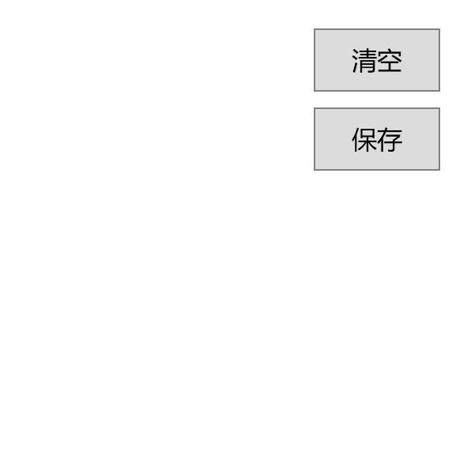

画图控件（PaintElement）

## 控件作用

在页面中生成绘画板画图。（目前不支持自定义配置背景板、颜色、保存路径等）

## 控件 UI 效果



## 配置文件样例

```xml
<PaintElement>
	<UIDisplay Left="0" Top="0" Width="300" Height="300" IsShow="True"  ZIndex="7" UsePercent="False" Opacity="1"/>

</PaintElement>

```

## 配置说明


## UIControlDict.xml 添加画图控件

如果使用画图控件则需要在 UIControlDict.xml 中添加画图控件，并且启用SensingData模块，并且通过AppPod配置软件

```
  <!-- 画图 -->
  <Element ViewType="PaintElement" AssemblyFile="UI.Paint.dll" TypeName="UI.Paint.PaintControl, UI.Paint, Version=1.0.0.0, Culture=neutral, PublicKeyToken=null">
	  <DataContext AssemblyFile="UI.Paint.dll" TypeName="UI.Paint.PaintControlViewModel, UI.Paint, Version=1.0.0.0, Culture=neutral, PublicKeyToken=null" />
  </Element>
```


