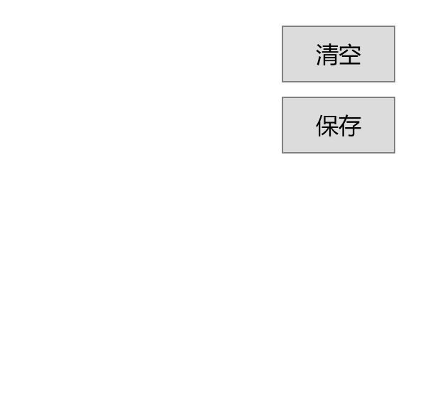

# 画图控件（PaintElement）

## 1.控件作用

画图控件用于在页面中生成一个绘画板，用户可以通过鼠标或触摸设备进行自由绘画、签名等操作。（目前不支持自定义配置背景板、颜色、保存路径等）

## 2.适用场景

- 签名板
- 涂鸦绘画
- 互动留言板
- 电子白板
- 手写输入

## 3.前置依赖

使用画图控件前，必须满足以下条件：

1. 项目目录中存在 `UI.Paint.dll`；
2. 在 `SysConfig/UIControlDict.xml` 中注册 `PaintElement`；
3. 在 `TronSensingShow.dll.config` 中启用 `SensingData` 模块（如需要）；
4. 通过 AppPod 配置软件完成相关配置（如需要）。

## 4.控件 UI 效果



## 5.配置文件样例

```xml
<PaintElement>
	<UIDisplay Left="-100" Top="0" Width="300" Height="300" IsShow="True" ZIndex="7" UsePercent="False" Opacity="1"/>

	<CustomerConfig>
		 <!--整体画布背景（颜色或图片）-->
		<Background Type="Color" Value="Red" />

		 <!--墨迹区域（InkCanvas）位置与默认画笔-->
		<InkPanel>
			<DefaultPen Color="#FF000000" Width="6" Height="6" Pressure="0.35" />
		</InkPanel>

		 <!--清空按钮-->
		<ClearButton IsShow="True" ZIndex="100">
			<Position Left="Auto" Right="30" Top="20" />
			<Size Width="100" Height="45" />
			<Style
			  Content="清空画布"
			  FontSize="16"
			  FontFamily="微软雅黑"
			  Background="#FFE8E8E8"
			  Foreground="#FF333333"
			  BorderThickness="1"
			  BorderColor="#FF999999"/>
		</ClearButton>

		 <!--保存按钮-->
		<SaveButton IsShow="True" ZIndex="100">
			<Position Left="Auto" Right="30" Top="80" />
			<Size Width="100" Height="45" />
			<Style
			  Content="保存签名"
			  FontSize="16"
			  FontFamily="微软雅黑"
			  Background="#FFD0F0D0"
			  Foreground="#FF006600"
			  BorderThickness="1"
			  BorderColor="#FF88CC88"/>
		</SaveButton>

		 <!--保存设置-->
		<SaveSettings>
			<Folder>Desktop\画板签名</Folder>
			<FilePrefix>签名_</FilePrefix>
			<Extension>.png</Extension>
			<ShowMessageAfterSave>true</ShowMessageAfterSave>
		</SaveSettings>

	</CustomerConfig>
</PaintElement>

```

## 6.UIDisplay 说明

`UIDisplay` 用法参考 [CommonElement.md](CommonElement.md)。

## 7.CustomerConfig 参数说明

### 7.1Background(画板背景)

| 属性    | 必填 | 说明                                                                       | 示例               |
| ------- | ---- | -------------------------------------------------------------------------- | ------------------ |
| `Type`  | 否   | 背景类型，支持 `Color` 和 `Image`                                          | `Color`            |
| `Value` | 否   | 背景值。`Type="Color"` 时为颜色名称或 `#ARGB`；`Type="Image"` 时为图片路径 | `Red`、`#FFFFFFFF` |

### 7.2 InkPanel(墨迹)

    DefaultPen：默认画笔，可以配置Color(颜色)、Width(画笔水平宽度)、Height(画笔垂直高度)、Pressure(影响粗细变化)

| 属性       | 必填 | 说明                           | 示例        |
| ---------- | ---- | ------------------------------ | ----------- |
| `Color`    | 否   | 画笔颜色                       | `#FF000000` |
| `Width`    | 否   | 画笔水平宽度                   | `6`         |
| `Height`   | 否   | 画笔垂直高度                   | `6`         |
| `Pressure` | 否   | 压力感应系数，影响线条粗细变化 | `0.35`      |

### 7.3 ClearButton/SaveButton(清除/保存按钮)

| 属性     | 必填 | 说明         | 示例   |
| -------- | ---- | ------------ | ------ |
| `IsShow` | 否   | 是否显示按钮 | `True` |
| `ZIndex` | 否   | 按钮层级     | `100`  |

### 7.4Position

| 属性    | 必填 | 说明                      | 示例   |
| ------- | ---- | ------------------------- | ------ |
| `Left`  | 否   | 左边距，`Auto` 表示不设置 | `Auto` |
| `Right` | 否   | 右边距                    | `30`   |
| `Top`   | 否   | 上边距                    | `20`   |

### 7.5Size

| 属性     | 必填 | 说明     | 示例  |
| -------- | ---- | -------- | ----- |
| `Width`  | 否   | 按钮宽度 | `100` |
| `Height` | 否   | 按钮高度 | `45`  |

### 7.6 Style 节点

| 属性              | 必填 | 说明       | 示例        |
| ----------------- | ---- | ---------- | ----------- |
| `Content`         | 否   | 按钮文字   | `清空画布`  |
| `FontSize`        | 否   | 字体大小   | `16`        |
| `FontFamily`      | 否   | 字体       | `微软雅黑`  |
| `Background`      | 否   | 按钮背景色 | `#FFE8E8E8` |
| `Foreground`      | 否   | 文字颜色   | `#FF333333` |
| `BorderThickness` | 否   | 边框粗细   | `1`         |
| `BorderColor`     | 否   | 边框颜色   | `#FF999999` |

### 7.7SaveSettings

| 子节点                 | 说明               | 示例               |
| ---------------------- | ------------------ | ------------------ |
| `Folder`               | 保存文件夹路径     | `Desktop\画板签名` |
| `FilePrefix`           | 文件名前缀         | `签名_`            |
| `Extension`            | 文件扩展名         | `.png`             |
| `ShowMessageAfterSave` | 保存后是否弹出提示 | `true`             |

## 8.UIControlDict.xml 添加画图控件

如果使用画图控件，需要在 `UIControlDict.xml` 中添加注册节点：

```
  <!-- 画图 -->
  <Element ViewType="PaintElement" AssemblyFile="UI.Paint.dll" TypeName="UI.Paint.PaintControl, UI.Paint, Version=1.0.0.0, Culture=neutral, PublicKeyToken=null">
	  <DataContext AssemblyFile="UI.Paint.dll" TypeName="UI.Paint.PaintControlViewModel, UI.Paint, Version=1.0.0.0, Culture=neutral, PublicKeyToken=null" />
  </Element>
```

## 9.SensingData 模块与 AppPod 配置

部分版本的画图控件可能需要 `SensingData` 模块支持，并通过 AppPod 配置软件进行配置。请在 `TronSensingShow.dll.config` 中启用：

```xml
<modules>
  <!--其他模块-->
  <module name="SensingData" assembly="Module.SensingData.dll" />
</modules>
```

> 模块的 exact 名称和 DLL 名称以实际项目为准。

## 10.部署说明

1. 将 `UI.Paint.dll` 复制到应用根目录（与 `TronSensingShow.exe` 同级）；
2. 在 `SysConfig/UIControlDict.xml` 中添加上方注册节点；
3. 如需动态数据，在 `TronSensingShow.dll.config` 中启用 `SensingData` 模块，并通过 AppPod 配置；
4. 在页面 XML 中使用 `PaintElement`，配置 `UIDisplay` 和 `CustomerConfig`。

## 11.常见问题

### 画板不显示

- 检查 `UIDisplay` 的 `IsShow` 是否为 `True`；
- 检查 `UI.Paint.dll` 是否存在于应用根目录；
- 检查 `UIControlDict.xml` 中的注册信息是否正确。

### 无法绘画

- 检查 `InkPanel` 是否配置正确；
- 检查是否有上层控件拦截了触摸或鼠标事件；
- 检查 `UIDisplay` 的 `Width` 和 `Height` 是否足够大。

### 画笔颜色/粗细不对

- 检查 `DefaultPen` 的 `Color`、`Width`、`Height` 是否配置正确；
- 检查 `Pressure` 是否设置过大或过小。

### 保存失败

- 检查 `SaveSettings` 中的 `Folder` 路径是否存在；
- 检查应用是否有写入权限；
- 检查 `Extension` 是否配置正确。

### 清空/保存按钮不显示

- 检查 `ClearButton` / `SaveButton` 的 `IsShow` 是否为 `True`；
- 检查 `Position` 和 `Size` 是否配置正确；
- 检查 `ZIndex` 是否过低导致被遮挡。

### 背景不显示

- 检查 `Background` 的 `Type` 和 `Value` 是否配置正确；
- 如果 `Type="Image"`，检查图片路径是否正确。

## 12.注意事项

- 画图控件的保存路径需要应用具有写入权限；
- 画板尺寸建议根据实际屏幕分辨率合理设置；
- 按钮的 `Left="Auto"` 表示不设置左边距，此时通常需要配置 `Right`；
- 不同版本的画图控件支持的配置参数可能不同。
