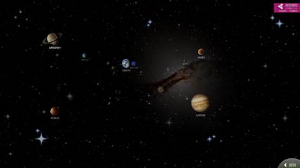

# 幻影墙控件（PerspectiveWallElement）

## 1.控件作用

幻影墙控件主要用于展示历史事件或时间轴内容，通过多层叠加和透视效果使内容富有层级感和立体感，给人一种魔幻般的视觉体验。

## 2.适用场景

- 企业发展历程展示
- 历史事件时间轴
- 产品演进阶段展示
- 展厅沉浸式内容展示

## 3.前置依赖

使用幻影墙控件前，必须满足以下条件：

1. 项目目录中存在 `UI.PerspectiveWall.dll`；
2. 在 `SysConfig/UIControlDict.xml` 中注册 `PerspectiveWallElement`；
3. 如需动态加载内容，需在 `Shell/Data/Data.xml` 中配置数据源并在页面中使用 `DataProvider`；
4. 需要在页面同级目录下新建 `PWall\Template\Template01.xml` 文件。

## 4.控件 UI 效果



## 5.配置文件样例

```xml
<PerspectiveWallElement Name="PWall">
	<UIDisplay Left="0" Top="0" Width="1920" Height="1080" IsShow="True" ZIndex="1" UsePercent="False" />
	<DataProvider>PWallData?CSTable=PWall</DataProvider>
	<Items>
		<Template>
			<ImageButton>
				<UIDisplay Left="100" Top="100" Width="300" Height="225" IsShow="True" ZIndex="1" UsePercent="False" />
				<ImageSource UriKind="Absolute">{$ImagePath}</ImageSource>
				<ClickEvent>PopupEvent?X=300&Y=300&Height=630&Width=1120&EventID={$EventID}&UriKind=Application&EventPath={$EventDirection}</ClickEvent>
			</ImageButton>
		</Template>
	</Items>
	<CustomerConfig>
		       <!--
            MaxLayer: 纵深层数（可见为层数-1，最小不能小于2）
            MaxCountPerLayer: 每层的事件数（不能小于1）
            Distance: 层间距（最小不能少于 ZoomStep 的3倍，否则可能无法出现层次）
            Detal: Idle 动画每帧位移
            CardDistance: 事件间距（建议500不要修改）
            CardWidth: 事件宽度
            CardHeight: 事件高度
            ZoomStep: 层切换步进
            OriginX、OriginY: 定义中心点
            IdleAnimeStep: 空闲动画步进
            IdleTime: 空闲时间，单位毫秒
        -->
		<PerspectiveWall MaxLayer="8" MaxCountPerLayer="4" Distance="600.0" CardDistance="500.0" Detal="300.0" CardWidth="600" CardHeight="400" ZoomStep="40.0" OriginX="960.0" OriginY="540.0" IdleAnimeStep="6" IdleTime="10000">
			<!-- 摄像机Z轴位置（可以为正，也可以为负值，但是数值建议不要更改），PositionX和PositionY摄像机平面位置，CameraField视角（相对于中心点的角度） -->
			<ViewCamera ViewingDistance="-1000.0" PositionX="0.0" PositionY="300.0" CameraField="120">
			<Surface SkipTime="50">
			<!-- 是否自动播放，IdleTime为在规定时间内没人操作将进行自动播放，单位为毫秒，Step为速度，正值为从前向后，负值为从后向前 -->
			<AutoPlay IdleTime="10000" Step="-6">
		</PerspectiveWall>
	</CustomerConfig>
</PerspectiveWallElement>

```

Template01.xml 配置：

在页面同级目录下新建 `PWall\Template\Template01.xml`，内容示例如下：

```xml
<Root>
	<!-- Left为距左边框距离 Top距上边框距离 Width宽度 Height高度 -->
	<Rect Left="0.0" Top="0.0" Width="960" Height="540">
	</Rect>
	<Rect Left="960.0" Top="0.0" Width="960" Height="540">
	</Rect>
	<Rect Left="0.0" Top="540.0" Width="640" Height="540">
	</Rect>
	<Rect Left="640.0" Top="540.0" Width="640" Height="540">
	</Rect>
	<Rect Left="1280.0" Top="540.0" Width="640" Height="540">
	</Rect>
</Root>

```

## 6.UIDisplay 说明

`UIDisplay` 用法参考 [CommonElement.md](CommonElement.md)

## 7.DataProvider 与 Items

### 7.1动态数据源模式

通过 `DataProvider` 绑定数据源，数据源中的每一行会生成幻影墙上的一个事件卡片。

```xml
<DataProvider>PWallData?CSTable=PWall</DataProvider>
```

- `PWallData`：数据源实例名称，需在 `Shell/Data/Data.xml` 中定义；
- `CSTable=PWall`：数据表/集合名称；
- `Template` 中的 `{$ImagePath}`、`{$EventID}`、`{$EventDirection}` 等变量需与数据源中的列名一致。

### 7.2Template

`Items` 内使用 `Template` 作为事件卡片的模板。模板内部通常放置 `ImageButton`，用于显示图片并响应点击事件。

## 8.CustomerConfig 参数说明

### 8.1PerspectiveWall 节点

| 属性               | 必填 | 说明                                                            | 示例    |
| ------------------ | ---- | --------------------------------------------------------------- | ------- |
| `MaxLayer`         | 是   | 纵深层数。可见层数为 `MaxLayer - 1`，最小不能小于 2             | `8`     |
| `MaxCountPerLayer` | 是   | 每层的事件数，不能小于 1                                        | `4`     |
| `Distance`         | 是   | 层间距，最小不能少于 `ZoomStep` 的 3 倍，否则可能无法出现层次； | `600.0` |
| `CardDistance`     | 是   | 事件间距，建议保持 500                                          | `500.0` |
| `Detal`            | 是   | Idle 动画每帧位移                                               | `300.0` |
| `CardWidth`        | 是   | 事件卡片宽度                                                    | `600`   |
| `CardHeight`       | 是   | 事件卡片高度                                                    | `400`   |
| `ZoomStep`         | 是   | 层切换步进                                                      | `40.0`  |
| `OriginX`          | 是   | 中心点 X 坐标                                                   | `960.0` |
| `OriginY`          | 是   | 中心点 Y 坐标                                                   | `540.0` |
| `IdleAnimeStep`    | 否   | 空闲动画步进                                                    | `6`     |
| `IdleTime`         | 否   | 空闲时间，单位毫秒                                              | `10000` |

### 8.2ViewCamera 节点

| 属性              | 必填 | 说明                                                  | 示例      |
| ----------------- | ---- | ----------------------------------------------------- | --------- |
| `ViewingDistance` | 是   | 摄像机 Z 轴位置，可以为正，也可以为负值，建议不要更改 | `-1000.0` |
| `PositionX`       | 是   | 摄像机平面 X 位置                                     | `0.0`     |
| `PositionY`       | 是   | 摄像机平面 Y 位置                                     | `300.0`   |
| `CameraField`     | 是   | 视角，相对于中心点的角度                              | `120`     |

### 8.3Surface 节点

| 属性       | 必填 | 说明                         | 示例 |
| ---------- | ---- | ---------------------------- | ---- |
| `SkipTime` | 否   | 跳过时间或切换间隔，单位毫秒 | `50` |

### 8.4AutoPlay 节点

| 属性       | 必填 | 说明                                     | 示例    |
| ---------- | ---- | ---------------------------------------- | ------- |
| `IdleTime` | 否   | 用户无操作后自动播放的等待时间，单位毫秒 | `10000` |
| `Step`     | 否   | 自动播放速度。正值从前向后，负值从后向前 | `-6`    |

## 9.文件目录结构

使用幻影墙控件时，需要在页面同级目录下建立如下结构：

```
Pages/
└── YourPage/
    ├── YourPage.xml          # 页面主配置文件
    └── PWall/
        └── Template/
            └── Template01.xml  # 幻影墙布局模板文件
```

## 10.UIControlDict.xml 添加幻影墙控件

如果使用幻影墙控件，需要在 `UIControlDict.xml` 中添加注册节点：

```xml
<!--UI.PerspectiveWall 控件包-->
<Element ViewType="PerspectiveWallElement" AssemblyFile="UI.PerspectiveWall.dll" TypeName="UI.PerspectiveWall.PWallControl, UI.PerspectiveWall, Version=1.0.0.0, Culture=neutral, PublicKeyToken=null">
    <DataContext AssemblyFile="UI.PerspectiveWall.dll" TypeName="UI.PerspectiveWall.PWallControlViewModel, UI.PerspectiveWall, Version=1.0.0.0, Culture=neutral, PublicKeyToken=null" />
</Element>
<!--UI.PerspectiveWall End-->
```

## 11.部署说明

1. 将 `UI.PerspectiveWall.dll` 复制到应用根目录（与 `TronSensingShow.exe` 同级）；
2. 在 `SysConfig/UIControlDict.xml` 中添加上方注册节点；
3. 如需动态数据，在 `Shell/Data/Data.xml` 中配置数据源，并在页面中使用 `DataProvider`；
4. 在页面同级目录下创建 `PWall\Template\Template01.xml` 文件；
5. 在页面 XML 中使用 `PerspectiveWallElement`，配置 `UIDisplay`、`DataProvider`、`Items` 和 `CustomerConfig`。

## 12.常见问题

### 幻影墙不显示

- 检查 `UI.PerspectiveWall.dll` 是否存在于应用根目录；
- 检查 `UIControlDict.xml` 中的注册信息是否正确；
- 检查 `UIDisplay` 的 `IsShow` 是否为 `True`。

### 事件卡片不显示

- 检查 `DataProvider` 中的数据源名称和表名是否正确；
- 检查 `ImageSource` 的 `UriKind` 和路径是否正确；
- 检查 `Template01.xml` 文件是否存在且路径正确。

### 没有透视层次感

- 检查 `Distance` 是否大于等于 `ZoomStep` 的 3 倍；
- 检查 `MaxLayer` 是否大于等于 2；
- 调整 `ViewCamera` 的 `CameraField` 和 `ViewingDistance`。

### 点击卡片没有反应

- 检查 `ClickEvent` 是否正确；
- 检查事件 URL 中的 `&` 是否已转义为 `&amp;`；
- 检查 `EventID` 和 `EventPath` 变量是否正确绑定。

### 自动播放不生效

- 检查 `AutoPlay` 的 `IdleTime` 是否设置合理；
- 检查 `Step` 是否不为 0；
- 检查用户交互后是否会暂停自动播放。

### Template01.xml 找不到

- 确认文件路径为 `PWall\Template\Template01.xml`，位于页面 XML 同级目录；
- 确认 `Template01.xml` 内容格式正确；
- 检查文件名大小写是否一致。

## 13.注意事项

- 幻影墙控件对 `Distance`、`ZoomStep`、`MaxLayer` 等参数敏感，建议按推荐值配置；
- `ViewingDistance` 建议保持默认值，不要随意更改；
- 图片资源建议使用合适分辨率，避免性能问题；
- `Template01.xml` 中的 `Rect` 定义了事件卡片的显示区域，需要根据实际屏幕分辨率调整。
