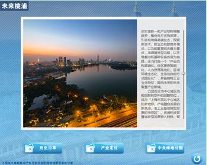

# 滚动条控件（ScrollViewElement）

## 控件作用

滚动条控件主要作用就是将无法在一页中全部显示的图片或者文字用滚动条的作用向下滚动翻看。可以配置点位，通过事件IndexChanged来驱动界面滚动到对应点位，并且到对应点位之后可以触发相关事件。


## 控件UI效果



## 配置文件样例

```
<ScrollViewElement>
    <UIDisplay Left="500" Top="600" Width="200" Height="400" IsShow="True" ZIndex="10" UsePercent="False" />
    <XYContainerElement>
        <UIDisplay Left="0" Top="0" Width="800" Height="500" />
        <Controls>
            <ImageElement>
                <UIDisplay Left="-20" Top="10" Width="965" Height="667" IsShow="True" ZIndex="2" UsePercent="False" />
                <ImageSource UriKind="Application">Shell\Pages\IntroPage\Items\Item1\resource\公司简介.png</ImageSource>
            </ImageElement>
        </Controls>
    </XYContainerElement>
    <CustomerConfig>
        <ThumbImage UriKind="Application" Width="33" Height="38">Shell\Pages\HomePage\resource\thumb.png</ThumbImage>
        <!-- thumb.png为滚动条上面的可拖动的图标，可根据具体的设计来更改 >
        <!-- AutoScroll是否自动滚动，默认为false   IsCanTouch 是否可以触摸滑动 Orientation 滑动方向-->
        <ScrollView Orientation = "Horizontal" ScrollWay="Horizontal" AutoScroll="false" IsCanTouch="false"/>
        <!-- 可以配置多个点位，通过事件可以让界面以一定的速度滑动到指定的点位，并且可以配置事件，滑动到指定点位的时候会触发事件 -->
        <!-- 还有初始化事件 ，以及初始化完成事件-->
        <PointManger Ip="192.168.0.7" Port="10000" Move="4" SweepInterval="20">
          <Init>

            <Event>ToDeviceDataEvent?Id=001&amp;Protocol=UDP&amp;Data=0000&amp;IsHex=True</Event>
            <Event>PopupEvent?TargetPageName=SlidingScreen&amp;TargetControlName=ShowPopItems3&amp;X=0&amp;Y=0&amp;Height=1920&amp;Width=1080&amp;EventID=init&amp;UriKind=Application&amp;EventPath=Shell\Pages\SlidingScreen\PopItems
            </Event>
            <!-- <Event>Control?TargetPageName=SlidingScreen&amp;TargetControlName=ShowPopItems4&amp;EventID=button&amp;From=1.0&amp;To=0.0</Event> -->

          </Init>
          <Inited>
            <Event>ClosePopup?TargetPageName=SlidingScreen&amp;TargetControlName=ShowPopItems3&amp;EventID=init
            </Event>

          </Inited>
          <Stop>
           <Event>ClosePopup?TargetPageName=SlidingScreen&amp;TargetControlName=ShowPopItems3&amp;EventID=transparent</Event>
          </Stop>

          <!-- <Point TargetDistance="0" Move="4" SweepInterval="20" Index="0" /> -->
          <Point TargetDistance="850" Move="1" SweepInterval="10" Index="1" Start= "900" End = "1077">
            <ClickEvent>
              <Event>PopupEvent?TargetPageName=SlidingScreen&amp;TargetControlName=ShowPopItems&amp;X=0&amp;Y=0&amp;Height=1080&amp;Width=1920&amp;EventID=2006&amp;UriKind=Application&amp;EventPath=Shell\Pages\SlidingScreen\PopItems
              </Event>
              <!-- <Event>ClosePopup?TargetPageName=SlidingScreen&amp;TargetControlName=ShowPopItems3&amp;EventID=transparent
              </Event> -->
              <Event>Control?TargetPageName=SlidingScreen&amp;TargetGroup=A&amp;TargetControlName=2006&amp;Action=Check
              </Event>
              <Event>SourceChanged?TargetControlName=2006&amp;UriKind=Project&amp;ImageSource=Pages\SlidingScreen\resource\透明.jpg</Event>
              <!-- <Event>Control?TargetPageName=SlidingScreen&amp;TargetControlName=ShowPopItems4&amp;EventID=button&amp;From=0.0&amp;To=1.0</Event> -->
            </ClickEvent>
            <QuictEvent>
              <Event>ClosePopup?TargetPageName=SlidingScreen&amp;TargetControlName=ShowPopItems&amp;EventID=2006
              </Event>
              <Event>Control?TargetPageName=SlidingScreen&amp;TargetGroup=A&amp;TargetControlName=2006&amp;Action=UnCheck
              </Event>
            </QuictEvent>
            <InputEvent>
              <!-- <Event>ToDeviceDataEvent?Id=001&amp;Protocol=UDP&amp;Data=02EE&amp;IsHex=True</Event> -->
              <!-- <Event>IndexChanged?TargetPageName=SlidingScreen&amp;TargetControlName=Items&amp;Move=ToIndex&amp;Index=1&amp;ToInput=false</Event> -->
              <Event>Control?TargetPageName=SlidingScreen&amp;TargetGroup=A&amp;TargetControlName=2006&amp;Action=Check</Event>
            </InputEvent>
          </Point>
          <!-- 2580 -->
          <Point TargetDistance="2750"  Move="1" SweepInterval="10" Index="2" Start= "2795" End = "2995">
            <ClickEvent>
              <Event>PopupEvent?TargetPageName=SlidingScreen&amp;TargetControlName=ShowPopItems&amp;X=0&amp;Y=0&amp;Height=1080&amp;Width=1920&amp;EventID=2011&amp;UriKind=Application&amp;EventPath=Shell\Pages\SlidingScreen\PopItems
              </Event>
              <!-- <Event>ClosePopup?TargetPageName=SlidingScreen&amp;TargetControlName=ShowPopItems3&amp;EventID=transparent
              </Event> -->
              <Event>Control?TargetPageName=SlidingScreen&amp;TargetGroup=A&amp;TargetControlName=2011&amp;Action=Check</Event>
              <!-- <Event>Control?TargetPageName=SlidingScreen&amp;TargetControlName=ShowPopItems4&amp;EventID=button&amp;From=0.0&amp;To=1.0</Event> -->
            </ClickEvent>
            <QuictEvent>
              <Event>ClosePopup?TargetPageName=SlidingScreen&amp;TargetControlName=ShowPopItems&amp;EventID=2011
              </Event>
              <Event>Control?TargetPageName=SlidingScreen&amp;TargetGroup=A&amp;TargetControlName=2011&amp;Action=UnCheck
              </Event>
            </QuictEvent>
            <InputEvent>
              <!-- <Event>ToDeviceDataEvent?Id=001&amp;Protocol=UDP&amp;Data=0992&amp;IsHex=True</Event> -->
              <!-- <Event>IndexChanged?TargetPageName=SlidingScreen&amp;TargetControlName=Items&amp;Move=ToIndex&amp;Index=2&amp;ToInput=false</Event> -->
              <Event>Control?TargetPageName=SlidingScreen&amp;TargetGroup=A&amp;TargetControlName=2011&amp;Action=Check</Event>
            </InputEvent>
          </Point>
         

          <!-- <Point TargetDistance="6000" Move="1" SweepInterval="20" Index="6" /> -->
        </PointManger>
    </CustomerConfig>
</ScrollViewElement>

```
## 配置说明

### 节点ThumbImage

        thumb.png为滚动条上面的可拖动的图标，可根据具体的设计来更改。
        ScrollView 界面滚动的相关配置，比如方向，是否可以触摸滑动等
        PointManger 点位配置，具体看注释

