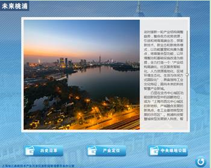

# 滚动条控件（ScrollViewElement）

## 1.控件作用

滚动条控件用于在页面中展示超出显示区域的内容，用户可以通过拖动或触摸滑动来滚动查看完整内容。控件支持配置滚动方向、自定义滚动条图标、自动滚动以及点位管理等功能。

通过 `IndexChanged` 事件，可以控制界面滚动到指定点位，并在到达点位时触发相关事件（如弹出窗口、发送设备指令等）。

## 2.适用场景

- 长图文内容滚动展示
- 图片列表横向/纵向滚动
- 需要精确控制滚动到指定位置的页面
- 滑动屏、时间轴、导览页面

## 3.前置依赖

使用滚动条控件前，必须满足以下条件：

1. 项目目录中存在 `UI.Common.dll`；
2. 在 `SysConfig/UIControlDict.xml` 中注册 `ScrollViewElement`；
3. 准备滚动内容（通常为 `XYContainerElement` 包裹的图片或文字）。

## 4.控件UI效果



## 5.配置文件样例

```xml
<ScrollViewElement>
    <UIDisplay Left="500" Top="600" Width="200" Height="400" IsShow="True" ZIndex="10" UsePercent="False" />
    <XYContainerElement>
     <!--滚动内容容器-->
        <UIDisplay Left="0" Top="0" Width="800" Height="500" />
        <Controls>
            <ImageElement>
                <UIDisplay Left="-20" Top="10" Width="965" Height="667" IsShow="True" ZIndex="2" UsePercent="False" />
                <ImageSource UriKind="Application">Shell\Pages\IntroPage\Items\Item1\resource\公司简介.png</ImageSource>
            </ImageElement>
        </Controls>
    </XYContainerElement>
    <CustomerConfig>
     <!--自定义滚动条图标-->
        <ThumbImage UriKind="Application" Width="33" Height="38">Shell\Pages\HomePage\resource\thumb.png</ThumbImage>
        <!-- thumb.png为滚动条上面的可拖动的图标，可根据具体的设计来更改
         AutoScroll是否自动滚动，默认为false   IsCanTouch 是否可以触摸滑动 Orientation 滑动方向-->
           <!--ScrollView: 滚动方向、自动滚动、触摸等配置-->
        <ScrollView Orientation = "Horizontal" ScrollWay="Horizontal" AutoScroll="false" IsCanTouch="false"/>
        <!-- 可以配置多个点位，通过事件可以让界面以一定的速度滑动到指定的点位，并且可以配置事件，滑动到指定点位的时候会触发事件 -->
          <!--PointManger: 点位管理配置
            Ip、Port: 网络配置（可选）
            Move: 默认移动速度
            SweepInterval: 默认滑动间隔，单位毫秒
        -->
        <PointManger Ip="192.168.0.7" Port="10000" Move="4" SweepInterval="20">
            <!--Init: 初始化事件-->
          <Init>
            <Event>ToDeviceDataEvent?Id=001&Protocol=UDP&Data=0000&IsHex=True</Event>
            <Event>PopupEvent?TargetPageName=SlidingScreen&TargetControlName=ShowPopItems3&X=0&Y=0&Height=1920&Width=1080&EventID=init&UriKind=Application&EventPath=Shell\Pages\SlidingScreen\PopItems
            </Event>
            <!-- <Event>Control?TargetPageName=SlidingScreen&TargetControlName=ShowPopItems4&EventID=button&From=1.0&To=0.0</Event> -->

          </Init>
          <!--Inited: 初始化完成事件-->
          <Inited>
            <Event>ClosePopup?TargetPageName=SlidingScreen&TargetControlName=ShowPopItems3&EventID=init
            </Event>

          </Inited>
           <!--Stop: 停止事件-->
          <Stop>
           <Event>ClosePopup?TargetPageName=SlidingScreen&TargetControlName=ShowPopItems3&EventID=transparent</Event>
          </Stop>

            <!--Point: 具体点位配置
                TargetDistance: 目标滚动距离
                Move: 移动到该点位的速度
                SweepInterval: 滑动间隔
                Index: 点位索引
                Start、End: 点位的有效范围
            -->
          <!-- <Point TargetDistance="0" Move="4" SweepInterval="20" Index="0" /> -->
          <Point TargetDistance="850" Move="1" SweepInterval="10" Index="1" Start= "900" End = "1077">
            <ClickEvent>
              <Event>PopupEvent?TargetPageName=SlidingScreen&TargetControlName=ShowPopItems&X=0&Y=0&Height=1080&Width=1920&EventID=2006&UriKind=Application&EventPath=Shell\Pages\SlidingScreen\PopItems
              </Event>
              <!-- <Event>ClosePopup?TargetPageName=SlidingScreen&TargetControlName=ShowPopItems3&EventID=transparent
              </Event> -->
              <Event>Control?TargetPageName=SlidingScreen&TargetGroup=A&TargetControlName=2006&Action=Check
              </Event>
              <Event>SourceChanged?TargetControlName=2006&UriKind=Project&ImageSource=Pages\SlidingScreen\resource\透明.jpg</Event>
              <!-- <Event>Control?TargetPageName=SlidingScreen&TargetControlName=ShowPopItems4&EventID=button&From=0.0&To=1.0</Event> -->
            </ClickEvent>
            <QuictEvent>
              <Event>ClosePopup?TargetPageName=SlidingScreen&TargetControlName=ShowPopItems&EventID=2006
              </Event>
              <Event>Control?TargetPageName=SlidingScreen&TargetGroup=A&TargetControlName=2006&Action=UnCheck
              </Event>
            </QuictEvent>
            <InputEvent>
              <!-- <Event>ToDeviceDataEvent?Id=001&Protocol=UDP&Data=02EE&IsHex=True</Event> -->
              <!-- <Event>IndexChanged?TargetPageName=SlidingScreen&TargetControlName=Items&Move=ToIndex&Index=1&ToInput=false</Event> -->
              <Event>Control?TargetPageName=SlidingScreen&TargetGroup=A&TargetControlName=2006&Action=Check</Event>
            </InputEvent>
          </Point>
          <!-- 2580 -->
          <Point TargetDistance="2750"  Move="1" SweepInterval="10" Index="2" Start= "2795" End = "2995">
            <ClickEvent>
              <Event>PopupEvent?TargetPageName=SlidingScreen&TargetControlName=ShowPopItems&X=0&Y=0&Height=1080&Width=1920&EventID=2011&UriKind=Application&EventPath=Shell\Pages\SlidingScreen\PopItems
              </Event>
              <!-- <Event>ClosePopup?TargetPageName=SlidingScreen&TargetControlName=ShowPopItems3&EventID=transparent
              </Event> -->
              <Event>Control?TargetPageName=SlidingScreen&TargetGroup=A&TargetControlName=2011&Action=Check</Event>
              <!-- <Event>Control?TargetPageName=SlidingScreen&TargetControlName=ShowPopItems4&EventID=button&From=0.0&To=1.0</Event> -->
            </ClickEvent>
            <QuictEvent>
              <Event>ClosePopup?TargetPageName=SlidingScreen&TargetControlName=ShowPopItems&EventID=2011
              </Event>
              <Event>Control?TargetPageName=SlidingScreen&TargetGroup=A&TargetControlName=2011&Action=UnCheck
              </Event>
            </QuictEvent>
            <InputEvent>
              <!-- <Event>ToDeviceDataEvent?Id=001&Protocol=UDP&Data=0992&IsHex=True</Event> -->
              <!-- <Event>IndexChanged?TargetPageName=SlidingScreen&TargetControlName=Items&Move=ToIndex&Index=2&ToInput=false</Event> -->
              <Event>Control?TargetPageName=SlidingScreen&TargetGroup=A&TargetControlName=2011&Action=Check</Event>
            </InputEvent>
          </Point>


          <!-- <Point TargetDistance="6000" Move="1" SweepInterval="20" Index="6" /> -->
        </PointManger>
    </CustomerConfig>
</ScrollViewElement>

```

## 6.UIDisplay 说明

`UIDisplay` 用法参考 [CommonElement.md](CommonElement.md)。

## 7.滚动内容

滚动条控件内部通常放置 `XYContainerElement` 作为内容容器，`XYContainerElement` 内部可以放置 `ImageElement`、`TextElement`、`ImageButton` 等控件。

```xml
<XYContainerElement>
    <UIDisplay Left="0" Top="0" Width="800" Height="500" />
    <Controls>
        <ImageElement>
            <ImageSource UriKind="Application">...</ImageSource>
        </ImageElement>
    </Controls>
</XYContainerElement>
```

- `XYContainerElement` 的 `Width` / `Height` 应大于 `ScrollViewElement` 的显示区域，以便产生滚动效果。

## 8.CustomerConfig 参数说明

### 8.1ThumbImage 节点

| 属性      | 必填 | 说明                   | 示例          |
| --------- | ---- | ---------------------- | ------------- |
| `UriKind` | 是   | 滚动条图标路径解析方式 | `Application` |
| `Width`   | 否   | 滚动条图标宽度         | `33`          |
| `Height`  | 否   | 滚动条图标高度         | `38`          |

`ThumbImage` 用于自定义滚动条上可拖动的图标。节点值为图片路径。

### 8.2ScrollView 节点

| 属性          | 必填 | 说明                                         | 示例         |
| ------------- | ---- | -------------------------------------------- | ------------ |
| `Orientation` | 否   | 滚动方向，`Horizontal` 水平，`Vertical` 垂直 | `Horizontal` |
| `ScrollWay`   | 否   | 滑动方式                                     | `Horizontal` |
| `AutoScroll`  | 否   | 是否自动滚动，`true` 或 `false`              | `false`      |
| `IsCanTouch`  | 否   | 是否支持触摸滑动，`true` 或 `false`          | `false`      |

### 8.3PointManger 节点

| 属性            | 必填 | 说明                   | 示例          |
| --------------- | ---- | ---------------------- | ------------- |
| `Ip`            | 否   | 网络 IP 地址           | `192.168.0.7` |
| `Port`          | 否   | 网络端口               | `10000`       |
| `Move`          | 否   | 默认移动速度           | `4`           |
| `SweepInterval` | 否   | 默认滑动间隔，单位毫秒 | `20`          |

### 8.4Point 节点

| 属性             | 必填 | 说明               | 示例   |
| ---------------- | ---- | ------------------ | ------ |
| `TargetDistance` | 是   | 目标滚动距离       | `850`  |
| `Move`           | 否   | 移动到该点位的速度 | `1`    |
| `SweepInterval`  | 否   | 滑动间隔，单位毫秒 | `10`   |
| `Index`          | 是   | 点位索引           | `1`    |
| `Start`          | 否   | 点位有效范围起始值 | `900`  |
| `End`            | 否   | 点位有效范围结束值 | `1077` |

### 8.5点位事件

每个 `Point` 节点内可以配置以下事件：

| 事件节点     | 触发时机                   |
| ------------ | -------------------------- |
| `ClickEvent` | 点击或进入该点位时触发     |
| `QuictEvent` | 离开该点位时触发           |
| `InputEvent` | 输入或持续处于该点位时触发 |

### 8.6Init / Inited / Stop 节点

| 节点     | 触发时机                 |
| -------- | ------------------------ |
| `Init`   | 滚动控件初始化时触发     |
| `Inited` | 滚动控件初始化完成时触发 |
| `Stop`   | 滚动停止时触发           |

## 9.IndexChanged 事件

通过 `IndexChanged` 事件可以控制滚动条滚动到指定点位。

```xml
<ClickEvent>IndexChanged?TargetControlName=MyScrollView&Index=1&Move=ToIndex</ClickEvent>
```

| 参数                | 说明                   | 示例           |
| ------------------- | ---------------------- | -------------- |
| `TargetControlName` | 目标滚动条控件名称     | `MyScrollView` |
| `Index`             | 目标点位索引           | `1`            |
| `Move`              | 移动方式，如 `ToIndex` | `ToIndex`      |

## 10.UIControlDict.xml 添加滚动条控件

如果使用滚动条控件，需要在 `UIControlDict.xml` 中添加注册节点：

```xml
<!--UI.Common 控件包-->
<Element ViewType="ScrollViewElement" AssemblyFile="UI.Common.dll" TypeName="UI.Common.SensingControl.ScrollViewControl, UI.Common, Version=1.0.0.0, Culture=neutral, PublicKeyToken=null">
    <DataContext AssemblyFile="UI.Common.dll" TypeName="UI.Common.SensingView.ScrollViewViewModel, UI.Common, Version=1.0.0.0, Culture=neutral, PublicKeyToken=null" />
</Element>
```

## 11部署说明

1. 确认项目目录中存在 `UI.Common.dll`；
2. 在 `SysConfig/UIControlDict.xml` 中添加上方注册节点；
3. 准备滚动内容图片或文字资源；
4. 在页面 XML 中使用 `ScrollViewElement`，配置 `UIDisplay`、滚动内容、`ThumbImage`、`ScrollView` 和 `PointManger`。

## 12.常见问题

### 内容不滚动

- 检查 `XYContainerElement` 的 `Width` / `Height` 是否大于 `ScrollViewElement` 的显示区域；
- 检查 `ScrollView` 的 `Orientation` 是否配置正确；
- 检查 `IsCanTouch` 是否设为 `true`（如果需要触摸滑动）。

### 无法滚动到指定点位

- 检查 `IndexChanged` 事件中的 `TargetControlName` 是否正确；
  | 检查 `Index` 是否与 `Point` 节点中的 `Index` 一致；
- 检查 `Point` 的 `TargetDistance` 是否设置合理。

### 滚动条图标不显示

- 检查 `ThumbImage` 的 `UriKind` 和路径是否正确；
- 检查图片文件是否存在；
- 检查 `Width` 和 `Height` 是否设置正确。

### 点位事件不触发

- 检查 `Point` 的 `Start` 和 `End` 范围是否包含当前滚动位置；
- 检查事件 URL 中的 `&` 是否已转义为 `&amp;`；
- 检查目标页面和控件是否存在。

### 自动滚动不生效

- 检查 `ScrollView` 的 `AutoScroll` 是否为 `true`；
- 检查是否有其他事件或用户交互中断了自动滚动。

## 13.注意事项

- 滚动条控件的内容容器尺寸必须大于显示区域，否则不会产生滚动效果；
- 点位索引建议从 1 开始连续编号；
- 事件 URL 中的 `&` 必须转义为 `&amp;`；
- `Ip` 和 `Port` 为可选配置，用于网络控制场景；
- 建议在目标设备上测试滚动流畅度和点位触发精度。
