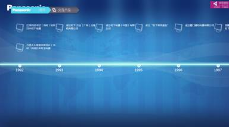

# 时间轴控件（SequenceItemElement）

## 控件作用

时间轴实际上就是根据数据库记录生成的一个水平滑动卡片和一个垂直水平卡片的组合，一般情况下是将一个垂直卡片动态的加在水平卡片的每个节点上。

## 控件 UI 效果



## 配置文件样例

```
<SequenceItemElement Name="Items">
    <UIDisplay Left="0" Top="0" Width="1920" Height="1080" IsShow="True"  ZIndex="2" UsePercent="False"/>
    <Items></Items>
    <CustomerConfig>
        <LayoutManager LayoutType="HorizontalListLayout" Margin="-50"></LayoutManager>
        <Data DataName="TimeLineData" ListDataName="TimelineListData"  PageSize="11" Collapsible="True" CollapsibleLevel="2" MaxCollapsibleLevel="2"></Data>
        <SequenceConfig IsCacheUI="True" IsCombineTemplate="False" IsAutoSweep="False" SweepInterval="15" MaxEllapsedTime="30000" SweepDelta.X="0" SweepDelta.Y="0"></SequenceConfig>
    </CustomerConfig>
</SequenceItemElement>
```

```
<SequenceItemElement>
    <UIDisplay Left="100" Top="350" Width="418" Height="520" IsShow="True"  ZIndex="2" UsePercent="False"/>
    <Items>
        <Template  TemplateID="10003">
            <XYContainerElement>
                <UIDisplay Left="0" Top="0" Width="418" Height="130"/>
                <Controls></Controls>
            </XYContainerElement>
        </Template>
    </Items>
    <CustomerConfig>
        <LayoutManager LayoutType="VerticalListLayout" Margin="0" Align="Top"></LayoutManager>
        <Data DataName="TimeLineData" ListDataName="TimelineContentData">
            <QueryParameters>
                <Parameter Name="Year" Value="{$Year}"/>
                <Parameter Name="Month" Value="{$Month}"/>
                <Parameter Name="Day" Value="{$Day}"/>
            </QueryParameters>
        </Data>
        <SequenceConfig IsCacheUI="True" IsCombineTemplate="False" IsAutoSweep="False" SweepInterval="15" MaxEllapsedTime="30000" SweepDelta.X="0" SweepDelta.Y="0"></SequenceConfig>
    </CustomerConfig>
</SequenceItemElement>

```

## 配置说明

时间轴控件的数据源只能用 TimeLineData 和 ExcelTimeLineData。

配置文件样例 1 是配置水平卡片(用于配置时间轴线，具体配置参照特效控件配置中，滑动卡片的配置)，在以上配置中和滑动卡片存在区别的地方是 Data 片段中的属性不同。

    属性说明

    PageSize：每屏显示的时间节点数；

    Collapsible：层级是否可以改变True/False；

    CollapsibleLevel：时间轴当前层级，分为三层，年层 1、月层 2、日层3；

    MaxCollapsibleLevel：最大层级可以拉伸到那一层；

    IsCaCheUI：是否预加载，就是是否在刚进入放电子书的页面时就加载所有页面，True为是，False为否。

配置文本样例 2 是配置好了水平方向的时间轴线的水平卡片之后，在水平卡片的时间轴点上配置垂直方向的事件卡片，在上述代码中的 Controls 片段中加入垂直卡片的配置，以上代码中的配置方式与滑动卡片的配置方式相同，区别在于 Data 片段的不同，Data 片段中加入了 QueryParameters 片段，QueryParameters 是将数据库中的事件动态的绑定到时间轴线的节点上。
