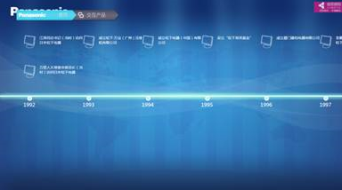

# 时间轴控件（SequenceItemElement）

## 1.控件作用

时间轴实际上就是根据数据库记录生成的一个水平滑动卡片和一个垂直水平卡片的组合，并在每个时间节点上动态叠加垂直方向的事件卡片。通常用于展示时间线事件、发展历程、历史记录等具有时间序列关系的数据。

> **重要提示**：在当前代码实现中，**并没有独立的 `SequenceItemElement` 控件类**。实际项目里时间轴效果通常直接通过 [`SequenceItemsElement`](SequenceItemsElement.md)（滑块控件）配合 `TimeLineData` / `ExcelTimeLineData` 数据源和相应模板来实现。本文档保留 `SequenceItemElement` 相关说明，用于描述时间轴场景的 XML 配置约定，但注册到 `UIControlDict.xml` 时建议使用 `SequenceItemsElement` 指向 `UI.SweepPanel.SequenceItemsControl`。

## 2.适用场景

- 企业发展历程时间轴
- 历史事件展示
- 项目里程碑展示
- 新闻时间线
- 具有时间层级（年/月/日）的数据展示

## 3.前置依赖

使用时间轴控件前，必须满足以下条件：

1. 项目目录中存在 `UI.SweepPanel.dll`；
2. 在 `SysConfig/UIControlDict.xml` 中注册 `SequenceItemElement`；
3. 在 `Shell/Data/Data.xml` 中配置时间轴数据源（`TimeLineData` 或 `ExcelTimeLineData`）。

## 4.控件 UI 效果



## 5.SequenceItemElement 与 SequenceItemsElement 的区别

| 对比项     | SequenceItemElement                          | SequenceItemsElement |
| ---------- | -------------------------------------------- | -------------------- |
| 用途       | 专门用于时间轴展示                           | 通用滑块/列表展示    |
| 数据源限制 | 只能用 `TimeLineData` 或 `ExcelTimeLineData` | 可使用多种数据源     |
| 层级特性   | 支持年/月/日层级折叠                         | 通常不支持层级折叠   |
| 典型布局   | 水平时间轴 + 垂直事件卡片                    | 水平/垂直列表        |

## 6.配置文件样例

### 6.1一：水平时间轴线

```xml
<SequenceItemElement Name="Items">
    <UIDisplay Left="0" Top="0" Width="1920" Height="1080" IsShow="True"  ZIndex="2" UsePercent="False"/>
    <Items></Items>
    <CustomerConfig>
        <LayoutManager LayoutType="HorizontalListLayout" Margin="-50"></LayoutManager>
        <Data DataName="TimeLineData" ListDataName="TimelineListData"  PageSize="11" Collapsible="True" CollapsibleLevel="2" MaxCollapsibleLevel="2"></Data>
        <SequenceConfig IsCacheUI="True" IsCombineTemplate="False" IsAutoSweep="False" SweepInterval="15" MaxEllapsedTime="30000" SweepDelta.X="0" SweepDelta.Y="0"></SequenceConfig>
    </CustomerConfig>
</SequenceItemElement>
```

### 6.2样例二：垂直事件卡片

```xml
<SequenceItemElement>
    <UIDisplay Left="100" Top="350" Width="418" Height="520" IsShow="True"  ZIndex="2" UsePercent="False"/>
    <Items>
        <Template  TemplateID="10003">
            <XYContainerElement>
                <UIDisplay Left="0" Top="0" Width="418" Height="130"/>
                <Controls> <!--垂直事件卡片内容--></Controls>
            </XYContainerElement>
        </Template>
    </Items>
    <CustomerConfig>
        <LayoutManager LayoutType="VerticalListLayout" Margin="0" Align="Top"></LayoutManager>
        <Data DataName="TimeLineData" ListDataName="TimelineContentData">
            <QueryParameters>
                <Parameter Name="Year" Value="{$Year}"/>
                <Parameter Name="Month" Value="{$Month}"/>
                <Parameter Name="Day" Value="{$Day}"/>
            </QueryParameters>
        </Data>
        <SequenceConfig IsCacheUI="True" IsCombineTemplate="False" IsAutoSweep="False" SweepInterval="15" MaxEllapsedTime="30000" SweepDelta.X="0" SweepDelta.Y="0"></SequenceConfig>
    </CustomerConfig>
</SequenceItemElement>

```

配置文本样例 2 是配置好了水平方向的时间轴线的水平卡片之后，在水平卡片的时间轴点上配置垂直方向的事件卡片，在上述代码中的 Controls 片段中加入垂直卡片的配置，以上代码中的配置方式与滑动卡片的配置方式相同，区别在于 Data 片段的不同，Data 片段中加入了 QueryParameters 片段，QueryParameters 是将数据库中的事件动态的绑定到时间轴线的节点上。

## 7.UIDisplay 说明

`UIDisplay` 用法参考 [CommonElement.md](CommonElement.md)

## 8.CustomerConfig 参数说明

### 8.1LayoutManager 节点

| 属性         | 必填 | 说明                                                                     | 示例                      |
| ------------ | ---- | ------------------------------------------------------------------------ | ------------------------- |
| `LayoutType` | 是   | 布局类型：`HorizontalListLayout` 水平列表，`VerticalListLayout` 垂直列表 | `HorizontalListLayout`    |
| `Margin`     | 否   | 项之间的间距                                                             | `-50`、`0`                |
| `Align`      | 否   | 对齐方式（垂直布局时使用）                                               | `Top`、`Center`、`Bottom` |

### 8.2Data 节点

| 属性                  | 必填 | 说明                                | 示例               |
| --------------------- | ---- | ----------------------------------- | ------------------ |
| `DataName`            | 是   | 数据源实例名称                      | `TimeLineData`     |
| `ListDataName`        | 是   | 数据列表名称                        | `TimelineListData` |
| `PageSize`            | 否   | 每屏显示的时间节点数                | `11`               |
| `Collapsible`         | 否   | 层级是否可以改变，`True` 或 `False` | `True`             |
| `CollapsibleLevel`    | 否   | 当前层级：`1` 年、`2` 月、`3` 日    | `2`                |
| `MaxCollapsibleLevel` | 否   | 最大可展开层级                      | `2`                |

### 8.3时间轴层级说明

| 层级值 | 含义 |
| ------ | ---- |
| `1`    | 年层 |
| `2`    | 月层 |
| `3`    | 日层 |

### 8.4QueryParameters 节点

`QueryParameters` 用于将时间轴节点的年、月、日等参数传递给事件卡片的数据源，实现动态绑定。

```xml
<QueryParameters>
    <Parameter Name="Year" Value="{$Year}" />
    <Parameter Name="Month" Value="{$Month}" />
    <Parameter Name="Day" Value="{$Day}" />
</QueryParameters>
```

| 属性    | 说明                       | 示例                            |
| ------- | -------------------------- | ------------------------------- |
| `Name`  | 参数名称                   | `Year`、`Month`、`Day`          |
| `Value` | 参数值，通常绑定数据源变量 | `{$Year}`、`{$Month}`、`{$Day}` |

### 8.5SequenceConfig 节点

| 属性                | 必填 | 说明                                       | 示例    |
| ------------------- | ---- | ------------------------------------------ | ------- |
| `IsCacheUI`         | 否   | 是否预加载 UI，`True` 缓存，`False` 不缓存 | `True`  |
| `IsCombineTemplate` | 否   | 是否合并模板                               | `False` |
| `IsAutoSweep`       | 否   | 是否自动滑动，`True` 或 `False`            | `False` |
| `SweepInterval`     | 否   | 自动滑动间隔                               | `15`    |
| `MaxEllapsedTime`   | 否   | 最大停留时间，单位毫秒                     | `30000` |
| `SweepDelta.X`      | 否   | 水平滑动增量                               | `0`     |
| `SweepDelta.Y`      | 否   | 垂直滑动增量                               | `0`     |

## 8.6数据源说明

时间轴控件的数据源只能使用以下两种类型：

- `TimeLineData`
- `ExcelTimeLineData`

数据源需要在 `Shell/Data/Data.xml` 中配置，并包含时间层级相关字段（如 `Year`、`Month`、`Day`）。

## 9.UIControlDict.xml 添加时间轴控件

如果使用时间轴控件，需要在 `UIControlDict.xml` 中添加注册节点：

```xml
<!--UI.SweepPanel 控件包-->
<Element ViewType="SequenceItemElement" AssemblyFile="UI.SweepPanel.dll" TypeName="UI.SweepPanel.Sequence.SequenceItemControl, UI.SweepPanel, Version=1.0.0.0, Culture=neutral, PublicKeyToken=null">
    <DataContext AssemblyFile="UI.SweepPanel.dll" TypeName="UI.SweepPanel.Sequence.SequenceItemViewModel, UI.SweepPanel, Version=1.0.0.0, Culture=neutral, PublicKeyToken=null" />
</Element>
```

> 注：`TypeName` 中的具体类名以实际 DLL 中的类型为准。

## 10部署说明

1. 将 `UI.SweepPanel.dll` 复制到应用根目录（与 `TronSensingShow.exe` 同级）；
2. 在 `SysConfig/UIControlDict.xml` 中添加上方注册节点；
3. 在 `Shell/Data/Data.xml` 中配置 `TimeLineData` 或 `ExcelTimeLineData` 数据源；
4. 准备时间轴页面配置（水平时间轴线）；
5. 准备事件卡片配置（垂直事件卡片，可选）；
6. 在页面 XML 中使用 `SequenceItemElement`，配置 `UIDisplay`、`Items` 和 `CustomerConfig`。

## 11.常见问题

### 时间轴不显示

- 检查 `UI.SweepPanel.dll` 是否存在于应用根目录；
- 检查 `UIControlDict.xml` 中的注册信息是否正确；
- 检查 `UIDisplay` 的 `IsShow` 是否为 `True`。

### 时间节点不生成

- 检查 `DataName` 和 `ListDataName` 是否正确；
- 检查数据源类型是否为 `TimeLineData` 或 `ExcelTimeLineData`；
- 检查数据源中是否有时间相关字段。

### 事件卡片不显示

- 检查 `QueryParameters` 中的参数名是否与数据源列名一致；
- 检查 `{$Year}`、`{$Month}`、`{$Day}` 等变量是否正确；
- 检查事件卡片的 `Template` 是否配置正确。

### 层级折叠不生效

- 检查 `Collapsible` 是否为 `True`；
- 检查 `CollapsibleLevel` 和 `MaxCollapsibleLevel` 是否设置合理；
- 检查数据源中是否有足够的层级数据。

### 时间轴滑动异常

- 检查 `LayoutManager` 的 `LayoutType` 是否配置正确；
- 检查 `SequenceConfig` 的 `IsAutoSweep`、`SweepInterval` 等参数；
- 检查 `Margin` 是否设置过大或过小。

## 12.注意事项

- 时间轴控件的数据源类型必须是 `TimeLineData` 或 `ExcelTimeLineData`；
- 水平时间轴线和垂直事件卡片通常配合使用，前者显示时间节点，后者显示具体事件；
- 时间层级字段名（如 `Year`、`Month`、`Day`）需要与数据源中的列名一致；
- `CollapsibleLevel` 和 `MaxCollapsibleLevel` 用于控制时间轴的折叠层级；
- 事件卡片的 `QueryParameters` 用于将当前时间节点的参数传递给数据源查询。
