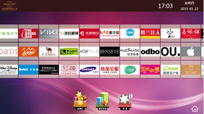

# 滑块控件（SequenceItemsElement）

## 1.控件作用

滑块控件以滑块的方式展示图片或内容列表，支持水平滑动、垂直滑动、环形滑动等多种布局方式。常用于图片轮播、产品列表、卡片滑动、文件夹浏览等场景。

## 2.适用场景

- 图片列表水平/垂直滑动
- 产品卡片轮播
- 文件夹内容浏览
- 随机角度漂浮展示
- 缩放布局展示

## 3.前置依赖

使用滑块控件前，必须满足以下条件：

1. 项目目录中存在 `UI.SweepPanel.dll`；
2. 在 `SysConfig/UIControlDict.xml` 中注册 `SequenceItemsElement`；
3. 如需动态加载内容，需在 `Shell/Data/Data.xml` 中配置数据源并在页面中使用 `DataProvider`。

## 4.控件 UI 效果



## 5.配置文件样例

### 样例一：Excel 数据源水平滑动

```xml
//数据源是EXCEL表格
<SequenceItemsElement>
    <UIDisplay Left="500" Top="800" Width="920" Height="100" IsShow="True"  ZIndex="6" UsePercent="False"/>
    <DataProvider>SequenceData?CSTable=Sequence</DataProvider>
    <Items>
        <Template>
            <ImageButton>
                <UIDisplay Left="0" Top="0" Width="90" Height="90" IsShow="True"  ZIndex="3" UsePercent="False"/>
                <ImageSource UriKind="Application">Shell\Pages\{$PhotoName}</ImageSource>
                <ClickEvent>PopupEvent?TargetPageName=VideoPage&X=0&Y=0&Height=1080&Width=1920&EventID=Animal-1&UriKind=Application&EventPath=Shell\Pages\Innovate</ClickEvent>
            </ImageButton>
        </Template>
    </Items>
    <CustomerConfig>
        <LayoutManager LayoutType="HorizontalListLayout" Margin="0" Align="Left" />
        <Data DataName="SequenceData" ListDataName="Sequence" Cycle="False" />
        <SequenceConfig IsCacheUI="True" IsCombineTemplate="False" IsAutoSweep="False" SweepInterval="15" MaxEllapsedTime="2000" SweepDelta.X="0" SweepDelta.Y="0" />
    </CustomerConfig>
</SequenceItemsElement>

```

### 样例二：固定 Item 水平滑动

```xml
//分两个区域
<SequenceItemsElement>
    <UIDisplay Left="0" Top="250" Width="1920" Height="476" IsShow="True"  ZIndex="6" UsePercent="False"/>
    <Items>
        <Item>
            <ImageButton>
                <UIDisplay Left="0" Top="0" Width="286" Height="476" IsShow="True"  ZIndex="3" UsePercent="False"/>
                <ImageSource UriKind="Application">Shell\Pages\VideoPage\CardIcon\AIRTRAIN.png</ImageSource>
                <ClickEvent>PopupEvent?TargetPageName=VideoPage&X=0&Y=0&Height=1080&Width=1920&EventID=Animal-1&UriKind=Application&EventPath=Shell\Pages\Innovate</ClickEvent>
            </ImageButton>
        </Item>
        <Item Left="0" Top="0" Width="261" Height="476"  >
            <ImageButton>
                <UIDisplay Left="0" Top="0" Width="261" Height="476" IsShow="True"  ZIndex="3" UsePercent="False"/>
                <ImageSource UriKind="Application">Shell\Pages\VideoPage\CardIcon\LAS.png</ImageSource>
                <ClickEvent>PopupEvent?TargetPageName=VideoPage&X=0&Y=0&Height=1080&Width=1920&EventID=Animal-1&UriKind=Application&EventPath=Shell\Pages\Innovate</ClickEvent>
            </ImageButton>
        </Items>
        <CustomerConfig>
            <LayoutManager LayoutType="HorizontalListLayout" Margin="0" Align="Left" />
            <SequenceConfig IsCacheUI="True" IsCombineTemplate="False" IsAutoSweep="False" SweepInterval="15" MaxEllapsedTime="2000" SweepDelta.X="0" SweepDelta.Y="0" />
        </CustomerConfig>
    </SequenceItemsElement>

```

### 样例三：文件夹数据源

```xml
//数据源文件夹
	<SequenceItemsElement Name="FolderListSequence">
			<UIDisplay Left="0" Top="300" Width="2160" Height="600" IsShow="True" ZIndex="1" UsePercent="False" />
			<DataProvider>FolderData?CSTable=1</DataProvider>
			<Items>
				<Template>
					<XYContainerElement>
						<UIDisplay Left="0" Top="195" Width="173" Height="147" IsShow="True" ZIndex="6" UsePercent="False"/>
						<Controls>
							<ToggleButton>
								<UIDisplay Left="0" Top="195" Width="300" Height="200" IsShow="True" ZIndex="7" UsePercent="False" />
								<CustomerConfig>
									<ImageSource UriKind="Application">Shell\Pages\AllPage\resource\B.png</ImageSource>
									<ImageSourceChecked UriKind="Application">Shell\Pages\AllPage\resource\组 11.png</ImageSourceChecked>
									<CheckedEvent>
										<Event>ClosePopup?TargetPageName=tthdPage&TargetControlName=PopItems&EffectName=ScaleClose&EventID=PopupShow&EventPath=Shell\Pages\tthdPage\PopItems</Event>
										<Event>PopupEvent?TargetPageName=tthdPage&TargetControlName=PopItems&X=0&Y=800&Height=3040&Width=2160&UriKind=Application&EventID=PopupShow&EventPath=Shell\Pages\tthdPage\PopItems&CSTable={$DataTableName}&FolderPath={$FolderPath}</Event>
									</CheckedEvent>
									<GroupName>Z</GroupName>
									<Button AutoClick="{$IsDefault}" />
									<IsChecked>{$IsDefault}</IsChecked>
								</CustomerConfig>
							</ToggleButton>

							<TextElement>
								<UIDisplay Left="0" Top="250" Width="300" Height="200" IsShow="True" ZIndex="8" UsePercent="False" IsHitTestVisible="False"/>
								<TextSource ForegroundColor="#FF5e5e5e" Family="微软雅黑" Size="30" CultureInfo="zh-CN" Alignment="Center" LineHeight="80" VerticalAlignment="Center">{$FolderName}({$FileCount})</TextSource>
							</TextElement >
						</Controls>
					</XYContainerElement>

				</Template>
			</Items>
			<CustomerConfig>
				<LayoutManager LayoutType="HorizontalListLayout" Margin="0" Align="Left" Row="1"/>
				<Data DataName="FolderData" ListDataName="Detail" Cycle="True" />
>
				<SequenceConfig IsCacheUI="True" IsCombineTemplate="False" IsAutoSweep="false" SweepInterval="30" MaxEllapsedTime="2000" SweepDelta.X="-0.2" SweepDelta.Y="-0.2" />
			</CustomerConfig>
		</SequenceItemsElement>
```

### 样例四：随机角度滑动

```xml
随机不同角度滑动
<SequenceItemsElement>
                <UIDisplay Left="0" Top="800" Width="2160" Height="3840" IsShow="True" ZIndex="1" UsePercent="False"  />
                <DataProvider>hzhbData?CSTable=tthd</DataProvider>
<Items>
				<Template  Left="0" Top="0" Width="488" Height="1000" TemplateID="10004">
					<XYContainerElement>
						<UIDisplay Left="0" Top="0" Width="488" Height="800"/>
						<Controls>


							<ImageButton>
								<UIDisplay Left="0" Top="0" Width="800" Height="800" IsShow="True" ZIndex="2" UsePercent="False" RotateRandom="True" LowRotateRange="-30" HighRotateRange="30"/>
								<ImageSource UriKind="Application">Shell\Pages\AllPage\resource\团体活动\1\{$TP1}</ImageSource>
								<ClickEvent>
									PopupEvent?TargetPageName=tthdPage&TargetControlName=Open2&X=0&Y=0&Width=1600&Height=1080&EventID=ShowPhoto&UriKind=Application&EventPath=Shell\Pages\tthdPage\PopItems&TP2={$TP2}
								</ClickEvent>
							                <CustomerConfig>
                                        <!-- AutoClick: 表示页面加载后会自动触发点击事件，执行一次 -->
                                        <Button AutoClick="False" />
                                        <!-- ElapsedTime 防抖动，两次点击时间超过这个时间才能触发事件，单位毫秒 MobileThreshold移动距离，超过此距离，则不触发触发点击事件 -->
                                        <Image ElapsedTime="300" MobileThreshold="600">
                                        </Image>
                                    </CustomerConfig>

                            </ImageButton>


						</Controls>
					</XYContainerElement>
				</Template>
			</Items>
                <CustomerConfig>
                    <LayoutManager LayoutType="HorizontalListLayout" Margin="800" Align="Left"  Row="3"/>
                    <Data DataName="hzhbData" ListDataName="tthd"  Cycle="True"/>
                    <SequenceConfig  IsCanTouch="True" IsCacheUI="True" IsCombineTemplate="False" IsAutoSweep="True" SweepInterval="1" MaxEllapsedTime="1" SweepDelta.X="-8" SweepDelta.Y="10"/>
                </CustomerConfig>
            </SequenceItemsElement>
```

## 6.UIDisplay 说明

`UIDisplay` 用法参考 [CommonElement.md](CommonElement.md)。

## 7.DataProvider 与 Items

### 7.1动态数据源模式

通过 `DataProvider` 绑定数据源，数据源中的每一行会生成一个滑块项。

```xml
<DataProvider>SequenceData?CSTable=Sequence</DataProvider>
```

### 7.2固定 Item 模式

如果不配置 `DataProvider`，可以在 `Items` 中直接放置多个 `Item` 节点，手动定义滑块项。

### 7.3Template 与 Item

- `Template`：用于动态数据源，每个数据项会按模板生成；
- `Item`：用于固定内容，每个 `Item` 对应一个滑块项。

## 8.CustomerConfig 参数说明

### 8.1LayoutManager 节点

| 属性           | 必填 | 说明                                      | 示例                     |
| -------------- | ---- | ----------------------------------------- | ------------------------ |
| `LayoutType` | 是   | 滑块布局类型                              | `HorizontalListLayout` |
| `Margin`     | 否   | 相邻卡片之间的间距，单位像素              | `0`、`800`           |
| `Align`      | 否   | 对齐方式：`Left`、`Center`、`Right` | `Left`                 |
| `Row`        | 否   | 显示行数，水平布局时有效                  | `1`、`3`             |
| `Column`     | 否   | 显示列数，垂直布局时有效                  | `2`                    |

#### 8.1.1 LayoutType 滑块方向的取值说明

| 取值                     | 说明                           |
| ------------------------ | ------------------------------ |
| `HorizontalCardLayout` | 水平单一滑动，每次滑动一张卡片 |
| `VerticalCardLayout`   | 垂直单一滑动，每次滑动一张卡片 |
| `HorizontalListLayout` | 水平滑动列表                   |
| `VerticalListLayout`   | 垂直滑动列表                   |
| `CircleListLayout`     | 环形滑动布局                   |
| `GraphicLayout`        | 缩放布局，支持手势缩放         |

#### 8.1.2GraphicLayout 额外参数

使用 `GraphicLayout` 时，`Item` 内的控件需要配置缩放相关属性：

| 属性          | 说明                                                     | 示例       |
| ------------- | -------------------------------------------------------- | ---------- |
| `CanScale`  | 是否可缩放                                               | `True`   |
| `MaxScale`  | 最大缩放倍数                                             | `2`      |
| `MinScale`  | 最小缩放倍数                                             | `0.5`    |
| `ScaleMode` | 超出边界时的行为：`Normal`、`Bounce`、`Disppear。` | `Bounce` |

这是一种较为特殊的方式，在Item里面控制缩放的大小边界，若要控制缩放图的大小，则CanScale必须为"True"，然后通过MaxScale及MinScale控制缩放的大小边界，
ScaleMode为碰到边缘时的反应，Normal就是正常的情况，Bounce就是超出最小和最大值范围后，手松开后会自动弹回来，Disppear就是超出最小值，直接关闭

#### 8.1.3CircleListLayout 额外参数

> 推荐使用 `CircleElement` 替代 `CircleListLayout` 实现环形效果。

$$
{\color{red}在Type为CircleListLayout的时候有一下几个参数可额外进行配置，在此用例的时候，推荐使用CircleElement进行配置}
$$

| 属性           | 说明            | 示例    |
| -------------- | --------------- | ------- |
| `Radius`     | 环绕半径        | `500` |
| `Center.X`   | 环绕中心 X 坐标 | `800` |
| `Center.Y`   | 环绕中心 Y 坐标 | `500` |
| `SpeedRatio` | 环绕速率        | `1`   |

### 8.2节点 Data

    此节点的数据值必须与DataProvider的保持一致，第一个参数为数据源的名称，第二个参数为Table的名称!
    属性说明

| 属性             | 必填 | 说明                                       | 示例             |
| ---------------- | ---- | ------------------------------------------ | ---------------- |
| `DataName`     | 是   | 数据源实例名称，需与 `DataProvider` 一致 | `SequenceData` |
| `ListDataName` | 是   | 数据表/列表名称                            | `Sequence`     |
| `Cycle`        | 否   | 是否循环显示，`True` 或 `False`        | `False`        |

### 8.3节点 SequenceConfig

| 属性                  | 必填 | 说明                                                                                 | 示例          |
| --------------------- | ---- | ------------------------------------------------------------------------------------ | ------------- |
| `IsCanTouch`        | 否   | 是否支持触摸滑动                                                                     | `True`      |
| `IsCacheUI`         | 否   | 是否预加载 UI                                                                        | `True`      |
| `IsCombineTemplate` | 否   | 是否合并模板                                                                         | `False`     |
| `IsAutoSweep`       | 否   | 是否自动默认循环滑动                                                                 | `False`     |
| `SweepInterval`     | 否   | 自动滑动间隔，单位毫秒                                                               | `15`        |
| `MaxEllapsedTime`   | 否   | 进入自动滑动前的等待时间，单位毫秒(场景如下，一段时间无人操作后，进入自动滑动模式)； | `2000`      |
| `SweepDelta.X`      | 否   | 水平滑动距离，负数为向左，单位为像素                                                 | `0`、`-8` |
| `SweepDelta.Y`      | 否   | 垂直滑动距离，负数为向上，单位为像素                                                 | `0`、`10` |

### 8.4随机旋转属性

在 `Template` 内的控件 `UIDisplay` 中可以配置随机旋转：

| 属性                | 说明         | 示例     |
| ------------------- | ------------ | -------- |
| `RotateRandom`    | 是否随机旋转 | `True` |
| `LowRotateRange`  | 最小旋转角度 | `-30`  |
| `HighRotateRange` | 最大旋转角度 | `30`   |

## 9.UIControlDict.xml 添加滑块控件

如果使用滑块控件，需要在 `UIControlDict.xml` 中添加注册节点：

```xml
<!--UI.SweepPanel 控件包-->
<Element ViewType="SequenceItemsElement" AssemblyFile="UI.SweepPanel.dll" TypeName="UI.SweepPanel.SequenceItemsControl, UI.SweepPanel, Version=1.0.0.0, Culture=neutral, PublicKeyToken=null">
    <DataContext AssemblyFile="UI.SweepPanel.dll" TypeName="UI.SweepPanel.SequenceItemsElementViewModel, UI.SweepPanel, Version=1.0.0.0, Culture=neutral, PublicKeyToken=null" />
</Element>
```

## 10.部署说明

1. 将 `UI.SweepPanel.dll` 复制到应用根目录（与 `TronSensingShow.exe` 同级）；
2. 在 `SysConfig/UIControlDict.xml` 中添加上方注册节点；
3. 如需动态数据，在 `Shell/Data/Data.xml` 中配置数据源，并在页面中使用 `DataProvider`；
4. 在页面 XML 中使用 `SequenceItemsElement`，配置 `UIDisplay`、`DataProvider`、`Items` 和 `CustomerConfig`。

## 11.常见问题

### 滑块不显示

- 检查 `UI.SweepPanel.dll` 是否存在于应用根目录；
- 检查 `UIControlDict.xml` 中的注册信息是否正确；
- 检查 `UIDisplay` 的 `IsShow` 是否为 `True`。

### 滑块项不生成

- 检查 `DataProvider` 中的数据源名称和表名是否正确；
- 检查 `Data` 节点的 `DataName` 和 `ListDataName` 是否与 `DataProvider` 一致；
- 检查数据源中是否有数据。

### 无法滑动

- 检查 `LayoutManager` 的 `LayoutType` 是否配置正确；
- 检查 `SequenceConfig` 的 `IsCanTouch` 是否为 `True`；
- 检查滑块项总数是否大于显示区域可容纳数量。

### 自动滑动不生效

- 检查 `IsAutoSweep` 是否为 `True`；
- 检查 `SweepInterval` 和 `MaxEllapsedTime` 是否设置合理；
- 检查用户交互后是否会暂停自动滑动。

### 点击事件不触发

- 检查 `ClickEvent` 是否正确；
- 检查事件 URL 中的 `&` 是否已转义为 `&amp;`；
- 检查目标页面和控件是否存在。

### 随机旋转效果异常

- 检查 `RotateRandom` 是否为 `True`；
- 检查 `LowRotateRange` 和 `HighRotateRange` 是否设置合理；
- 检查 `UIDisplay` 中是否配置了这些属性。

## 12.注意事项

- 事件 URL 中的 `&` 必须转义为 `&amp;`；
- `DataName` 和 `ListDataName` 必须与 `DataProvider` 保持一致；
- `Row` 只在水平布局时有效，`Column` 只在垂直布局时有效；
- `Cycle="True"` 可实现循环滚动，但需注意数据量和性能；
- 图片路径中的空格需要避免，否则可能导致加载失败；
- 随机旋转功能适用于图片墙等创意展示场景。

## 13.更新日志

- **2023-1-28**：支持动态数据源的增加功能（如文件夹数据源）。
