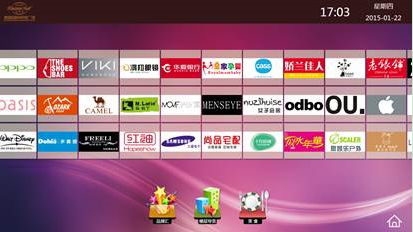

# 滑块控件（SequenceItemsElement）

## 控件作用

滑块控件以滑块的方式展示图片的列表,支持水平和垂直的布局!

## 控件 UI 效果



## 配置文件样例

```xml
//数据源是EXCEL表格
<SequenceItemsElement>
    <UIDisplay Left="500" Top="800" Width="920" Height="100" IsShow="True"  ZIndex="6" UsePercent="False"/>
    <DataProvider>SequenceData?CSTable=Sequence</DataProvider>
    <Items>
        <Template>
            <ImageButton>
                <UIDisplay Left="0" Top="0" Width="90" Height="90" IsShow="True"  ZIndex="3" UsePercent="False"/>
                <ImageSource UriKind="Application">Shell\Pages\{$PhotoName}</ImageSource>
                <ClickEvent>PopupEvent?TargetPageName=VideoPage&X=0&Y=0&Height=1080&Width=1920&EventID=Animal-1&UriKind=Application&EventPath=Shell\Pages\Innovate</ClickEvent>
            </ImageButton>
        </Template>
    </Items>
    <CustomerConfig>
        <LayoutManager LayoutType="HorizontalListLayout" Margin="0" Align="Left" />
        <Data DataName="SequenceData" ListDataName="Sequence" Cycle="False" />
        <SequenceConfig IsCacheUI="True" IsCombineTemplate="False" IsAutoSweep="False" SweepInterval="15" MaxEllapsedTime="2000" SweepDelta.X="0" SweepDelta.Y="0" />
    </CustomerConfig>
</SequenceItemsElement>

```

```xml
//分两个区域
<SequenceItemsElement>
    <UIDisplay Left="0" Top="250" Width="1920" Height="476" IsShow="True"  ZIndex="6" UsePercent="False"/>
    <Items>
        <Item>
            <ImageButton>
                <UIDisplay Left="0" Top="0" Width="286" Height="476" IsShow="True"  ZIndex="3" UsePercent="False"/>
                <ImageSource UriKind="Application">Shell\Pages\VideoPage\CardIcon\AIRTRAIN.png</ImageSource>
                <ClickEvent>PopupEvent?TargetPageName=VideoPage&X=0&Y=0&Height=1080&Width=1920&EventID=Animal-1&UriKind=Application&EventPath=Shell\Pages\ Innovate</ClickEvent>
            </ImageButton>
        </Item>
        <Item Left="0" Top="0" Width="261" Height="476"  >
            <ImageButton>
                <UIDisplay Left="0" Top="0" Width="261" Height="476" IsShow="True"  ZIndex="3" UsePercent="False"/>
                <ImageSource UriKind="Application">Shell\Pages\VideoPage\CardIcon\LAS.png</ImageSource>
                <ClickEvent>PopupEvent?TargetPageName=VideoPage&X=0&Y=0&Height=1080&Width=1920&EventID=Animal-1&UriKind=Application&EventPath=Shell\Pages\Innovate</ClickEvent>
            </ImageButton>
        </Items>
        <CustomerConfig>
            <LayoutManager LayoutType="HorizontalListLayout" Margin="0" Align="Left" />
            <SequenceConfig IsCacheUI="True" IsCombineTemplate="False" IsAutoSweep="False" SweepInterval="15" MaxEllapsedTime="2000" SweepDelta.X="0" SweepDelta.Y="0" />
        </CustomerConfig>
    </SequenceItemsElement>

```
```
//数据源文件夹
	<SequenceItemsElement Name="FolderListSequence">
			<UIDisplay Left="0" Top="300" Width="2160" Height="600" IsShow="True" ZIndex="1" UsePercent="False" />
			<DataProvider>FolderData?CSTable=1</DataProvider>
			<Items>
				<Template>
					<XYContainerElement>
						<UIDisplay Left="0" Top="195" Width="173" Height="147" IsShow="True" ZIndex="6" UsePercent="False"/>
						<Controls>
							<ToggleButton>
								<UIDisplay Left="0" Top="195" Width="300" Height="200" IsShow="True" ZIndex="7" UsePercent="False" />
								<CustomerConfig>
									<ImageSource UriKind="Application">Shell\Pages\AllPage\resource\B.png</ImageSource>
									<ImageSourceChecked UriKind="Application">Shell\Pages\AllPage\resource\组 11.png</ImageSourceChecked>
									<CheckedEvent>
										<Event>ClosePopup?TargetPageName=tthdPage&amp;TargetControlName=PopItems&amp;EffectName=ScaleClose&amp;EventID=PopupShow&amp;EventPath=Shell\Pages\tthdPage\PopItems</Event>
										<Event>PopupEvent?TargetPageName=tthdPage&amp;TargetControlName=PopItems&amp;X=0&amp;Y=800&amp;Height=3040&amp;Width=2160&amp;UriKind=Application&amp;EventID=PopupShow&amp;EventPath=Shell\Pages\tthdPage\PopItems&amp;CSTable={$DataTableName}&amp;FolderPath={$FolderPath}</Event>
									</CheckedEvent>
									<GroupName>Z</GroupName>
									<Button AutoClick="{$IsDefault}" />
									<IsChecked>{$IsDefault}</IsChecked>
								</CustomerConfig>
							</ToggleButton>

							<TextElement>
								<UIDisplay Left="0" Top="250" Width="300" Height="200" IsShow="True" ZIndex="8" UsePercent="False" IsHitTestVisible="False"/>
								<TextSource ForegroundColor="#FF5e5e5e" Family="微软雅黑" Size="30" CultureInfo="zh-CN" Alignment="Center" LineHeight="80" VerticalAlignment="Center">{$FolderName}({$FileCount})</TextSource>
							</TextElement >
						</Controls>
					</XYContainerElement>

				</Template>
			</Items>
			<CustomerConfig>
				<LayoutManager LayoutType="HorizontalListLayout" Margin="0" Align="Left" Row="1"/>
				<Data DataName="FolderData" ListDataName="Detail" Cycle="True" />
>
				<SequenceConfig IsCacheUI="True" IsCombineTemplate="False" IsAutoSweep="false" SweepInterval="30" MaxEllapsedTime="2000" SweepDelta.X="-0.2" SweepDelta.Y="-0.2" />
			</CustomerConfig>
		</SequenceItemsElement>
```
```
随机不同角度滑动
<SequenceItemsElement>
                <UIDisplay Left="0" Top="800" Width="2160" Height="3840" IsShow="True" ZIndex="1" UsePercent="False"  />
                <DataProvider>hzhbData?CSTable=tthd</DataProvider>
<Items>
				<Template  Left="0" Top="0" Width="488" Height="1000" TemplateID="10004">
					<XYContainerElement>
						<UIDisplay Left="0" Top="0" Width="488" Height="800"/>
						<Controls>
							

							<ImageButton>
								<UIDisplay Left="0" Top="0" Width="800" Height="800" IsShow="True" ZIndex="2" UsePercent="False" RotateRandom="True" LowRotateRange="-30" HighRotateRange="30"/>
								<ImageSource UriKind="Application">Shell\Pages\AllPage\resource\团体活动\1\{$TP1}</ImageSource>
								<ClickEvent>
									PopupEvent?TargetPageName=tthdPage&amp;TargetControlName=Open2&amp;X=0&amp;Y=0&amp;Width=1600&amp;Height=1080&amp;EventID=ShowPhoto&amp;UriKind=Application&amp;EventPath=Shell\Pages\tthdPage\PopItems&amp;TP2={$TP2}
								</ClickEvent>
							                <CustomerConfig>
                                        <!-- AutoClick: 表示页面加载后会自动触发点击事件，执行一次 -->
                                        <Button AutoClick="False" />
                                        <!-- ElapsedTime 防抖动，两次点击时间超过这个时间才能触发事件，单位毫秒 MobileThreshold移动距离，超过此距离，则不触发触发点击事件 -->
                                        <Image ElapsedTime="300" MobileThreshold="600">
                                        </Image>
                                    </CustomerConfig>
                            
                            </ImageButton>

							
						</Controls>
					</XYContainerElement>
				</Template>
			</Items>
                <CustomerConfig>
                    <LayoutManager LayoutType="HorizontalListLayout" Margin="800" Align="Left"  Row="3"/>
                    <Data DataName="hzhbData" ListDataName="tthd"  Cycle="True"/> 
                    <SequenceConfig  IsCanTouch="True" IsCacheUI="True" IsCombineTemplate="False" IsAutoSweep="True" SweepInterval="1" MaxEllapsedTime="1" SweepDelta.X="-8" SweepDelta.Y="10"/>
                </CustomerConfig>
            </SequenceItemsElement>
```
## 配置说明

### 节点 LayoutManager

    属性说明
       1. LayoutType：滑块方向
            水平单一滑动：HorizontalCardLayout；
            垂直单一滑动：VerticalCardLayout；
            水平滑动：HorizontalListLayout；
            垂直滑动：VerticalListLayout；
            环形滑块：CircleListLayout；
            缩放模块：GraphicLayout
                这是一种较为特殊的方式，在Item里面控制缩放的大小边界，若要控制缩放图的大小，则CanScale必须为"True"，
                然后通过MaxScale及MinScale控制缩放的大小边界，
                ScaleMode为碰到边缘时的反应，
                Normal就是正常的情况，
                Bounce就是超出最小和最大值范围后，手松开后会自动弹回来，
                Disppear就是超出最小值，直接关闭

    2. Margin：相邻卡片间的间距，单位为：像素；
    3. Align：对齐方式：Left/Center/Right；
    4. Row: 显示几行，在水平布局的时候有效;
    5. Column: 显示几列，在垂直布局的时候有效;

$$
{\color{red}在Type为CircleListLayout的时候有一下几个参数可额外进行配置，在此用例的时候，推荐使用CircleElement进行配置}
$$

    Radius:环绕到中心点的半径；
        Center.X/Center.Y: 环绕的中心点位置
        SpeedRatio: 环绕的速率

### 节点 Data

    此节点的数据值必须与DataProvider的保持一致，第一个参数为数据源的名称，第二个参数为Table的名称!
    属性说明

    DataName：与此控件相连的数据库的名字；

    ListDataName：运用到的数据库中表的名字；

    Cycle：是否循环显示。

### 节点 SequenceConfig

    属性说明

    IsCanTouch="True" 是否可以触摸滑动，值为True/False；

    IsCacheUI：是否预加载，值为True/False；

    IsAutoSweep：是否自动默认循环滑动，值为True/False；

    SweepInterval：多久移动一次，单位为毫秒，为自动滑动使用；

    MaxEllapsedTime：为进入自动滑动的时间，单位为毫秒(场景如下，一段时间无人操作后，进入自动滑动模式)；

    SweepDelta.X：左右移动的距离，单位为像素，负数为向左.
	
    SweepDelta.Y：上下移动的距离，单位为像素，负数为向右.
	
	RotateRandom="True" 是否随机旋转，值为True/False；

    LowRotateRange：最小旋转角度，单位为度；

    HighRotateRange：最大旋转角度，单位为度；

# UIControlDict.xml 添加滑块控件

如果使用滑块控件则需要在 UIControlDict.xml 中添加滑块控件

```
  <Element ViewType="SequenceItemsElement" AssemblyFile="UI.SweepPanel.dll" TypeName="UI.SweepPanel.SequenceItemsControl, UI.SweepPanel, Version=1.0.0.0, Culture=neutral, PublicKeyToken=null">
  <DataContext AssemblyFile="UI.SweepPanel.dll" TypeName="UI.SweepPanel.SequenceItemsElementViewModel, UI.SweepPanel, Version=1.0.0.0, Culture=neutral, PublicKeyToken=null" />
</Element>
```

### 更新日志

    2023-1-28: 支持动态数据源的增加功能（如文件夹数据源）
