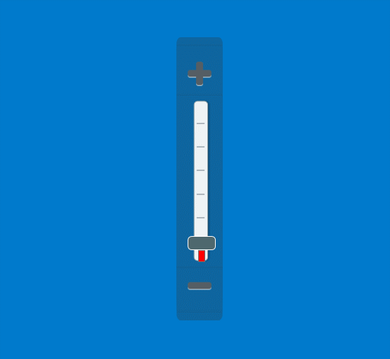

# 滑动杆控件控件（SliderElement）

## 1.控件作用

滑动杆控件提供一个可在数值区间内拖拽的滑块，用于选择单个连续值。控件支持水平与垂直两种方向，可通过外部事件控制滑块步进增减或复位，常用于地图缩放、音量调节、进度控制、参数调节等场景。

## 2.适用场景

- 地图/图片缩放调节
- 音量、亮度等连续参数控制
- 时间轴或进度条调节
- 需要通过外部按钮精确增减数值的场景

## 3.前置依赖

使用滑动杆控件前，必须满足以下条件：

1. 项目目录中存在 `UI.Common.dll`；
2. 在 `SysConfig/UIControlDict.xml` 中注册 `SliderElement`。

## 4.控件 UI 效果



## 5.配置文件样例

```xml
    <XYContainerElement>
      <UIDisplay Left="1800" Top="600" Width="66" Height="403" IsShow="True"  ZIndex="3" UsePercent="False"/>
      <Controls>
        <ImageElement>
          <UIDisplay Left="0" Top="0" Width="66" Height="403" IsShow="True" ZIndex="1" UsePercent="False" />
          <ImageSource UriKind="Application">Shell\Pages\huaganPage\resource\滑竿底图.png</ImageSource>
        </ImageElement>
        <ImageButton>
          <UIDisplay  Left="0" Top="19" Width="66" Height="66" IsShow="True" ZIndex="1" UsePercent="False" />
          <ImageSource UriKind="Application">Shell\Pages\huaganPage\resource\放大.png</ImageSource>
          <ClickEvent>IncreaseEvent?TargetPageName=huaganPage&TargetControlName=ScaleBar</ClickEvent>
        </ImageButton>
        <SliderElement Name="ScaleBar">
          <UIDisplay Left="16" Top="90" Width="40" Height="230" IsShow="True" ZIndex="1" UsePercent="False" />
          <ClickEvent>ChangeScaleEvent?TargetPageName=huaganPage&TargetControlName=map&Scale={$NewValue}</ClickEvent>
          <CustomerConfig>
            <Slider Orientation="Vertical" Maximum="2" Minimum="0.1" Value="0.25">
              <SolidColorBrush Key="SliderThumb.Pressed.Background" Color="#76aab6"/>
              <SolidColorBrush Key="SliderThumb.Pressed.Border" Color="#FF569DE5"/>
              <SolidColorBrush Key="SliderThumb.Static.Background" Color="#4e686e"/>
              <SolidColorBrush Key="SliderThumb.Static.Border" Color="White"/>
              <SolidColorBrush Key="SliderThumb.Track.Border" Color="#3bb6ab"/>
              <SolidColorBrush Key="SliderThumb.Track.Background" Color="Transparent"/>
              <SolidColorBrush Key="SliderThumb.Track.Left" Color="Transparent"/>
              <Double Key="ThumbWidth">40</Double>
              <Double Key="ThumbHeight">20</Double>
              <Double Key="ThumbRadius">5</Double>
              <Double Key="TrackThickness">10</Double>
              <Double Key="TrackRadius">0</Double>
            </Slider>
          </CustomerConfig>
        </SliderElement>
        <ImageButton>
          <UIDisplay  Left="0" Top="320" Width="66" Height="66" IsShow="True" ZIndex="1" UsePercent="False" />
          <ImageSource UriKind="Application">Shell\Pages\huaganPage\resource\缩小.png</ImageSource>
          <ClickEvent>DecreaseEvent?TargetPageName=huaganPage&TargetControlName=ScaleBar</ClickEvent>
        </ImageButton>
      </Controls>
    </XYContainerElement>


```

## 6.UIDisplay 说明

`UIDisplay` 用法参考 [CommonElement.md](CommonElement.md)。针对滑动杆控件：

- `Width` / `Height`：定义滑动杆的显示区域大小；
- `ZIndex`：注意滑动杆与其他控件的层级关系；
- `UsePercent`：若需要按父容器百分比布局，可设为 `True`。

## 7.CustomerConfig 参数说明

### 7.1Slider 节点

`Slider` 节点为必填子节点，承载滑动杆的核心属性与外观资源。

| 属性          | 必填 | 类型                      | 默认值       | 说明                   |
| ------------- | ---- | ------------------------- | ------------ | ---------------------- |
| `Orientation` | 否   | `Horizontal` / `Vertical` | `Horizontal` | 滑动杆方向。           |
| `Maximum`     | 否   | `double`                  | `1`          | 滑块可到达的最大值。   |
| `Minimum`     | 否   | `double`                  | `0`          | 滑块可到达的最小值。   |
| `Value`       | 否   | `double`                  | `0`          | 初始化时滑块所处的值。 |

#### 7.1.1颜色资源（SolidColorBrush）

在 `Slider` 节点内通过 `<SolidColorBrush Key="..." Color="..."/>` 覆盖默认画刷。

| Key                              | 作用                              |
| -------------------------------- | --------------------------------- |
| `SliderThumb.Static.Foreground`  | 滑块默认前景色。                  |
| `SliderThumb.Pressed.Background` | 鼠标悬停或拖拽时滑块背景色。      |
| `SliderThumb.Pressed.Border`     | 鼠标悬停或拖拽时滑块边框色。      |
| `SliderThumb.Static.Background`  | 滑块常态背景色。                  |
| `SliderThumb.Static.Border`      | 滑块常态边框色。                  |
| `SliderThumb.Track.Border`       | 轨道边框色。                      |
| `SliderThumb.Track.Background`   | 轨道背景色。                      |
| `SliderThumb.Track.Left`         | 滑块左侧/下侧已走过轨道的填充色。 |

#### 7.1.2尺寸资源（Double）

在 `Slider` 节点内通过 `<Double Key="...">值</Double>` 覆盖默认尺寸。

| Key              | 类型     | 默认值 | 说明           |
| ---------------- | -------- | ------ | -------------- |
| `ThumbWidth`     | `double` | `30`   | 滑块宽度。     |
| `ThumbHeight`    | `double` | `30`   | 滑块高度。     |
| `ThumbRadius`    | `double` | `15`   | 滑块圆角半径。 |
| `TrackThickness` | `double` | `10`   | 轨道粗细。     |
| `TrackRadius`    | `double` | `10`   | 轨道圆角半径。 |

## 8.可接受的事件

### 8.1ClickEvent 事件

拖拽释放导致滑块值变化时触发，可通过模板变量 `{$NewValue}` 引用当前数值。

```xml
<ClickEvent>ChangeScaleEvent?TargetPageName=huaganPage&TargetControlName=map&Scale={$NewValue}</ClickEvent>
```

| 参数          | 说明       | 示例   |
| ------------- | ---------- | ------ |
| `{$NewValue}` | 当前滑块值 | `0.25` |

### 8.2IncreaseEvent 事件

将目标滑动杆的值按 `LargeChange` 步长增加。

```xml
<ClickEvent>IncreaseEvent?TargetPageName=huaganPage&TargetControlName=ScaleBar</ClickEvent>
```

| 参数                | 说明               | 示例         |
| ------------------- | ------------------ | ------------ |
| `TargetPageName`    | 目标页面名称       | `huaganPage` |
| `TargetControlName` | 目标滑动杆控件名称 | `ScaleBar`   |

### 8.3DecreaseEvent 事件

将目标滑动杆的值按 `LargeChange` 步长减小。

```xml
<ClickEvent>DecreaseEvent?TargetPageName=huaganPage&TargetControlName=ScaleBar</ClickEvent>
```

### 8.4ResetEvent 事件

将目标滑动杆恢复为配置中的 `Value` 初始值。匹配规则为同时校验 `TargetPageName` 与 `TargetControlName`。

## 9.UIControlDict.xml 添加滑动杆控件

如果使用滑动杆控件，需要在 `UIControlDict.xml` 中添加注册节点：

```xml
<Element ViewType="SliderElement" AssemblyFile="UI.Common.dll" TypeName="UI.Common.SensingControl.SliderControl, UI.Common, Version=1.0.0.0, Culture=neutral, PublicKeyToken=null">
    <DataContext AssemblyFile="UI.Common.dll" TypeName="UI.Common.SensingView.SliderControlViewModel, UI.Common, Version=1.0.0.0, Culture=neutral, PublicKeyToken=null" />
</Element>
```

## 10.部署说明

1. 确认项目目录中存在 `UI.Common.dll`；
2. 在 `SysConfig/UIControlDict.xml` 中添加上方注册节点；
3. 准备滑动杆相关资源（底图、放大/缩小按钮等）；
4. 在页面 XML 中使用 `SliderElement`，配置 `UIDisplay`、`CustomerConfig` 与 `ClickEvent`。

## 11.常见问题

### 滑动杆不显示

- 检查 `UIDisplay` 的 `IsShow` 是否为 `True`；
- 检查 `Width` / `Height` 是否大于 0；
- 检查 `ZIndex` 是否被其他控件遮挡；
- 确认 `UIControlDict.xml` 中已注册 `SliderElement`。

### 滑块值变化后没有触发事件

- 检查 `ClickEvent` 是否配置正确；
- 确认事件 URL 中的 `&` 已转义为 `&amp;`；
- 检查 `TargetPageName` 与 `TargetControlName` 是否指向正确的接收方。

### 放大/缩小按钮无效

- 检查按钮的 `ClickEvent` 是否为 `IncreaseEvent` 或 `DecreaseEvent`；
- 检查 `TargetControlName` 是否与 `SliderElement` 的 `Name` 一致；
- 检查 `TargetPageName` 是否与当前页面名称一致。

### 滑块样式与预期不符

- 检查 `SolidColorBrush` 的 `Key` 是否与文档列出的可覆盖项一致；
- 检查 `Double` 资源的 `Key` 是否拼写正确；
- 颜色或尺寸解析失败时会记录错误日志，控件将回退到默认值。

## 12.注意事项

- `SliderElement` 运行时由 `UI.Common.SensingControl.SliderControl` 与 `UI.Common.SensingView.SliderControlViewModel` 配对实现；
- `Orientation`、`Maximum`、`Minimum`、`Value` 在控件初始化时读取，如需动态修改需配合事件或数据绑定；
- 事件 URL 中的 `&` 必须转义为 `&amp;`；
- 控件订阅了 `IncreaseEvent`、`DecreaseEvent`、`ResetEvent`，`Dispose` 时会取消订阅以避免内存泄漏；
- 建议为需要被外部事件引用的滑动杆配置 `Name` 属性。
