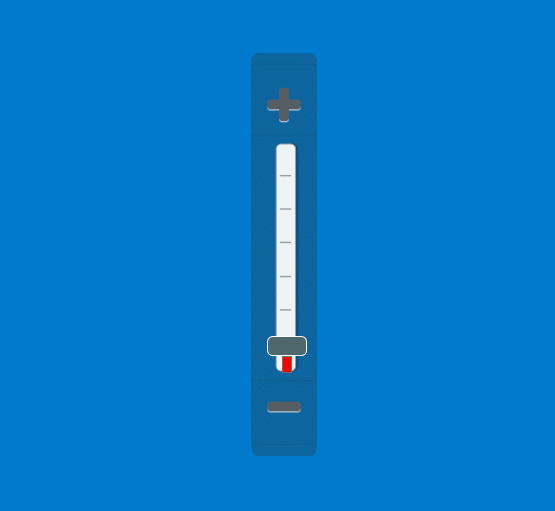

# 滑动杆控件控件（SliderElement）

## 控件作用

选择范围区间

## 控件 UI 效果



## 配置文件样例

```
    <XYContainerElement>
      <UIDisplay Left="1800" Top="600" Width="66" Height="403" IsShow="True"  ZIndex="3" UsePercent="False"/>
      <Controls>
        <ImageElement>
          <UIDisplay Left="0" Top="0" Width="66" Height="403" IsShow="True" ZIndex="1" UsePercent="False" />
          <ImageSource UriKind="Application">Shell\Pages\huaganPage\resource\滑竿底图.png</ImageSource>
        </ImageElement>
        <ImageButton>
          <UIDisplay  Left="0" Top="19" Width="66" Height="66" IsShow="True" ZIndex="1" UsePercent="False" />
          <ImageSource UriKind="Application">Shell\Pages\huaganPage\resource\放大.png</ImageSource>
          <ClickEvent>IncreaseEvent?TargetPageName=huaganPage&amp;TargetControlName=ScaleBar</ClickEvent>
        </ImageButton>
        <SliderElement Name="ScaleBar">
          <UIDisplay Left="16" Top="90" Width="40" Height="230" IsShow="True" ZIndex="1" UsePercent="False" />
          <ClickEvent>ChangeScaleEvent?TargetPageName=huaganPage&amp;TargetControlName=map&amp;Scale={$NewValue}</ClickEvent>
          <CustomerConfig>
            <Slider Orientation="Vertical" Maximum="2" Minimum="0.1" Value="0.25">
              <SolidColorBrush Key="SliderThumb.Pressed.Background" Color="#76aab6"/>
              <SolidColorBrush Key="SliderThumb.Pressed.Border" Color="#FF569DE5"/>
              <SolidColorBrush Key="SliderThumb.Static.Background" Color="#4e686e"/>
              <SolidColorBrush Key="SliderThumb.Static.Border" Color="White"/>
              <SolidColorBrush Key="SliderThumb.Track.Border" Color="#3bb6ab"/>
              <SolidColorBrush Key="SliderThumb.Track.Background" Color="Transparent"/>
              <SolidColorBrush Key="SliderThumb.Track.Left" Color="Transparent"/>
              <Double Key="ThumbWidth">40</Double>
              <Double Key="ThumbHeight">20</Double>
              <Double Key="ThumbRadius">5</Double>
              <Double Key="TrackThickness">10</Double>
              <Double Key="TrackRadius">0</Double>
            </Slider>
          </CustomerConfig>
        </SliderElement>
        <ImageButton>
          <UIDisplay  Left="0" Top="320" Width="66" Height="66" IsShow="True" ZIndex="1" UsePercent="False" />
          <ImageSource UriKind="Application">Shell\Pages\huaganPage\resource\缩小.png</ImageSource>
          <ClickEvent>DecreaseEvent?TargetPageName=huaganPage&amp;TargetControlName=ScaleBar</ClickEvent>
        </ImageButton>
      </Controls>
    </XYContainerElement>


```

## 配置说明

### 节点 CustomerConfig

   


