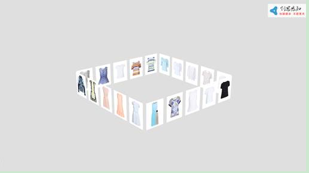

# 正方体控件（Square3DElement）

## 控件作用

正方体控件以 3D 立方体形式展示图片内容，支持配置立方体面的布局、初始旋转角度、放大摄像机的 Z 轴位移以及动画时间，常用于产品展示、图片墙、3D 展厅等场景。

## 适用场景

- 产品图片 3D 立方体展示
- 展厅中多面图片内容切换
- 需要初始倾斜角度与点击放大效果的 3D 图片墙

## 前置依赖

使用正方体控件前，必须满足以下条件：

1. 项目目录中存在对应的控件程序集（如 `UI.Square3D.dll` 或包含该控件的模块 DLL）；
2. 在 `SysConfig/UIControlDict.xml` 中注册 `Square3DElement`；
3. 如需动态加载图片，需配置数据源并在页面中使用 `DataProvider`。

> **说明**：当前代码库中未找到 `Square3DElement` 对应的源码文件，以下内容基于现有 XML 配置样例整理。如需补充源码链接，请先确认控件所在模块是否已纳入版本控制。

## 控件UI效果



## 配置文件样例

```xml
<Square3DElement>
    <UIDisplay Left="0" Top="0" Width="1920" Height="1080" IsShow="True" ZIndex="1" UsePercent="false" IsUseCache="false" />
    <DataProvider>IntroductionData?CSTable=AboutUs</DataProvider>
    <CustomerConfig>
        <Square3D>
            <Layout ItemWidth="420" ItemHeight="540" Row="1" Colum="5" SurfaceWidth="1.2" InitAngleX="18" InitAngleY="20" IntervalAngle="10"></Layout>
            <Zoom ZoomInZ="-2.5"></Zoom>
            <AnimationTime>400</AnimationTime>
        </Square3D>
    </CustomerConfig>
</Square3DElement>
```

## UIDisplay 说明

`UIDisplay` 用法参考 [CommonElement.md](CommonElement.md)。

## DataProvider 说明

通过 `DataProvider` 可动态绑定图片数据源。数据源中的每一行通常会生成立方体上的一个展示项。

```xml
<DataProvider>IntroductionData?CSTable=AboutUs</DataProvider>
```

- `IntroductionData`：数据源实例名称，需在 `Shell/Data/Data.xml` 中定义；
- `CSTable=AboutUs`：数据表/集合名称。

## CustomerConfig 参数说明

### Square3D 节点

`CustomerConfig` 内必须包含一个 `Square3D` 节点，用于配置 3D 立方体的外观与行为。

### Layout 节点

| 属性            | 必填 | 类型     | 默认值 | 说明                                                       |
| --------------- | ---- | -------- | ------ | ---------------------------------------------------------- |
| `ItemWidth`     | 否   | `double` | —      | 每个展示项（图片）的宽度。                                 |
| `ItemHeight`    | 否   | `double` | —      | 每个展示项（图片）的高度。                                 |
| `Row`           | 否   | `int`    | `1`    | 立方体一个面上显示的行数。                                 |
| `Colum`         | 否   | `int`    | `5`    | 立方体一个面上显示的列数（注意：XML 中属性名为 `Colum`）。 |
| `SurfaceWidth`  | 否   | `double` | —      | 立方体一个面的显示宽度，3D 空间中一般在 `0` ~ `4` 之间。   |
| `InitAngleX`    | 否   | `double` | `0`    | 初始状态下立方体绕 X 轴的倾斜角度。                        |
| `InitAngleY`    | 否   | `double` | `0`    | 初始状态下立方体绕 Y 轴的倾斜角度。                        |
| `IntervalAngle` | 否   | `double` | `0`    | 每个列之间的倾斜角度差。                                   |

### Zoom 节点

| 属性      | 必填 | 类型     | 默认值 | 说明                                                                |
| --------- | ---- | -------- | ------ | ------------------------------------------------------------------- |
| `ZoomInZ` | 否   | `double` | —      | 点击某个图像放大后摄像机沿 Z 轴移动的距离。数值越小，放大倍数越大。 |

### AnimationTime 节点

| 节点            | 类型  | 说明                     |
| --------------- | ----- | ------------------------ |
| `AnimationTime` | `int` | 动画间隔时间，单位毫秒。 |

## UIControlDict.xml 添加正方体控件

如果使用正方体控件，需要在 `UIControlDict.xml` 中添加注册节点。由于当前代码库中未找到对应源码，以下 TypeName 为占位示例，请根据实际控件所在程序集修改：

```xml
<Element ViewType="Square3DElement" AssemblyFile="UI.Square3D.dll" TypeName="UI.Square3D.Square3DControl, UI.Square3D, Version=1.0.0.0, Culture=neutral, PublicKeyToken=null">
    <DataContext AssemblyFile="UI.Square3D.dll" TypeName="UI.Square3D.Square3DControlViewModel, UI.Square3D, Version=1.0.0.0, Culture=neutral, PublicKeyToken=null" />
</Element>
```

## 部署说明

1. 确认项目目录中存在正方体控件对应的程序集；
2. 在 `SysConfig/UIControlDict.xml` 中添加上方注册节点；
3. 如需动态加载图片，在 `Shell/Data/Data.xml` 中配置数据源，并在页面中使用 `DataProvider`；
4. 在页面 XML 中使用 `Square3DElement`，配置 `UIDisplay`、`DataProvider` 与 `CustomerConfig`。
