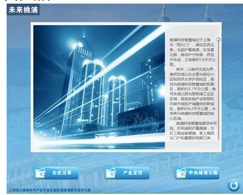

# 文字控件（TextElement）

## 1.控件作用

文字控件用于在页面或弹出框中直接显示文字内容。支持配置字体、字号、颜色、对齐方式、行高、垂直对齐等样式，支持走马灯滚动效果，也可绑定数据源动态显示文本。

## 2.适用场景

- 页面标题、副标题展示
- 说明文字、提示信息
- 动态绑定数据源显示文本（如名称、状态）
- 需要走马灯滚动展示的长文本

## 3.前置依赖

使用文字控件前，必须满足以下条件：

1. 项目目录中存在 `UI.Common.dll`；
2. 在 `SysConfig/UIControlDict.xml` 中注册 `TextElement`。

## 4.控件 UI 效果



## 5.配置文件样例

### 5.1基础文本

```xml
<TextElement Name="LogoText">
    <!--参考控件公用片段的讲解中UIDdisplay片段讲解-->
    <UIDisplay Left="800" Top="1000" Width="1100" Height="80" IsShow="True"  ZIndex="1" UsePercent="False"/>
    <!--文本的配置 ForegroundColor文字颜色，Family为字体，Size文字大小，CultureInfo语言，Alignment对齐方式, LineHeight每行的高度，VerticalAlignment垂直方向上的对齐方式-->
    <TextSource ForegroundColor="#FFFF0000" Family="微软雅黑" Size="50" CultureInfo="zh-CN" Alignment="Center" LineHeight="80" VerticalAlignment="Top">这里就是你放文字的地方</TextSource>
    <CustomerConfig>
        <!--Enable走马灯是否开启，Duration走一遍所花的时间，Direction走马灯的方向，分为顺时针Clockwise，和逆时针Counterclockwise-->
        <AutoMove Enable="True" Duration="00:00:20" Direction="Clockwise"/>
    </CustomerConfig>
</TextElement>
```

### 5.2绑定数据源

```xml
 <TextElement Name="名称">
                        <!--参考控件公用片段的讲解中UIDdisplay片段讲解-->
                        <UIDisplay Left="100" Top="52" Width="400" Height="180" IsShow="True" ZIndex="2" UsePercent="False" />
                        <!--文本的配置ForegroundColor文字颜色，Family为字体，Size文字大小，CultureInfo语言，Alignment对齐方式-->
                        <TextSource ForegroundColor="#FFFFFFFF" Family="黑体" Size="24"
                          CultureInfo="zh-CN" Alignment="Left">{$Name}</TextSource>
                      </TextElement>
```

## 6.UIDisplay 说明

`UIDisplay` 用法参考 [CommonElement.md](CommonElement.md)。

TextSource 参数说明

`TextSource` 节点用于配置需要显示的文字及其样式。节点内部文本为实际显示内容，支持通过 `{$ColumnName}` 绑定数据源字段。

## 7.TextSource 参数说明

`TextSource` 节点用于配置需要显示的文字及其样式。节点内部文本为实际显示内容，支持通过 `{$ColumnName}` 绑定数据源字段。

| 属性                | 必填 | 类型                                    | 默认值      | 说明                                   |
| ------------------- | ---- | --------------------------------------- | ----------- | -------------------------------------- |
| `ForegroundColor`   | 否   | `string`                                | `#FFFFFFFF` | 文字颜色，格式为 `#AARRGGBB`。         |
| `Family`            | 否   | `string`                                | `微软雅黑`  | 字体名称。                             |
| `Size`              | 否   | `int`                                   | `10`        | 文字大小。                             |
| `CultureInfo`       | 否   | `string`                                | `en-US`     | 语言区域信息，影响数字、日期等格式化。 |
| `Alignment`         | 否   | `Left` / `Right` / `Center`             | `Left`      | 文字水平对齐方式。                     |
| `LineHeight`        | 否   | `int`                                   | `0`         | 每行高度，`0` 表示使用默认行高。       |
| `VerticalAlignment` | 否   | `Top` / `Center` / `Bottom` / `Stretch` | `Top`       | 文字垂直方向对齐方式。                 |

### 7.1对齐方式

| 取值     | 说明       |
| -------- | ---------- |
| `Left`   | 左对齐。   |
| `Right`  | 右对齐。   |
| `Center` | 水平居中。 |

### 7.2垂直对齐方式

| 取值      | 说明       |
| --------- | ---------- |
| `Top`     | 顶部对齐。 |
| `Center`  | 垂直居中。 |
| `Bottom`  | 底部对齐。 |
| `Stretch` | 拉伸填充。 |

## 8.DataProvider 说明

文字控件支持通过 `DataProvider` 绑定数据源，动态替换 `TextSource` 中的模板变量。

```xml
<DataProvider>IntroductionData?CSTable=AboutUs</DataProvider>
<TextSource>{$Name}</TextSource>
```

- `IntroductionData`：数据源实例名称，需在 `Shell/Data/Data.xml` 中定义；
- `CSTable=AboutUs`：数据表/集合名称；
- `{$Name}`：数据源中的列名，运行时会替换为实际值。

## 9.CustomerConfig 参数说明

### 9.1AutoMove 节点

`AutoMove` 节点用于控制文字走马灯效果。不需要走马灯时，可省略 `CustomerConfig` 节点。

| 属性        | 必填 | 类型                             | 默认值      | 说明                                                      |
| ----------- | ---- | -------------------------------- | ----------- | --------------------------------------------------------- |
| `Enable`    | 否   | `bool`                           | `False`     | 是否开启走马灯效果。                                      |
| `Duration`  | 否   | `string`                         | `00:00:20`  | 文字走一遍所需时间，格式为 `HH:MM:SS` 或 `HH:MM:SS.fff`。 |
| `Direction` | 否   | `Clockwise` / `Counterclockwise` | `Clockwise` | 走马灯滚动方向。                                          |

### 9.2Direction 说明

| 取值               | 说明                                                |
| ------------------ | --------------------------------------------------- |
| `Clockwise`        | 顺时针:从右向左滚动（文字从右侧进入，向左侧移出）。 |
| `Counterclockwise` | 逆时针:从左向右滚动（文字从左侧进入，向右侧移出）。 |

## 10.UIControlDict.xml 添加文字控件

如果使用文字控件，需要在 `UIControlDict.xml` 中添加注册节点：

```xml
<Element ViewType="TextElement" AssemblyFile="UI.Common.dll" TypeName="UI.Common.SensingControl.TextControl, UI.Common, Version=1.0.0.0, Culture=neutral, PublicKeyToken=null">
    <DataContext AssemblyFile="UI.Common.dll" TypeName="UI.Common.SensingView.TextElementViewModel, UI.Common, Version=1.0.0.0, Culture=neutral, PublicKeyToken=null" />
</Element>
```

## 11.部署说明

1. 确认项目目录中存在 `UI.Common.dll`；
2. 在 `SysConfig/UIControlDict.xml` 中添加上方注册节点；
3. 在页面 XML 中使用 `TextElement`，配置 `UIDisplay` 和 `TextSource`；
4. 如需动态文本，配置 `DataProvider` 并在 `TextSource` 中使用 `{$ColumnName}` 模板变量；
5. 如需走马灯效果，在 `CustomerConfig` 中配置 `AutoMove`。

## 12.常见问题

### 文字不显示

- 检查 `UIDisplay` 的 `IsShow` 是否为 `True`；
- 检查 `TextSource` 的 `ForegroundColor` 是否被背景色覆盖；
- 检查 `ZIndex` 是否被其他控件遮挡；
- 检查 `Width` / `Height` 是否足够显示文字。

### 走马灯不滚动

- 检查 `AutoMove` 的 `Enable` 是否为 `True`；
- 检查 `Duration` 格式是否正确，例如 `00:00:20`；
- 检查文字长度是否超过控件宽度，过短的文本不会明显滚动。

### 数据绑定不生效

- 检查 `DataProvider` 中的数据源名称和表名是否正确；
- 检查 `TextSource` 中的 `{$ColumnName}` 与数据源列名是否一致；
- 检查数据源中是否有数据行。

### 文字换行异常

- 文字控件默认启用自动换行（`TextWrapping="Wrap"`）；
- 调整 `Width` 或 `LineHeight` 以控制换行效果；
- 检查 `Alignment` 与 `VerticalAlignment` 是否符合预期。

## 13.注意事项

- 文字控件默认启用 `ClipToBounds`，超出控件边界的内容会被裁剪；
- `Alignment` 仅支持 `Left`、`Right`、`Center` 三种水平对齐方式；
- 走马灯通过动画改变 `Canvas.Left` 实现，会覆盖手动设置的水平位置；
- 控件卸载时会取消数据源变更事件订阅，避免内存泄漏；
- 事件 URL 中的 `&` 必须转义为 `&amp;`。
