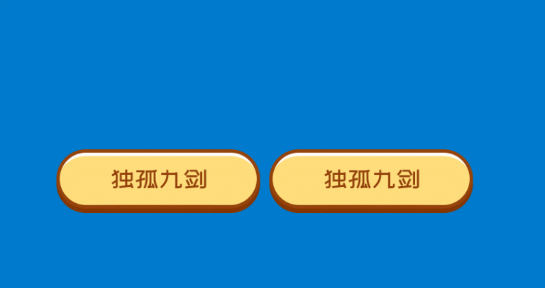

# 支持两种状态的图片按钮控件（ToggleButton）

## 控件作用

支持两种状态的图片按钮控件,点击图片按钮触发事件。也可以通过事件(control)来控制按钮是否选中。

## 控件 UI 效果



## 配置文件样例

```
<ToggleButton>
	<UIDisplay Left="523" Top="878" Width="300" Height="90" IsShow="True" ZIndex="4" UsePercent="False" />
	<CustomerConfig>
		<ImageSource UriKind="Application">Shell\Pages\img\独孤九剑.png</ImageSource>
		<ImageSourceChecked UriKind="Application">Shell\Pages\img\独孤九剑高亮.png</ImageSourceChecked>
		  <ClickEvent>Navigate?Page=HomePage</ClickEvent>
		  <GroupName>img</GroupName>
		  <Button AutoClick="True" />
		  <IsChecked>False</IsChecked>
	</CustomerConfig>
</ToggleButton>

```
```xml
 <!-- 触发对应togglebutton的check事件并且按钮会触发相关动画，也可以UnCheck -->
  <Event>Control?TargetPageName=SlidingScreen&amp;TargetGroup=A&amp;TargetControlName=2006&amp;Action=Check</Event>
```

````
 <ToggleButton>
        <UIDisplay Left="261" Top="936" Width="328" Height="131" IsShow="True" ZIndex="4" UsePercent="False" />
        <CustomerConfig>
          <ImageSource UriKind="Application">Shell\Pages\jjfaPage\resource\wurendian\自助体验店亮.png</ImageSource>
          <ImageSourceChecked UriKind="Application">Shell\Pages\jjfaPage\resource\wurendian\自助体验店.png</ImageSourceChecked>
          <CheckedEvent>PopupEvent?TargetPageName=jjfaPage&TargetControlName=PopItemsP&X=0&Y=0&Height=1080&Width=1920&TP=自助体验店.png&EventID=wurendiantp&UriKind=Application&EventPath=Shell\Pages\jjfaPage\PopItems\wurendian</CheckedEvent>
          <GroupName>Z</GroupName>
          <Button AutoClick="True" />
          <IsChecked>True</IsChecked>
        </CustomerConfig>
      </ToggleButton>
	  ```


## 配置说明

### 节点 CustomerConfig

属性说明

        GroupName：给按钮分组，样例中的组名为img，若多个ToggleButton为同一个组，ToggleButton之间可以交互。

        Button AutoClick：自动按钮，True或False

        IsChecked：进入页面中图片的点击状态，True或False，True为已被点击，False为未被点击。

# UIControlDict.xml 添加支持两种状态的图片按钮控件

如果使用支持两种状态的图片按钮控件则需要在 UIControlDict.xml 中添加支持两种状态的图片按钮控件

````

<Element ViewType="ToggleButton" AssemblyFile="UI.Common.dll" TypeName="UI.Common.SensingControl.ImageToggleButtonControl, UI.Common, Version=1.0.0.0, Culture=neutral, PublicKeyToken=null">
    <DataContext AssemblyFile="UI.Common.dll" TypeName="UI.Common.SensingView.ImageToggleButtonControlViewModel, UI.Common, Version=1.0.0.0, Culture=neutral, PublicKeyToken=null" />
  </Element>
```
