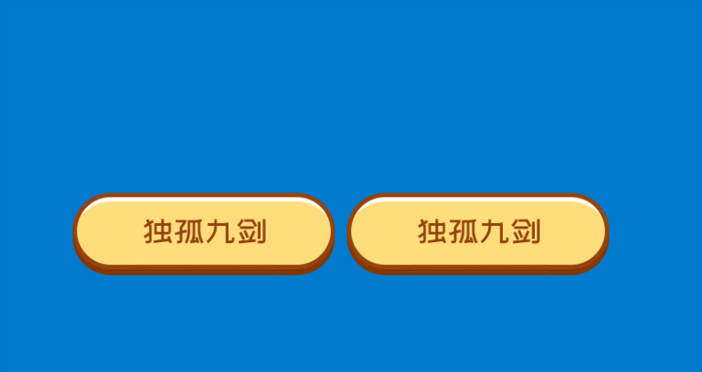

# 支持两种状态的图片按钮控件（ToggleButton）

## 1.控件作用

`ToggleButton` 是一个支持两种状态（未选中 / 已选中）的图片按钮控件。通过配置未选中图片和选中图片，可在点击后切换显示效果，并可触发选中/取消选中事件。同组按钮之间可实现单选互斥效果，常用于分类切换、楼层选择、状态切换等场景。

## 2.适用场景

- 分类/标签切换按钮
- 楼层、地图图层选择
- 图片选中/未选中状态展示
- 需要分组互斥的选项按钮

## 3.前置依赖

使用 `ToggleButton` 控件前，必须满足以下条件：

1. 项目目录中存在 `UI.Common.dll`；
2. 在 `SysConfig/UIControlDict.xml` 中注册 `ToggleButton`。

## 4.控件 UI 效果



## 5.配置文件样例

### 5.1基础切换按钮

```xml
<ToggleButton>
	<UIDisplay Left="523" Top="878" Width="300" Height="90" IsShow="True" ZIndex="4" UsePercent="False" />
	<CustomerConfig>
		<ImageSource UriKind="Application">Shell\Pages\img\独孤九剑.png</ImageSource>
		<ImageSourceChecked UriKind="Application">Shell\Pages\img\独孤九剑高亮.png</ImageSourceChecked>
		  <ClickEvent>Navigate?Page=HomePage</ClickEvent>
		  <GroupName>img</GroupName>
		  <Button AutoClick="True" />
		  <IsChecked>False</IsChecked>
	</CustomerConfig>
</ToggleButton>

```

```xml
 <!-- 触发对应togglebutton的check事件并且按钮会触发相关动画，也可以UnCheck -->
  <Event>Control?TargetPageName=SlidingScreen&TargetGroup=A&TargetControlName=2006&Action=Check</Event>
```

### 5.2带状态事件的切换按钮

```xml
 <ToggleButton>
        <UIDisplay Left="261" Top="936" Width="328" Height="131" IsShow="True" ZIndex="4" UsePercent="False" />
        <CustomerConfig>
          <ImageSource UriKind="Application">Shell\Pages\jjfaPage\resource\wurendian\自助体验店亮.png</ImageSource>
          <ImageSourceChecked UriKind="Application">Shell\Pages\jjfaPage\resource\wurendian\自助体验店.png</ImageSourceChecked>
          <CheckedEvent>PopupEvent?TargetPageName=jjfaPage&TargetControlName=PopItemsP&X=0&Y=0&Height=1080&Width=1920&TP=自助体验店.png&EventID=wurendiantp&UriKind=Application&EventPath=Shell\Pages\jjfaPage\PopItems\wurendian</CheckedEvent>
          <GroupName>Z</GroupName>
          <Button AutoClick="True" />
          <IsChecked>True</IsChecked>
           <UnCheckedEvent>
            <Event>ClosePopup?TargetPageName=jjfaPage&TargetControlName=PopItemsP&EventID=wurendiantp</Event>
        </UnCheckedEvent>
        </CustomerConfig>
      </ToggleButton>
```

### 5.3嵌套内容

`ToggleButton` 支持在节点内直接嵌套 `Content`，作为按钮的内部内容（会覆盖在图片之上）：

```xml
<ToggleButton Name="btnWithContent">
    <UIDisplay Left="100" Top="100" Width="200" Height="100" IsShow="True" ZIndex="1" UsePercent="False" />
    <CustomerConfig>
        <ImageSource UriKind="Application">Shell\Pages\Common\bg.png</ImageSource>
        <GroupName>A</GroupName>
    </CustomerConfig>
    <Content>
        <TextElement>
            <UIDisplay Left="0" Top="0" Width="200" Height="100" IsShow="True" ZIndex="1" UsePercent="False" />
            <TextSource ForegroundColor="#FFFFFFFF" Family="微软雅黑" Size="24" Alignment="Center">按钮文字</TextSource>
        </TextElement>
    </Content>
</ToggleButton>
```

## 6.UIDisplay 说明

`UIDisplay` 用法参考 [CommonElement.md](CommonElement.md)。

## 7.CustomerConfig 参数说明

### 7.1图片资源

| 节点/属性            | 必填 | 说明                                                          |
| -------------------- | ---- | ------------------------------------------------------------- |
| `ImageSource`        | 否   | 未选中状态下显示的图片。支持 `UriKind` 属性指定路径解析方式。 |
| `ImageSourceChecked` | 否   | 已选中状态下显示的图片。支持 `UriKind` 属性指定路径解析方式。 |
| `ImageSourceDisable` | 否   | 当前代码中已解析但未实际使用，保留用于未来扩展。              |

### 7.2状态与分组

| 节点/属性                | 必填 | 类型     | 默认值   | 说明                                                                               |
| ------------------------ | ---- | -------- | -------- | ---------------------------------------------------------------------------------- |
| `GroupName`              | 否   | `string` | 空字符串 | 分组名称。同组按钮具有单选互斥行为，选中其中一个会自动取消同组其他按钮的选中状态。 |
| `IsChecked`              | 否   | `bool`   | `False`  | 初始状态。`True` 表示初始已选中，`False` 表示未选中。                              |
| `Button.AutoClick`       | 否   | `bool`   | `False`  | 是否在控件加载后自动触发一次选中事件。                                             |
| `IsTransparentClickable` | 否   | `bool`   | `False`  | 是否允许点击透明区域。`False` 时仅图片中 Alpha 值大于 10 的像素可响应点击。        |

### 7.3事件节点

| 节点             | 说明                                                            |
| ---------------- | --------------------------------------------------------------- |
| `CheckedEvent`   | 按钮从未选中变为已选中时触发。可包含一个或多个 `Event` 子节点。 |
| `UnCheckedEvent` | 按钮从已选中变为未选中时触发。可包含一个或多个 `Event` 子节点。 |
| `DisableEvent`   | 按钮变为不可用状态时触发。可包含一个或多个 `Event` 子节点。     |

## 8.可接受的事件

### 8.1Control 事件

外部可通过 `Control` 事件远程控制 `ToggleButton` 的状态，常用于分组联动。

```xml
<Event>Control?TargetPageName=SlidingScreen&TargetGroup=A&TargetControlName=2006&Action=Check</Event>
```

| 参数                | 说明                                                  | 示例            |
| ------------------- | ----------------------------------------------------- | --------------- |
| `TargetPageName`    | 目标页面名称                                          | `SlidingScreen` |
| `TargetGroup`       | 目标按钮分组                                          | `A`             |
| `TargetControlName` | 目标按钮名称。配置为 `All` 时表示对同组所有按钮生效。 | `2006`          |
| `Action`            | 操作类型：`Check`、`UnCheck`、`Enable`、`Disable`     | `Check`         |

### 8.2SourceChanged 事件

可通过 `SourceChanged` 事件动态修改按钮未选中状态下的图片。

```xml
<ClickEvent>SourceChanged?TargetControlName=2006&UriKind=Project&ImageSource=Pages\SlidingScreen\resource\透明.jpg</ClickEvent>
```

| 参数                | 说明         | 示例                                    |
| ------------------- | ------------ | --------------------------------------- |
| `TargetControlName` | 目标按钮名称 | `2006`                                  |
| `ImageSource`       | 新的图片路径 | `Pages\SlidingScreen\resource\透明.jpg` |
| `UriKind`           | 路径解析方式 | `Project`                               |

## 9.UIControlDict.xml 添加切换按钮控件

如果使用切换按钮控件，需要在 `UIControlDict.xml` 中添加注册节点：

```xml
<Element ViewType="ToggleButton" AssemblyFile="UI.Common.dll" TypeName="UI.Common.SensingControl.ImageToggleButtonControl, UI.Common, Version=1.0.0.0, Culture=neutral, PublicKeyToken=null">
    <DataContext AssemblyFile="UI.Common.dll" TypeName="UI.Common.SensingView.ImageToggleButtonControlViewModel, UI.Common, Version=1.0.0.0, Culture=neutral, PublicKeyToken=null" />
</Element>
```

## 10.部署说明

1. 确认项目目录中存在 `UI.Common.dll`；
2. 在 `SysConfig/UIControlDict.xml` 中添加上方注册节点；
3. 准备未选中/选中两种状态的图片资源；
4. 在页面 XML 中使用 `ToggleButton`，配置 `UIDisplay`、`CustomerConfig`；
5. 如需分组互斥，为同组按钮配置相同的 `GroupName`；
6. 如需状态切换时触发事件，在 `CustomerConfig` 中配置 `CheckedEvent` / `UnCheckedEvent`。

## 11.常见问题

### 按钮不显示

- 检查 `UIControlDict.xml` 中是否已注册 `ToggleButton`；
- 检查 `ImageSource` 的 `UriKind` 和路径是否正确；
- 检查 `UIDisplay` 的 `IsShow` 是否为 `True`；
- 检查 `ZIndex` 是否被其他控件遮挡。

### 点击后状态不切换

- 检查 `IsTransparentClickable` 是否配置正确，透明区域可能无法点击；
- 如果配置了 `GroupName` 且当前按钮已被选中，再次点击不会取消选中；
- 检查是否有其他事件或控件拦截了触摸事件。

### 分组互斥不生效

- 检查同组按钮的 `GroupName` 是否完全一致；
- 检查 `UIControlDict.xml` 中注册的控件类型是否为 `ImageToggleButtonControl`。

### CheckedEvent / UnCheckedEvent 不触发

- 检查事件是否配置在 `CustomerConfig` 节点内；
- 检查事件 URL 中的 `&` 是否已转义为 `&amp;`；
- 检查 `CheckedEvent` / `UnCheckedEvent` 内部是否使用 `Event` 子节点包装。

## 12.注意事项

- XML 标签名为 `ToggleButton`，实际运行时映射到 `ImageToggleButtonControl` 与 `ImageToggleButtonControlViewModel`；
- `ClickEvent` 作为 `ToggleButton` 的直接子节点时，当前代码中不会被触发，请使用 `CheckedEvent` / `UnCheckedEvent`；
- `ImageSourceDisable` 已在 ViewModel 中解析，但当前控件初始化时未使用；
- 同组按钮（`GroupName` 相同）具有 RadioButton 互斥行为，未分组的按钮每次点击都会切换状态；
- 按钮点击时会有缩放动画反馈，触摸抬起后恢复；
- 控件卸载时会取消 `ControlEvent` 事件订阅，避免内存泄漏。
