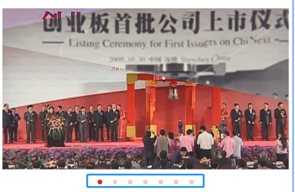

# 视频滑块控件（VideoBannerElement）

## 1.控件作用

视频滑块控件用于轮播播放多个视频或图片资源。控件以滑动切换的方式展示内容，当前项播放结束后自动播放下一条，也支持通过左右按钮或滑动手势触发切换。

## 2.适用场景

- 展厅宣传视频轮播
- 产品图片/视频混合展示
- 需要自动切换的多媒体 Banner
- 支持手势滑动切换的视频墙

## 3.前置依赖

使用视频滑块控件前，必须满足以下条件：

1. 项目目录中存在 `UI.VideoBanner.dll`；
2. 在 `SysConfig/UIControlDict.xml` 中注册 `VideoBannerElement`；
3. 如需动态加载内容，需在 `Shell/Data/Data.xml` 中配置数据源并在页面中使用 `DataProvider`。

## 4.控件UI效果




## 5.配置文件样例

### 5.1基础视频轮播

```xml
<VideoBannerElement Name="videoPlayer">
    <UIDisplay Left="114" Top="582" Width="861" Height="519" IsShow="True" ZIndex="1" UsePercent="False" />
    <DataProvider>VideoData?CSTable=Videos</DataProvider>
    <Items>
        <Template Left="0" Top="0" Width="1169" Height="661" TemplateID="10001">
            <VideoSource UriKind="Application">Shell\Pages\HomePage\resource\证券基础知识\衍生品\视频\{$weizhi}\{$video}</VideoSource>
        </Template>
    </Items>
    <CustomerConfig>
        <VideoBanner Interval="10" IsFixedInterval="False">
            <ImageButton Name="LeftArrowButton">
                <UIDisplay Left="0" Top="0" Width="80" Height="80" IsShow="True" ZIndex="2" UsePercent="False" />
                <ImageSource UriKind="Application">Shell\Pages\HomePage\resource\last_btn.png</ImageSource>
            </ImageButton>
            <ImageButton Name="RightArrowButton">
                <UIDisplay Left="0" Top="0" Width="80" Height="80" IsShow="True" ZIndex="2" UsePercent="False" />
                <ImageSource UriKind="Application">Shell\Pages\HomePage\resource\next_btn.png</ImageSource>
            </ImageButton>
        </VideoBanner>
    </CustomerConfig>
</VideoBannerElement>
```

```xml
<!--点点示例-->PagerIndex / NumberIndex 在当前代码中未解析---已是旧版不可用
<VideoBannerElement Name="videoPlayer">
    <UIDisplay Left="114" Top="582" Width="861" Height="519" IsShow="True" ZIndex="1" UsePercent="False" />
    <DataProvider>VideoData?CSTable={$sheet}</DataProvider>
    <Items>
        <Template Left="0" Top="0" Width="1169" Height="661" TemplateID="10001">
            <VideoSource UriKind="Application">Shell\Pages\HomePage\resource\证券基础知识\衍生品\视频\{$weizhi}\{$video}</VideoSource>
        </Template>
    </Items>
    <CustomerConfig>
        <PagerIndex VerticalAlignment="Bottom" Offset="-100" PageIndexColor="Gray" PageIndexSelectedColor="RED" />
    </CustomerConfig>
</VideoBannerElement>
```

```xml
<!--数字示例-->PagerIndex / NumberIndex 在当前代码中未解析---已是旧版不可用
<VideoBannerElement Name="videoPlayer">
    <UIDisplay Left="114" Top="582" Width="861" Height="519" IsShow="True" ZIndex="1" UsePercent="False" />
    <DataProvider>VideoData?CSTable={$sheet}</DataProvider>
    <Items>
        <Template Left="0" Top="0" Width="1169" Height="661" TemplateID="10001">
            <VideoSource UriKind="Application">Shell\Pages\HomePage\resource\证券基础知识\衍生品\视频\{$weizhi}\{$video}</VideoSource>
        </Template>
    </Items>
    <CustomerConfig>
        <NumberIndex VerticalAlignment="Bottom" Offset="-100">
            <XYContainerElement>
                <UIDisplay Left="0" Top="0" Width="800" Height="50" IsShow="True" ZIndex="1" UsePercent="False" />
                <Controls>
                    <TextElement Name="CURRENT_INDEX_TEXT">
                        <UIDisplay Left="280" Top="0" Width="100" Height="50" IsShow="True" ZIndex="2" UsePercent="False" />
                        <TextSource ForegroundColor="#324cc2" Family="黑体" Size="40" CultureInfo="zh-CN" Alignment="Right">1</TextSource>
                    </TextElement>
                    <TextElement Name="SPLIT">
                        <UIDisplay Left="385" Top="0" Width="30" Height="50" IsShow="True" ZIndex="2" UsePercent="False" />
                        <TextSource ForegroundColor="#324cc2" Family="黑体" Size="40" CultureInfo="zh-CN" Alignment="Center">/</TextSource>
                    </TextElement>
                    <TextElement Name="TOTAL_PAGE_TEXT">
                        <UIDisplay Left="420" Top="0" Width="100" Height="50" IsShow="True" ZIndex="2" UsePercent="False" />
                        <TextSource ForegroundColor="#324cc2" Family="黑体" Size="40" CultureInfo="zh-CN" Alignment="Left">100</TextSource>
                    </TextElement>
                </Controls>
            </XYContainerElement>
        </NumberIndex> -
    </CustomerConfig>
</VideoBannerElement>
```

## 6.按钮触发滑动

```xml
<!--上一页-->
<ImageButton>
    <UIDisplay Left="0" Top="0" Width="512" Height="512" IsShow="True" ZIndex="1" UsePercent="False" />
    <ImageSource UriKind="Application">Shell\Pages\HomePage\resource\last_btn.jpg</ImageSource>
    <ClickEvent>IndexChanged?TargetPageName=HomePage&TargetControlName=videoBanner&IndexString=Pre&Index=-1</ClickEvent>
</ImageButton>
<!--下一页-->
<ImageButton>
    <UIDisplay Left="500" Top="0" Width="512" Height="512" IsShow="True" ZIndex="1" UsePercent="False" />
    <ImageSource UriKind="Application">Shell\Pages\HomePage\resource\next_btn.jpg</ImageSource>
    <ClickEvent>IndexChanged?TargetPageName=HomePage&TargetControlName=videoBanner&IndexString=Next&Index=-1</ClickEvent>
</ImageButton>
```

## 7.UIDisplay 说明

`UIDisplay` 用法参考 [CommonElement.md](CommonElement.md)。

## 8.配置说明

可以设置两种页码控件，其它NumberIndex可以包含一个XYContainerElement包含元素控件。

### 8.1PagerIndex参数说明

1. VerticalAlignment="Bottom" 垂直位置(Top | Center | Bottom)
2. Offset="-100" 垂直偏移
3. PageIndexColor="Gray" 点点颜色
4. PageIndexSelectedColor="RED" 点点选中颜色

### 8.2NumberIndex说明

1. VerticalAlignment="Bottom" 垂直位置(Top | Center | Bottom)
2. Offset="-100" 垂直偏移

## 9.DataProvider 与 Items

### 9.1动态数据源模式

通过 `DataProvider` 绑定数据源，数据源中的每一行会生成一个轮播项。

```xml
<DataProvider>VideoData?CSTable=Videos</DataProvider>
```

- `VideoData`：数据源实例名称，需在 `Shell/Data/Data.xml` 中定义；
- `CSTable=Videos`：数据表/集合名称；
- `Template` 中的 `{$weizhi}`、`{$video}` 等变量需与数据源中的列名一致。

### 9.2Template 配置

`Items` 内使用 `Template` 作为轮播项模板。模板内部必须包含 `VideoSource` 节点，节点值为视频或图片路径。

```xml
<Items>
    <Template Left="0" Top="0" Width="1169" Height="661" TemplateID="10001">
        <VideoSource UriKind="Application">Shell\Pages\HomePage\resource\video\{$name}.mp4</VideoSource>
    </Template>
</Items>
```

| 属性         | 必填 | 说明                              |
| ------------ | ---- | --------------------------------- |
| `Left`       | 否   | 模板内容相对于轮播区域的 X 坐标。 |
| `Top`        | 否   | 模板内容相对于轮播区域的 Y 坐标。 |
| `Width`      | 否   | 模板内容宽度。                    |
| `Height`     | 否   | 模板内容高度。                    |
| `TemplateID` | 否   | 模板标识。                        |

### 9.3VideoSource 参数

| 属性      | 必填 | 说明               | 示例                                           |
| --------- | ---- | ------------------ | ---------------------------------------------- |
| `UriKind` | 否   | 路径解析方式       | `Application`                                  |
| 节点值    | 是   | 视频或图片文件路径 | `Shell\Pages\HomePage\resource\video\demo.mp4` |

> 当前实现支持 `.mp4`、`.wmv` 视频格式，以及其他图片格式（如 `.jpg`、`.png`）。

## 10.CustomerConfig 参数说明

### 10.1VideoBanner 节点

`CustomerConfig` 内必须包含一个 `VideoBanner` 节点。

| 属性              | 必填 | 类型   | 默认值  | 说明                                                                                                                  |
| ----------------- | ---- | ------ | ------- | --------------------------------------------------------------------------------------------------------------------- |
| `Interval`        | 否   | `int`  | `0`     | 图片项的停留时间，或固定间隔轮播的时间，单位秒。仅对图片或 `IsFixedInterval=True` 时生效。                            |
| `IsFixedInterval` | 否   | `bool` | `False` | 是否使用固定时间间隔切换。`True` 时按 `Interval` 秒强制切换；`False` 时视频播放完自动切换，图片按 `Interval` 秒切换。 |

### 10.2导航按钮

在 `VideoBanner` 节点内可配置 `ImageButton` 作为左右导航按钮。当前代码对以下两个特殊名称做了默认定位处理，并会自动绑定上下翻页事件：

| 按钮名称           | 作用                  | 默认位置                         |
| ------------------ | --------------------- | -------------------------------- |
| `LeftArrowButton`  | 切换到上一个视频/图片 | 轮播区域左侧，外边距 `-40,0,0,0` |
| `RightArrowButton` | 切换到下一个视频/图片 | 轮播区域右侧，外边距 `0,0,-40,0` |

对于这两个命名按钮，如果没有配置 `ClickEvent`，控件会自动注入 `IndexChanged` 事件实现上下翻页。因此最简配置可以省略 `ClickEvent`：

```xml
<VideoBanner Interval="10" IsFixedInterval="False">
    <ImageButton Name="LeftArrowButton">
        <UIDisplay Left="0" Top="0" Width="80" Height="80" IsShow="True" ZIndex="2" UsePercent="False" />
        <ImageSource UriKind="Application">Shell\Pages\HomePage\resource\last_btn.png</ImageSource>
    </ImageButton>
    <ImageButton Name="RightArrowButton">
        <UIDisplay Left="0" Top="0" Width="80" Height="80" IsShow="True" ZIndex="2" UsePercent="False" />
        <ImageSource UriKind="Application">Shell\Pages\HomePage\resource\next_btn.png</ImageSource>
    </ImageButton>
</VideoBanner>
```

如果需要自定义事件行为，也可以显式配置 `ClickEvent`，此时控件不会自动注入，以你配置的为准：

```xml
<ClickEvent>IndexChanged?TargetPageName=HomePage&TargetControlName=videoBanner&IndexString=Pre&Index=-1</ClickEvent>
```

## 11.可接受的事件

### 11.1IndexChanged 事件

#### 上一页 / 下一页

通过 `IndexChanged` 事件可以控制轮播切换到上一项或下一项。

```xml
<!-- 上一页 -->
<ClickEvent>IndexChanged?TargetPageName=HomePage&TargetControlName=videoBanner&IndexString=Pre&Index=-1</ClickEvent>

<!-- 下一页 -->
<ClickEvent>IndexChanged?TargetPageName=HomePage&TargetControlName=videoBanner&IndexString=Next&Index=-1</ClickEvent>
```

#### 跳转到指定项

```xml
<!-- 跳转到第 3 项（索引从 0 开始） -->
<ClickEvent>IndexChanged?TargetPageName=HomePage&TargetControlName=videoBanner&Index=2</ClickEvent>
```

| 参数                | 说明                                                                              | 示例          |
| ------------------- | --------------------------------------------------------------------------------- | ------------- |
| `TargetPageName`    | 目标页面名称                                                                      | `HomePage`    |
| `TargetControlName` | 目标视频滑块控件名称                                                              | `videoBanner` |
| `IndexString`       | 切换方向，`Next` 下一项，`Pre` 上一项                                             | `Next`        |
| `Index`             | 目标项索引（从 0 开始）。配合 `IndexString` 时请填 `-1`；单独使用时直接填目标索引 | `-1`          |

> **注意**：`IndexChangedEventFirer` 要求 `Index` 参数必须存在，所以即使使用 `IndexString` 方向切换，也需要带上 `Index=-1`。

## 12.UIControlDict.xml 添加视频滑块控件

如果使用视频滑块控件，需要在 `UIControlDict.xml` 中添加注册节点：

```xml
<Element ViewType="VideoBannerElement" AssemblyFile="UI.VideoBanner.dll" TypeName="UI.VideoBanner.VideoBannerControl, UI.VideoBanner, Version=1.0.0.0, Culture=neutral, PublicKeyToken=null">
    <DataContext AssemblyFile="UI.VideoBanner.dll" TypeName="UI.VideoBanner.VideoBannerControlViewModel, UI.VideoBanner, Version=1.0.0.0, Culture=neutral, PublicKeyToken=null" />
</Element>
```

## 13.部署说明

1. 确认项目目录中存在 `UI.VideoBanner.dll`；
2. 在 `SysConfig/UIControlDict.xml` 中添加上方注册节点；
3. 如需动态加载内容，在 `Shell/Data/Data.xml` 中配置数据源，并在页面中使用 `DataProvider`；
4. 准备视频/图片资源；
5. 在页面 XML 中使用 `VideoBannerElement`，配置 `UIDisplay`、`DataProvider`、`Items` 和 `CustomerConfig`。

## 14.常见问题

### 视频轮播不显示

- 检查 `UI.VideoBanner.dll` 是否存在于应用根目录；
- 检查 `UIControlDict.xml` 中是否已注册 `VideoBannerElement`；
- 检查 `UIDisplay` 的 `IsShow` 是否为 `True`；
- 检查 `ZIndex` 是否被其他控件遮挡。

### 视频/图片不播放

- 检查 `VideoSource` 的 `UriKind` 和路径是否正确；
- 确认文件真实存在且格式正确（视频支持 `.mp4`、`.wmv`）；
- 检查 `DataProvider` 中的数据源名称和表名是否正确；
- 检查模板中的 `{$ColumnName}` 变量是否与数据源列名一致。

### 导航按钮不生效

- 检查按钮名称是否为 `LeftArrowButton` 或 `RightArrowButton`；
- 检查按钮是否配置在 `CustomerConfig/VideoBanner` 节点内；
- 检查按钮图片路径是否正确。

### 切换间隔不符合预期

- 视频项默认播放完自动切换，不受 `Interval` 控制；
- 图片项按 `Interval` 秒切换；
- 设置 `IsFixedInterval="True"` 可对所有项强制按 `Interval` 秒切换。

## 15.注意事项

- 当前实现内置圆点指示器，位于轮播区域底部居中位置，点击圆点可直接跳转到对应项；
- 左右导航按钮命名为 `LeftArrowButton` / `RightArrowButton` 时会自动定位并默认注入上下翻页的 `IndexChanged` 事件，也可通过显式配置 `ClickEvent` 覆盖默认行为；
- 切换动画期间重复点击箭头或圆点会被忽略，防止双播放器状态错乱导致蓝屏/黑屏；
- 原配置文档中提到的 `PagerIndex` / `NumberIndex` 在当前代码中未解析，如需自定义页码样式，建议通过修改 `VideoBanner.xaml` 模板或在外部叠加控件实现；
- 控件使用双播放器（`PART_Current` / `PART_Next`）实现切换动画，切换时带淡入效果；
- 页面停止时（`StopPage`）会自动停止播放；
- 事件 URL 中的 `&` 必须转义为 `&amp;`。
