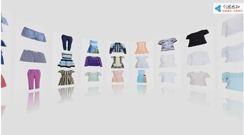

# 3D 凹面墙控件（Wall3DElement）

## 1.控件作用

3D 凹面墙控件将图片或视频以 3D 凹面墙的形式进行展示。内容按照椭球面排列，支持触摸滑动旋转、点击放大查看、自动旋转以及镜像倒影效果，常用于展厅图片墙、产品展示等场景。

## 2.适用场景

- 展厅图片墙/视频墙
- 产品多图 3D 展示
- 需要触摸交互的环形内容展示
- 需要点击放大查看的 3D 内容墙

## 3.前置依赖

使用 3D 凹面墙控件前，必须满足以下条件：

1. 项目目录中存在 `UI.Wall3D.dll`；
2. 在 `SysConfig/UIControlDict.xml` 中注册 `Wall3DElement`；
3. 如需动态加载内容，需配置数据源并在页面中使用 `DataProvider`，数据源中需包含 `FullName` 列（图片或视频路径）。

## 4.控件 UI 效果



## 5.配置文件样例

```xml
<Wall3DElement>
    <UIDisplay Left="0" Top="0" Width="1920" Height="1080" IsShow="True" ZIndex="1" UsePercent="false" IsUseCache="false" />
    <DataProvider>IntroductionData?CSTable=AboutUs</DataProvider>
    <Items>
        <Template  TemplateID="Image">
            <ImageElement  Name="Background">
                <UIDisplay Left="0" Top="0" Width="420" Height="540" IsShow="True"  ZIndex="1" UsePercent="False" Opacity="1" IsHitTestVisible="True" IsUseCache="True"/>
                <ImageSource UriKind="Absolute">{$FullName}</ImageSource>
            </ImageElement>
        </Template>
    </Items>
    <CustomerConfig>
        <Scenario3D>
            <Camera>
             <!--摄像机默认设置-->
                <Default>
                 <!--摄像机的视野-->
                    <FieldView>90</FieldView>
                     <!--摄像机的位置-->
                    <Position>
                        <X>0</X>
                        <Y>0</Y>
                        <Z>4.6</Z>
                    </Position>
                       <!--摄像机的朝向-->
                    <LookDirection>
                        <X>0</X>
                        <Y>0</Y>
                        <Z>-1</Z>
                    </LookDirection>
                     <!--摄像机绕X轴旋转的角度-->
                    <XAxisAngle>0</XAxisAngle>
                </Default>
                 <!--点击放大,拉近摄像机时摄像机的属性-->
                <Scaled>
                    <FieldView>90</FieldView>
                    <Position>
                        <X>0</X>
                        <Y>0</Y>
                        <Z>-3.2</Z>
                    </Position>
                    <LookDirection>
                        <X>0</X>
                        <Y>0</Y>
                        <Z>-1</Z>
                    </LookDirection>
                    <XAxisAngle>0</XAxisAngle>
                </Scaled>
                 <!--当3dWall变成一个圆筒时摄像机的属性-->
                <FullView>
                    <FieldView>90</FieldView>
                    <Position>
                        <X>0</X>
                        <Y>0</Y>
                        <!--当3DWall变成一个圆筒时，摄像机会被拉远，Z轴最大为8.6-->
                        <Z>8.6</Z>
                    </Position>
                    <LookDirection>
                        <X>0</X>
                        <Y>0</Y>
                         <!--当3dWall变成一个圆筒时 摄像机会被拉远，Z轴最大为8.6-->
                        <Z>-1</Z>
                    </LookDirection>
                    <!--摄像机绕X轴的最大角度 旋转80度后就不能继续旋转了-->
                    <XAxisAngle>80</XAxisAngle>
                </FullView>
            </Camera>
            <Model3D>
             <!--RadiusA,RadiusB,RadiusC 椭球的3个轴。在3D坐标系中 RadiusA:x轴 ，RadiusB:Z轴 ，RadiusC:y轴-->
                <RadiusA>4.8</RadiusA>
                <RadiusB>5</RadiusB>
                <RadiusC>5</RadiusC>
                 <!--纬度-->
                <Latitude>25</Latitude>
                     <!--每个Item之间的夹角-->
                <ItemMarginAngle>2</ItemMarginAngle>
                        <!--每个Item的子元素间的间距-->
                <SubItemMargin>2</SubItemMargin>
                  <!--每个Item的子元素的高度-->
                <SubItemHeight>540</SubItemHeight>
                 <!--每个Item的子元素的宽度-->
                <SubItemWidth>420</SubItemWidth>
                    <!--3DWall 展示的行数-->
                <ShowRow>3</ShowRow>
                <!--3DWall 展示的列数-->
                <ShowColumn>15</ShowColumn>
                <HasMirror>True</HasMirror>
            </Model3D>
        </Scenario3D>
        <Animation>
          <!--放大SubItem的动画时间-->
            <DefaultMoveInterval>2000</DefaultMoveInterval>
             <!--点击放大后的SubItem，SubItem移动到中间的动画时间-->
            <ScaledMoveInterval>500</ScaledMoveInterval>
              <!--预留节点-->
            <ShrinkInterval>2000</ShrinkInterval>
        </Animation>
        <!--图片资源-->
        <Source RootPath="Wall3D">
            <Extension>*.jpg</Extension>
        </Source>
    </CustomerConfig>
</Wall3DElement>

```

## 6.UIDisplay 说明

`UIDisplay` 用法参考 [CommonElement.md](CommonElement.md)。

## 7.DataProvider 与 Items

### 7.1动态数据源模式

通过 `DataProvider` 绑定数据源，数据源中的每一行会生成 3D 墙中的一个展示项。

```xml
<DataProvider>IntroductionData?CSTable=AboutUs</DataProvider>
```

- `IntroductionData`：数据源实例名称，需在 `Shell/Data/Data.xml` 中定义；
- `CSTable=AboutUs`：数据表/集合名称；
- 数据源中必须包含 `FullName` 列，用于指定图片或视频路径；
- `Template` 中的 `{$FullName}` 会被替换为实际路径。

### 7.2Template 配置

`Items` 内使用 `Template` 作为每个展示项的模板。模板内部通常放置 `ImageElement`，用于显示图片。

```xml
<Items>
    <Template TemplateID="Image">
        <ImageElement Name="Background">
            <ImageSource UriKind="Absolute">{$FullName}</ImageSource>
        </ImageElement>
    </Template>
</Items>
```

## 8.CustomerConfig 参数说明

### 8.1Scenario3D 节点

`Scenario3D` 节点用于配置 3D 场景，包含 `Camera` 和 `Model3D` 两个子节点。

### 8.2Camera 节点

`Camera` 节点包含三种摄像机状态：`Default`（默认）、`Scaled`（点击放大后）、`FullView`（全景观看）。每种状态包含以下子节点：

| 子节点          | 说明                                        |
| --------------- | ------------------------------------------- |
| `FieldView`     | 摄像机视野角度。                            |
| `Position`      | 摄像机位置，包含 `X`、`Y`、`Z` 三个子节点。 |
| `LookDirection` | 摄像机朝向，包含 `X`、`Y`、`Z` 三个子节点。 |
| `XAxisAngle`    | 摄像机绕 X 轴旋转的角度。                   |

### 8.3Model3D 节点

| 属性                 | 必填 | 类型     | 默认值  | 说明                                                 |
| -------------------- | ---- | -------- | ------- | ---------------------------------------------------- |
| `RadiusA`            | 否   | `double` | `2`     | 椭球 X 轴半径。                                      |
| `RadiusB`            | 否   | `double` | `10`    | 椭球 Z 轴半径。                                      |
| `RadiusC`            | 否   | `double` | `3`     | 椭球 Y 轴半径。                                      |
| `Latitude`           | 否   | `double` | `15`    | 纬度，控制 3D 墙的弧度。                             |
| `ShowRow`            | 否   | `int`    | `3`     | 展示行数。                                           |
| `ShowColumn`         | 否   | `int`    | `15`    | 展示列数。                                           |
| `ItemMarginAngle`    | 否   | `double` | `4`     | 每个 Item 之间的夹角。                               |
| `SubItemMargin`      | 否   | `double` | `40`    | 每个 Item 内部子元素之间的间距。                     |
| `SubItemHeight`      | 否   | `double` | `340`   | 每个子元素的高度。                                   |
| `SubItemWidth`       | 否   | `double` | `701`   | 每个子元素的宽度。                                   |
| `HasMirror`          | 否   | `bool`   | `False` | 是否显示镜像倒影。                                   |
| `PixelPerAngle`      | 否   | `double` | `8`     | 触摸滑动时像素与角度的转换比例，数值越小旋转越灵敏。 |
| `LinearDeceleration` | 否   | `double` | `0.1`   | 惯性滚动的减速度。                                   |

### 8.4Animation 节点

| 子节点                | 必填 | 类型     | 默认值 | 说明                                           |
| --------------------- | ---- | -------- | ------ | ---------------------------------------------- |
| `DefaultMoveInterval` | 否   | `double` | `2000` | 从放大状态恢复到默认状态的动画时间，单位毫秒。 |
| `ScaledMoveInterval`  | 否   | `double` | `1000` | 放大或放大状态间切换的动画时间，单位毫秒。     |
| `ShrinkInterval`      | 否   | `double` | `2000` | 预留字段，当前未实际使用。                     |

### 8.5AutoMove 节点

| 属性       | 必填 | 类型     | 默认值  | 说明               |
| ---------- | ---- | -------- | ------- | ------------------ |
| `IsEnable` | 否   | `bool`   | `False` | 是否启用自动旋转。 |
| `Speed`    | 否   | `double` | `1`     | 自动旋转速度。     |

## 9.交互说明

### 9.1触摸滑动

- 在 3D 墙上水平滑动可旋转凹面墙；
- 在默认状态下垂直滑动可调整摄像机 X 轴角度，模拟俯视/仰视；
- 滑动结束后保留惯性滚动效果。

### 9.2点击放大

- 点击某个子项后，摄像机移动到 `Scaled` 配置的位置，放大显示该子项；
- 再次点击已放大子项，恢复到默认状态；
- 放大状态下水平滑动可切换到相邻项，垂直滑动可在同一列的子项间切换。

## 10.UIControlDict.xml 添加 3D 凹面墙控件

如果使用 3D 凹面墙控件，需要在 `UIControlDict.xml` 中添加注册节点：

```xml
<Element ViewType="Wall3DElement" AssemblyFile="UI.Wall3D.dll" TypeName="UI.Wall3D.Wall3DControl, UI.Wall3D, Version=1.0.0.0, Culture=neutral, PublicKeyToken=null">
    <DataContext AssemblyFile="UI.Wall3D.dll" TypeName="UI.Wall3D.Wall3DControlViewModel, UI.Wall3D, Version=1.0.0.0, Culture=neutral, PublicKeyToken=null" />
</Element>
```

## 11.部署说明

1. 确认项目目录中存在 `UI.Wall3D.dll`；
2. 在 `SysConfig/UIControlDict.xml` 中添加上方注册节点；
3. 如需动态加载内容，在 `Shell/Data/Data.xml` 中配置数据源，数据源需包含 `FullName` 列；
4. 准备图片或视频资源；
5. 在页面 XML 中使用 `Wall3DElement`，配置 `UIDisplay`、`DataProvider`、`Items` 和 `CustomerConfig`。

## 12.常见问题

### 3D 墙不显示

- 检查 `UI.Wall3D.dll` 是否存在于应用根目录；
- 检查 `UIControlDict.xml` 中是否已注册 `Wall3DElement`；
- 检查 `UIDisplay` 的 `IsShow` 是否为 `True`；
- 检查 `ZIndex` 是否被其他控件遮挡。

### 图片/视频不显示

- 检查 `DataProvider` 中的数据源名称和表名是否正确；
- 检查数据源中是否包含 `FullName` 列；
- 检查 `ImageSource` 的 `UriKind` 和路径是否正确；
- 确认图片/视频文件真实存在。

### 3D 墙变形或排列异常

- 调整 `RadiusA`、`RadiusB`、`RadiusC` 以改变椭球形状；
- 调整 `Latitude` 以改变弧度；
- 调整 `ShowRow`、`ShowColumn`、`ItemMarginAngle` 以改变行列布局。

### 触摸滑动不灵敏

- 调整 `PixelPerAngle`，数值越小旋转越灵敏；
- 检查是否有其他控件拦截了触摸事件。

### 自动旋转不生效

- 检查 `AutoMove` 的 `IsEnable` 是否为 `True`；
- 检查 `Speed` 是否不为 0。

## 13.注意事项

- 数据源中必须包含 `FullName` 列，用于提供图片或视频路径；
- 原配置文档中提到的 `Source` / `Extension` 节点在当前代码中未解析，请使用 `DataProvider` + `Items/Template` 模式加载内容；
- `HasMirror=True` 时会在底部添加镜像倒影，会增加一行的渲染开销；
- `ScaledMoveInterval` 影响点击放大和放大状态间切换的动画时间；
- `ShrinkInterval` 为预留字段，当前未实际使用；
- 事件 URL 中的 `&` 必须转义为 `&amp;`。
