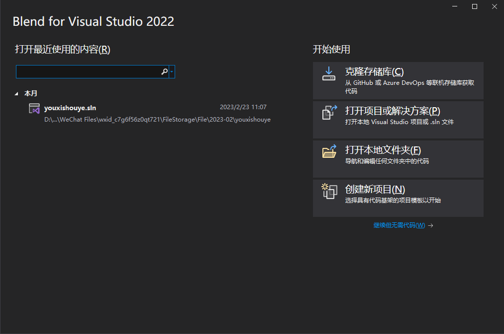
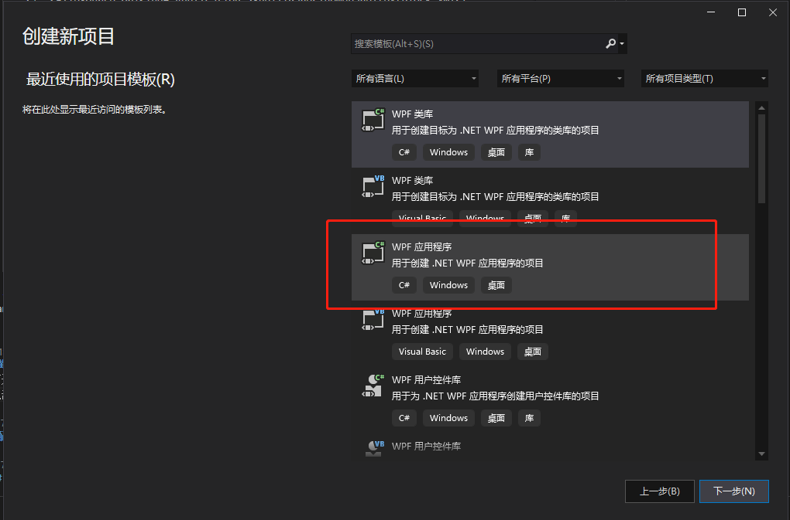
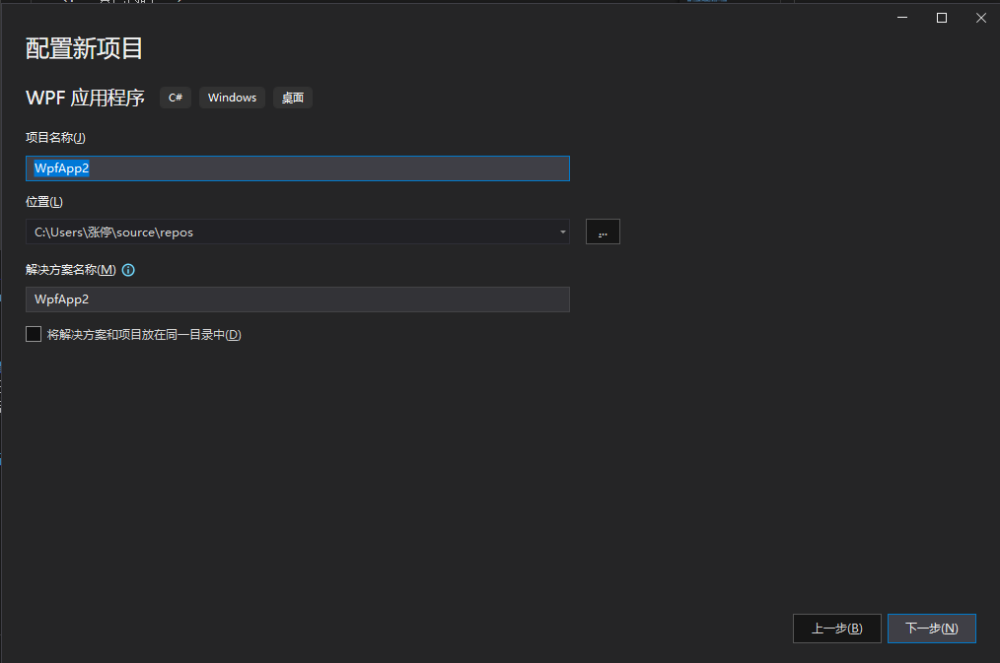
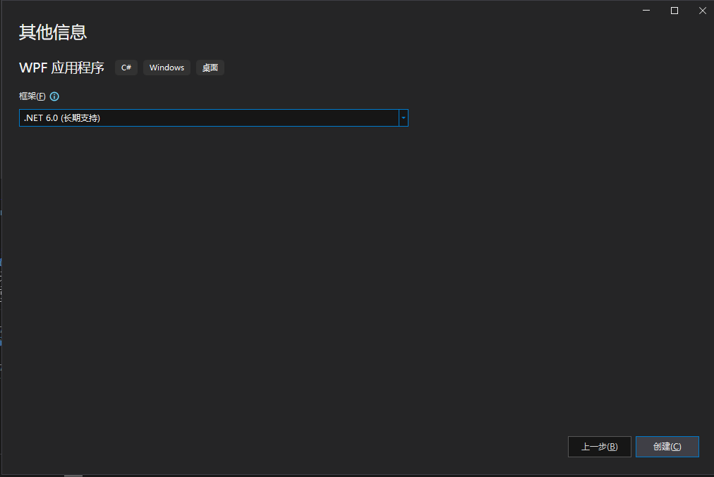
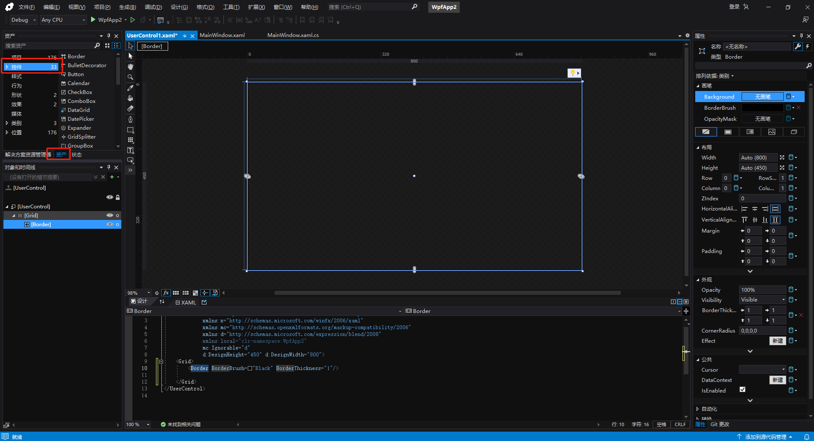
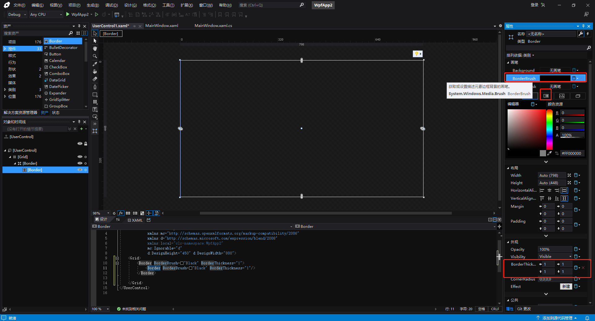
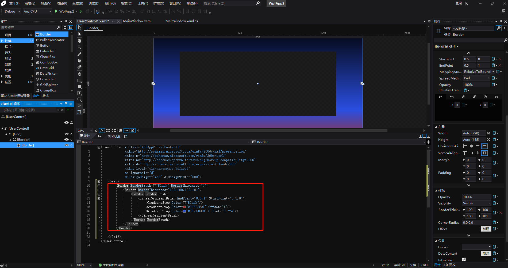

# 包动画控件（XamlElement）

## 控件作用

包动画控件主要使用工具Blend for Visual Studio 或者Visual Studio 制作一些背景动画，用动画来展示制作一些东西，使得界面更加生动。


## 配置文件样例

```
<XamlElement>
    <UIDisplay Left="0" Top="0" Width="1920" Height="1080"  IsShow="True" ZIndex="5" UsePercent="False" />
    <Xaml>
        <!--<FileSource UriKind="Application">Shell\Pages\homepage\textblock.xml</FileSource>-->
		<Border
            xmlns="http://schemas.microsoft.com/winfx/2006/xaml/presentation" >

			<!-- 黄色代码 -->
			
            <Border.Background>
                <LinearGradientBrush>
                    <LinearGradientBrush.GradientStops>
                        <GradientStop Color="#FF008000" Offset="0" />
                        <GradientStop Color="#FF0000FF" Offset="0.5" />
                        <GradientStop Color="#FFFF0000" Offset="1" />
                    </LinearGradientBrush.GradientStops>
                </LinearGradientBrush>
            </Border.Background>
        </Border>		
		
		<!-- 黄色代码 -->
	
    </Xaml>
</XamlElement>   

```


## 配置说明

#### 注：黄色部分的代码在Blend中复制即可

1.打开Blend for Visual Studio 2022 或者Visual Studio 2022

2.点击创建新项目，选择WPF应用程序，点击下一步



3.默认填写项目名称和存储位置，可进行修改，点击下一步


4.点击创建

5.blend里控件路径：资产-控件-选择控件

 Studio里控件路径：工具箱-常用WPF控件


6.点击border拖动至中间的画面中，修改右侧的属性内容


7.属性里，点击BroderBrush

8.点击下方第三个框渐变画笔，可以修改背景渐变

9.可以添加其他控件

10.xaml的border内容为上方黄色代码


