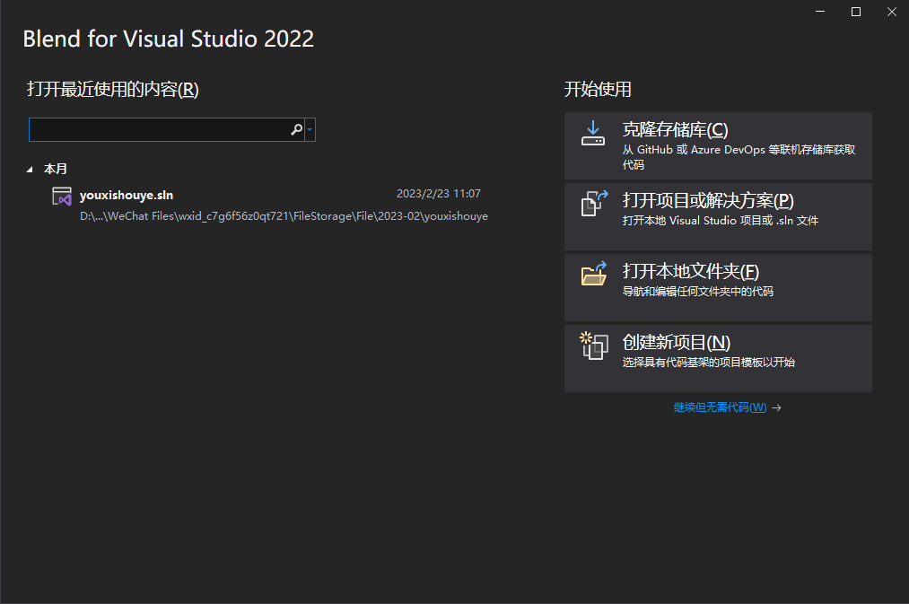
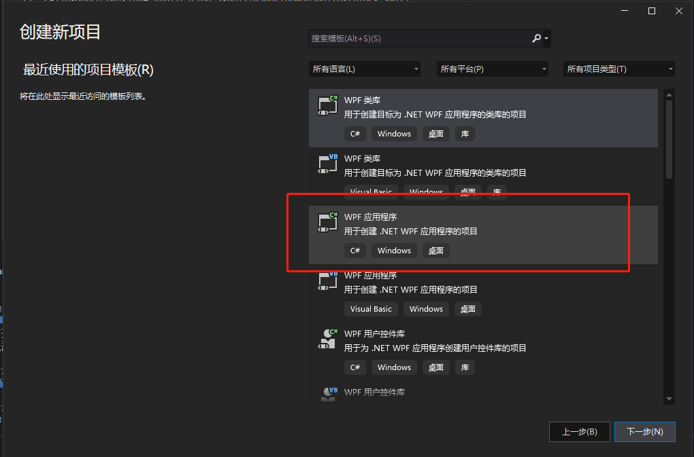
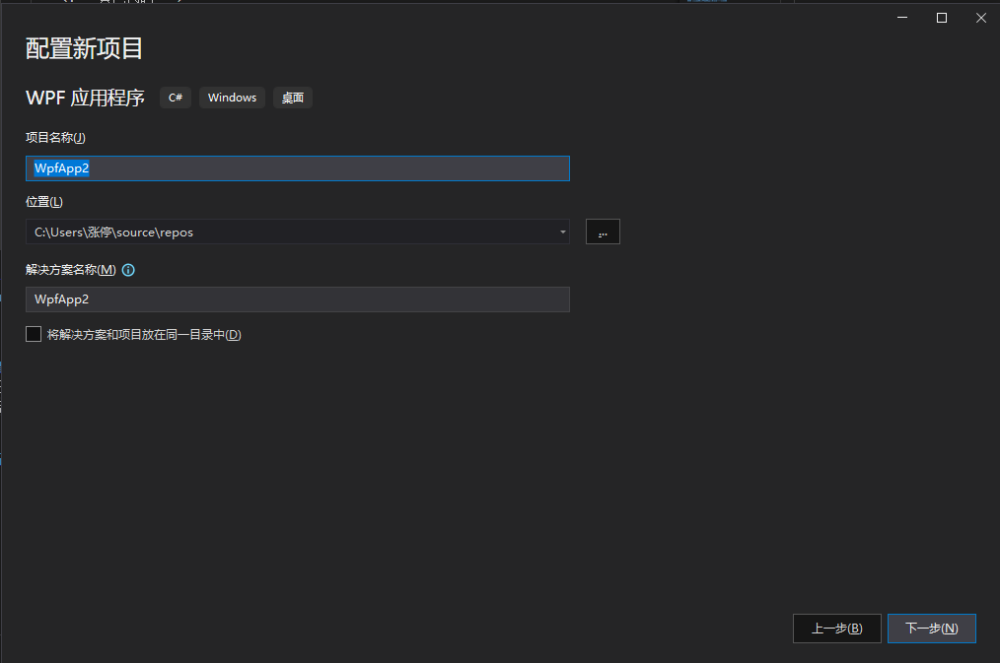
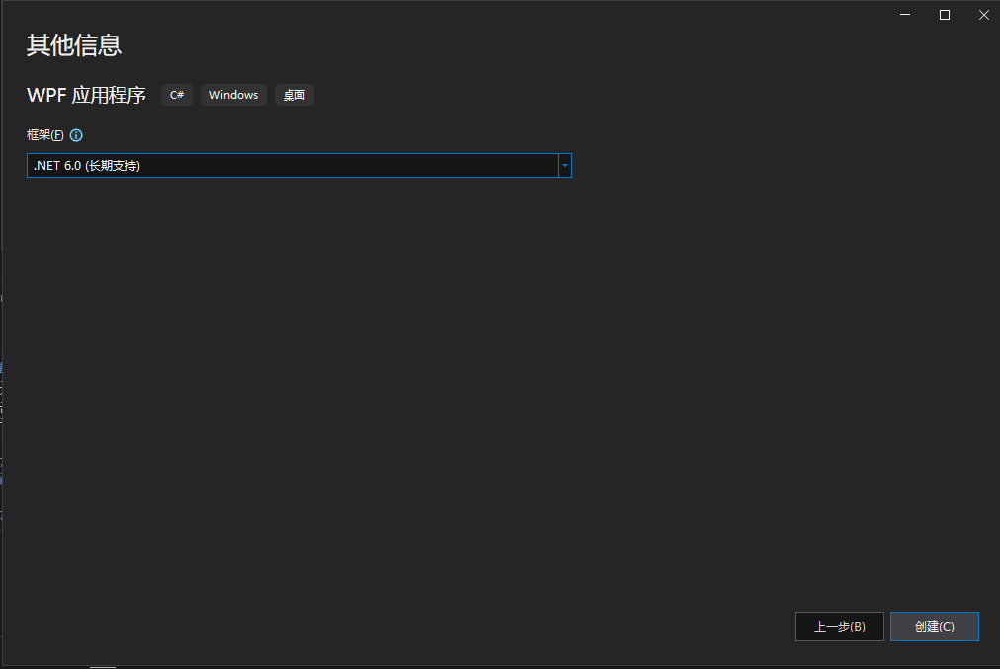
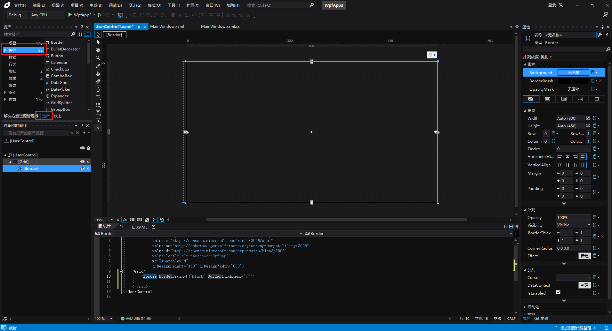
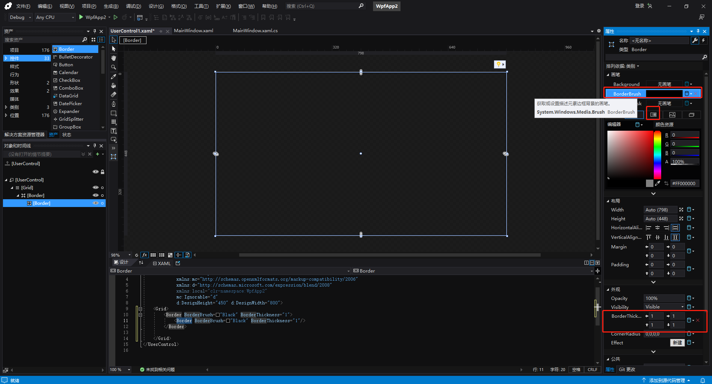
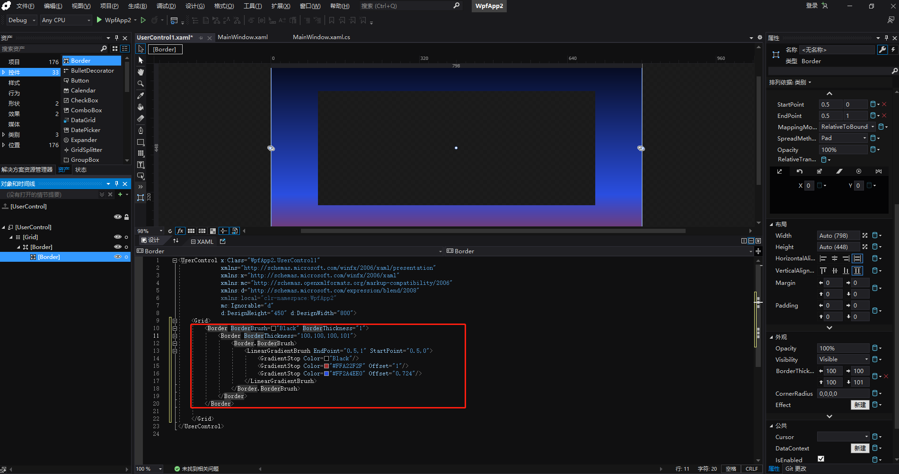

# 包动画控件（XamlElement）

## 1.控件作用

包动画控件用于在页面中直接嵌入自定义 XAML 内容。通常使用 Blend for Visual Studio 或 Visual Studio 制作背景动画、渐变效果、动态元素等，然后将生成的 XAML 代码嵌入到配置中，使界面更加生动。

## 2.适用场景

- 页面背景渐变或动态背景
- 复杂的 WPF 动画效果
- 使用 Blend/Visual Studio 设计的可视化元素
- 需要自定义 XAML 实现的特殊展示效果

## 3.前置依赖

使用包动画控件前，必须满足以下条件：

1. 项目目录中存在 `UI.Common.dll`；
2. 在 `SysConfig/UIControlDict.xml` 中注册 `XamlElement`。

## 4.配置文件样例

### 4.1内联 XAML

```xml
<XamlElement>
    <UIDisplay Left="0" Top="0" Width="1920" Height="1080"  IsShow="True" ZIndex="5" UsePercent="False" />
    <Xaml>
        <!--<FileSource UriKind="Application">Shell\Pages\homepage\textblock.xml</FileSource>-->
		<Border
            xmlns="http://schemas.microsoft.com/winfx/2006/xaml/presentation" >

			<!-- 黄色代码 -->

            <Border.Background>
                <LinearGradientBrush>
                    <LinearGradientBrush.GradientStops>
                        <GradientStop Color="#FF008000" Offset="0" />
                        <GradientStop Color="#FF0000FF" Offset="0.5" />
                        <GradientStop Color="#FFFF0000" Offset="1" />
                    </LinearGradientBrush.GradientStops>
                </LinearGradientBrush>
            </Border.Background>
        </Border>

		<!-- 黄色代码 -->

    </Xaml>
</XamlElement>

```

### 4.2外部 XAML 文件

```xml
<XamlElement Name="Xaml">
    <UIDisplay Left="0" Top="0" Width="1920" Height="1080" IsShow="True" ZIndex="5" UsePercent="False" />
    <Xaml>
        <FileSource UriKind="Application">Shell\Pages\homepage\animation.xaml</FileSource>
    </Xaml>
</XamlElement>
```

## 5.UIDisplay 说明

`UIDisplay` 用法参考 [CommonElement.md](CommonElement.md)。

## 6.Xaml 节点说明

`Xaml` 为 `XamlElement` 的直接子节点，内部可包含两种方式之一：

### 6.1方式一：内联 XAML

直接在 `Xaml` 节点内写入标准的 WPF XAML 元素。根元素必须声明 `xmlns="http://schemas.microsoft.com/winfx/2006/xaml/presentation"` 命名空间。

### 6.2方式二：外部文件

通过 `FileSource` 节点引用外部 `.xaml` 文件。

| 属性      | 必填 | 类型     | 默认值     | 说明                 |
| --------- | ---- | -------- | ---------- | -------------------- |
| `UriKind` | 否   | `string` | `Relative` | 文件路径解析方式。   |
| 节点值    | 是   | `string` | —          | 外部 XAML 文件路径。 |

## 7.使用 Blend / Visual Studio 制作 XAML

1. 打开 Blend for Visual Studio 或 Visual Studio；
2. 创建新的 WPF 应用程序项目；
3. 从工具箱/资产面板中拖动控件到设计界面，例如 `Border`；
4. 在属性面板中调整控件的背景、大小、动画等属性；
5. 将设计器生成的 XAML 代码复制到 `Xaml` 节点内，或保存为 `.xaml` 文件后通过 `FileSource` 引用。

### 7.1注：黄色部分的代码在Blend中复制即可

1.打开Blend for Visual Studio 2022 或者Visual Studio 2022

2.点击创建新项目，选择WPF应用程序，点击下一步



3.默认填写项目名称和存储位置，可进行修改，点击下一步


4.点击创建

5.blend里控件路径：资产-控件-选择控件

Studio里控件路径：工具箱-常用WPF控件

 6.点击border拖动至中间的画面中，修改右侧的属性内容


7.属性里，点击BroderBrush

8.点击下方第三个框渐变画笔，可以修改背景渐变

9.可以添加其他控件

10.xaml的border内容为上方黄色代码


## 8.UIControlDict.xml 添加包动画控件

如果使用包动画控件，需要在 `UIControlDict.xml` 中添加注册节点：

```xml
<Element ViewType="XamlElement" AssemblyFile="UI.Common.dll" TypeName="UI.Common.SensingControl.XamlPanelControl, UI.Common, Version=1.0.0.0, Culture=neutral, PublicKeyToken=null">
    <DataContext AssemblyFile="UI.Common.dll" TypeName="UI.Common.SensingView.XamlPanelViewModel, UI.Common, Version=1.0.0.0, Culture=neutral, PublicKeyToken=null" />
</Element>
```

## 9.部署说明

1. 确认项目目录中存在 `UI.Common.dll`；
2. 在 `SysConfig/UIControlDict.xml` 中添加上方注册节点；
3. 使用 Blend 或 Visual Studio 制作 XAML 动画效果；
4. 将生成的 XAML 直接内联到页面 XML 中，或保存为外部 `.xaml` 文件；
5. 在页面 XML 中使用 `XamlElement`，配置 `UIDisplay` 与 `Xaml`。

## 10.常见问题

### XAML 不显示

- 检查 `UIControlDict.xml` 中是否已注册 `XamlElement`；
- 检查 `UIDisplay` 的 `IsShow` 是否为 `True`；
- 检查 `ZIndex` 是否被其他控件遮挡；
- 检查 XAML 根元素是否声明了正确的命名空间。

### XAML 解析失败

- 检查 XAML 语法是否正确；
- 检查根元素是否包含 `xmlns="http://schemas.microsoft.com/winfx/2006/xaml/presentation"`；
- 如果使用了自定义控件或资源字典，确保相关程序集已加载。

### 外部文件不加载

- 检查 `FileSource` 的 `UriKind` 和路径是否正确；
- 确认 `.xaml` 文件真实存在；
- 检查文件编码是否为 UTF-8。

### 动画不播放

- 检查 XAML 中是否定义了 `Storyboard` 或动画触发器；
- 确认动画的 `BeginTime`、`Duration` 配置正确；
- 检查是否有 `Loaded` 事件触发器。

## 11.注意事项

- `Xaml` 节点内的 XAML 会被 `XamlReader` 解析，因此必须是格式良好的 WPF XAML；
- 内联 XAML 不支持代码后置（Code-Behind），只能使用纯 XAML；
- 建议优先使用外部 `FileSource` 方式管理复杂的 XAML 动画，便于维护和复用；
- 事件 URL 中的 `&` 必须转义为 `&amp;`。
