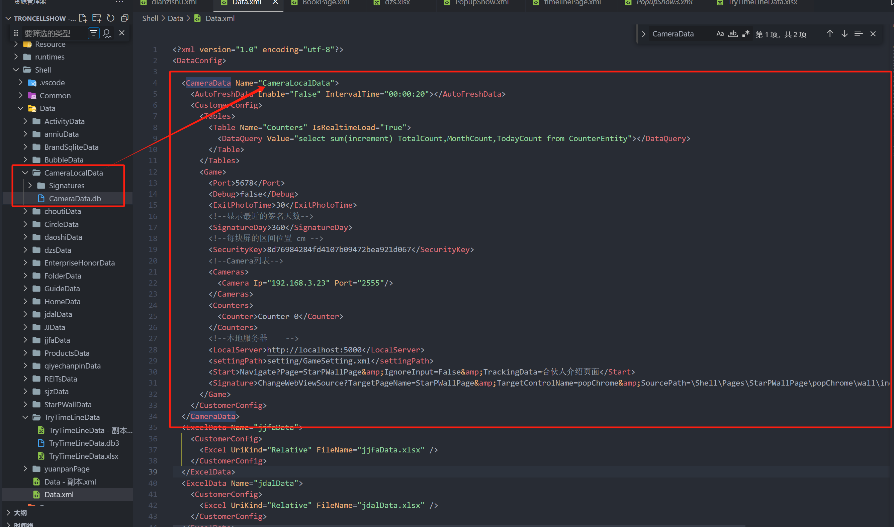

# CameraData 数据源

## 数据源用途

主要用于显示 VCA 摄像头的实时数据(目前提供年人数，月人数以及日人数)，和签名的互动数据(通过 UDP 服务-默认 5678 端口和 GameServer 服务来实现-默认 5001 的端口)，当数据有更新的时候，CameraData 会进行实施的分发出去

## 数据的配置

在文件 Data.xml 里添加，添加后同时需要在 Data 文件夹下有对应文件夹

```xml
  <CameraData Name="CameraLocalData">
    <AutoFreshData Enable="true" IntervalTime="00:00:20"></AutoFreshData>
    <CustomerConfig>
      <Tables>
        <Table Name="Counters" IsRealtimeLoad="True">
          <DataQuery Value="select sum(increment) TotalCount,MonthCount,TodayCount from CounterEntity"></DataQuery>
        </Table>
      </Tables>
      <Game>
        <!--UDP的端口号-->
        <Port>5678</Port>
        <!--是否是调试模式-->
        <Debug>false</Debug>
        <!--签名退出时间-->
        <ExitPhotoTime>30</ExitPhotoTime>
        <!--显示最近的签名天数-->
        <SignatureDay>360</SignatureDay>
        <!--每块屏的区间位置 cm -->
        <SecurityKey>8d76984284fd4107b09472bea921d067</SecurityKey>
        <!--Camera列表-->
        <Cameras>
          <Camera Ip="192.168.3.143" Port="2555"/>
        </Cameras>
        <!--计数器的名称配置-->
        <Counters>
          <Counter>Counter 0</Counter>
        </Counters>
        <!--签名图片的本地服务器    -->
        <LocalServer>http://localhost:5001</LocalServer>
        <!--开始签名的事件    -->
        <Start>Navigate?Page=StarPWallPage&IgnoreInput=False&TrackingData=合伙人介绍页面</Start>
        <!--签名后的事件-->
        <Signature>ChangeWebViewSource?TargetPageName=StarPWallPage&TargetControlName=popChrome&SourcePath=\Shell\Pages\StarPWallPage\popChrome\wall\index.html?name={$FilePath}</Signature>
      </Game>
    </CustomerConfig>
  </CameraData>
```



## 配置讲解

这种数据源不能自定义数据列，目前提供就一条 Counter 的 Table 的数据，而且始终只有一条数据，字段为三个，分别为 TotalCount，MonthCount，TodayCount。
其它的相关配置放在 Game 下的，具体的 Game 配置参考如下

### Game 节点的配置

1. Port ，接受本机的 UDP 的端口
2. Cameras ，实时监控的摄像头的配置，包含 IP 地址和端口号
3. Counters ，摄像头下的计数器的名称，用于统计数据用的
4. LocalServer，用户接受签名的服务器地址，就是 GameServer 的地址(后续会用 SensingHub)
5. Start, 接收到开始签名的触发的事件，可配置为和 ClickEvent 中的所有事件
6. Signature, 接受签名完成后的事件，可配置为和 ClickEvent 中的所有事件，其中{$FilePath}就是签名的图片

## page 页面中引用 Camera 配置

```
 <Item Left="0" Top="0" Width="1920" Height="1080" TemplateID="10001">
          <XYContainerElement>
            <UIDisplay Left="0" Top="0" Width="1920" Height="1080" />
            <Controls>
              <ImageElement TitleTag="bj">
                <UIDisplay Left="0" Top="0" Width="1920" Height="1080" IsShow="True" ZIndex="5" UsePercent="False" />
                <ImageSource UriKind="Application">Shell\Pages\HomePage\resource\bg.png</ImageSource>
              </ImageElement>
              <TextElement Name="TotalCounter">
                <DataProvider>CameraLocalData?CSTable=Counters</DataProvider>
                <!-- <DataProvider>FolderData?CSTable=Page</DataProvider> -->
                <!--参考控件公用片段的讲解中UIDdisplay片段讲解-->
                <UIDisplay Left="735" Top="980" Width="470" Height="50" IsShow="True" ZIndex="9" UsePercent="False"/>
                <!--文本的配置 ForegroundColor文字颜色，Family为字体，Size文字大小，CultureInfo语言，Alignment对齐方式-->
                <TextSource ForegroundColor="white" Family="HarmonyOS Sans SC" Size="36" CultureInfo="zh-CN" Alignment="Center">您是第    {$TotalCount}    位参访者 </TextSource>
                <CustomerConfig>
                  <AutoMove Enable="false" Duration="00:00:45" Direction="Counterclockwise"/>
                </CustomerConfig>
              </TextElement>
              <DateTimesElement>
                <UIDisplay Left="0" Top="0" Width="1920" Height="1080" IsShow="True" ZIndex="6" UsePercent="False" />
                <CustomerConfig>
                  <!--LineStyle：ALine/TwoLine-->
                  <Time FontFamily="[HarmonyOS Sans SC]" FontSize="50" FontWeight="Normal" Left="1541" Top="36" Format="HH : mm" Foreground="white" Culture="ZH-CN" />
                  <Date FontFamily="[HarmonyOS_Sans_SC]" Left="1721" Top="30" FontSize="27" FontWeight="Normal" Format="yyyy/MM/dd" Foreground="white" Culture="ZH-CN" />
                  <Week FontFamily="[HarmonyOS_Sans_SC]" FontSize="26" FontWeight="Normal" Left="1721" Top="66" Format="dddd" Foreground="white" Culture="ZH-CN" />
                </CustomerConfig>
              </DateTimesElement>
            </Controls>
          </XYContainerElement>
        </Item>
```
