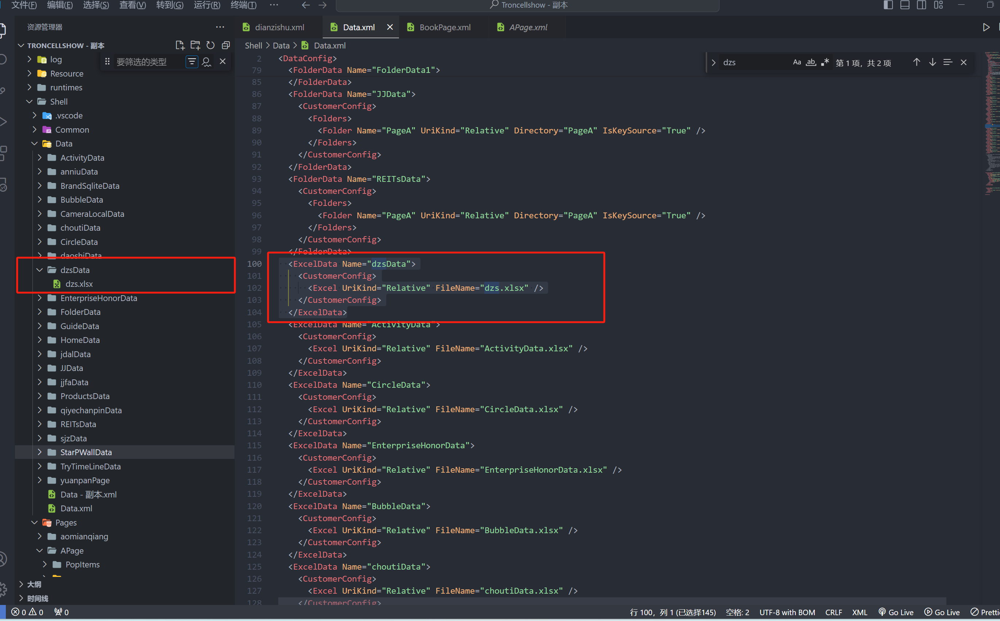
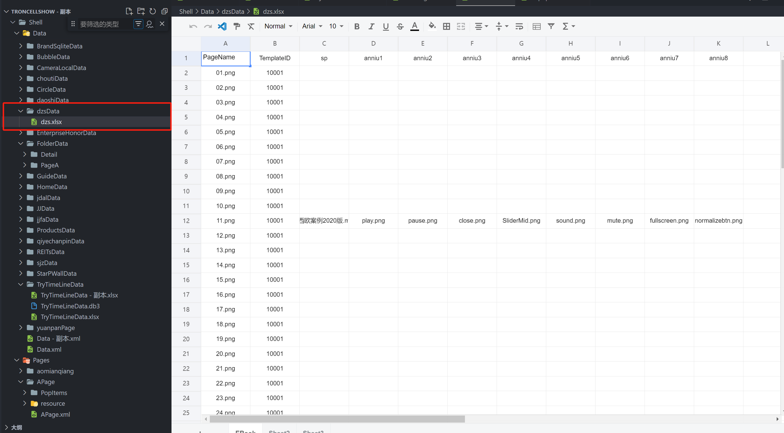

# ExcelData 数据源

## 数据源用途

主要用 Excel 作为数据源, 这种方式功能比较强大，同时可维护能力强，用户上手也比较简单！

## 数据的配置

在文件 Data.xml 里添加，添加后同时需要在 Data 文件夹下有对应文件夹和表格

```xml
<ExcelData Name="dzsData">
    <CustomerConfig>
      <Excel UriKind="Relative" FileName="dzsData.xlsx" />
    </CustomerConfig>
  </ExcelData>
```



## 配置讲解

这种数据源以 Excel 中的每个 Sheet 作为 Table,Sheet 中的第一行为 Table 的字段名，可以理解一个 Sheet 就是一个数据表

### Excel 文件的配置

1. UriKind，文件的路径类型，支持 Relative/Application 等
2. FileName，Excel 的文件名

### page 页面中引用 EXCEL 配置

```
       <UIDisplay Left="289" Top="60" Width="1342" Height="1080" IsShow="True" ZIndex="3" UsePercent="False" />
      <DataProvider>dzsData?CSTable=EBook</DataProvider>
      <Items>
         <Template Left="0" Top="0" Width="671" Height="949" TemplateID="10001">
          <XYContainerElement>
              <UIDisplay Left="0" Top="0" Width="671" Height="949" />
            <Controls>
              <ImageElement>
              <UIDisplay Left="0" Top="0" Width="671" Height="949" IsShow="True" ZIndex="1" UsePercent="False" />
                <ImageSource UriKind="Application">Shell\Pages\BookPage\resource\Solution\Page\{$PageName}</ImageSource>
              </ImageElement>
            </Controls>
          </XYContainerElement>
        </Template>
      </Items>

```

**具体可参考数据一览目录下的 README.md 文件**

1.dzsData 为 Data.xml 文件里对应 ExcelData 的名称也是对应的文件夹名称，若 Data.xml 或 Data 文件夹下没有，需要新建好对应 excel 及数据

2.CSTable=EBook 为 dzsData 文件夹下表格里的 sheet 名称

3.TemplateID="10001"和表格里 TemplateID 一致

4.ImageSource UriKind 图片路径里的图片和表格里表头为 PageName 下进行匹配


