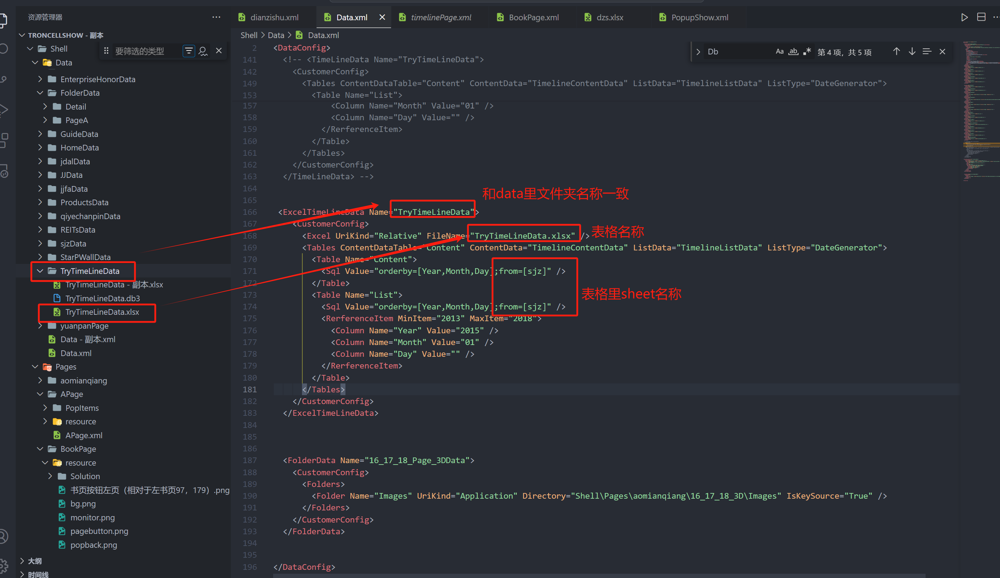
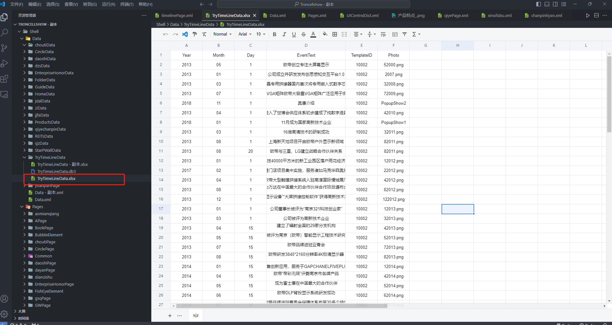

# ExcelData 数据源

## 数据源用途

主要用 Excel 作为数据源, 这种方式功能比较强大，同时可维护能力强，用户上手也比较简单！
ExcelTimeLineData 仅作用于配置时间轴控件，配置方法和 ExcelData 一致。

## 数据的配置

在文件 Data.xml 里添加，添加后同时需要在 Data 文件夹下有对应文件夹和 Excel

```xml
      <ExcelTimeLineData Name="TryTimeLineData">
    <CustomerConfig>
      <Excel UriKind="Relative" FileName="TryTimeLineData.xlsx" />
      <Tables ContentDataTable="Content" ContentData="TimelineContentData" ListData="TimelineListData" ListType="DateGenerator">
        <Table Name="Content">
          <Sql Value="orderby=[Year,Month,Day];from=[sjz]" />
        </Table>
        <Table Name="List">
          <Sql Value="orderby=[Year,Month,Day];from=[sjz]" />
          <RerferenceItem MinItem="2013" MaxItem="2018">
            <Column Name="Year" Value="2015" />
            <Column Name="Month" Value="01" />
            <Column Name="Day" Value="" />
          </RerferenceItem>
        </Table>
      </Tables>
    </CustomerConfig>
  </ExcelTimeLineData>
```



1.TryTimeLineData 为 Data.xml 文件里文件夹 data 的名称也是对应 Data 文件夹里的文件夹名称，若 Data.xml 或 Data 文件夹下没有，没有需要新建好对应文件夹及数据

## 配置讲解

这种数据源以 Excel 中的每个 Sheet 作为 Table,Sheet 中的第一行为 Table 的字段名，可以理解一个 Sheet 就是一个数据表

page 页面中引用时间轴 ExcelData 的数据源的配置

### Excel 文件的配置

1. UriKind，文件的路径类型，支持 Relative/Application 等
2. FileName，Excel 的文件名
3. Table Name，表名
4. Sql Value，sql 查询方式，from=[]填写表格里 sheet 名称
5. MinItem，时间轴开始的年份
6. MaxItem，时间轴结束的年份

## page 页面中引用时间轴 ExcelData 的数据源的配置

```
 <SequenceItemsElement Name="Items">
    <UIDisplay Left="0" Top="12" Width="1920" Height="1056" IsShow="True" ZIndex="2" UsePercent="False" />
      <DataProvider>TryTimeLineData?CSTable=sjz</DataProvider>
        <Items>
           <Template Left="0" Top="0" Width="331" Height="1056" TemplateID="10002">
              <XYContainerElement>
                 <UIDisplay Left="0" Top="0" Width="450" Height="1056" />
                   <Controls>
                     <SequenceItemsElement>
                      <UIDisplay Left="130" Top="850" Width="331" Height="332" IsShow="True" ZIndex="2" UsePercent="False" />
                      <Items>
                      <Template Left="0" Top="0" Width="331" Height="332" TemplateID="10002">
                      <XYContainerElement>
                      <UIDisplay Left="0" Top="0" Width="331" Height="332" />
                      <Controls>
                      <ImageButton>
                      <UIDisplay Left="0" Top="0" Width="288" Height="111" IsShow="True" ZIndex="2" UsePercent="False" />
                      <ImageSource UriKind="Relative">节点.png</ImageSource>
                      <ClickEvent> PopupEvent?TargetPageName=timelinePage&X=0&Y=0&Height=1080&Width=1920&EventID={$Photo}&UriKind=Application&EventPath=Shell\Pages\timelinePage\Items\PopupItems&EventText={$EventText}</ClickEvent>
                      </ImageButton>
                       <TextElement>
                      <UIDisplay Left="45" Top="0" Width="240" Height="150" IsShow="True" IsHitTestVisible="False" ZIndex="2" UsePercent="False" />
                      <TextSource ForegroundColor="black" Family="黑体" Size="25" CultureInfo="en-US" Alignment="Left">{$EventText}</TextSource>
                       </TextElement>
                    </Controls>
               </XYContainerElement>
                                    </Template>
                                </Items>
                                <CustomerConfig>
                                    <LayoutManager LayoutType="VerticalListLayout" Margin="0" Align="Top" />
                                    <Data DataName="TryTimeLineData" ListDataName="TimelineContentData">
                                        <QueryParameters>
                                            <Parameter Name="Year" Value="{$Year}" />
                                            <Parameter Name="Month" Value="{$Month}" />
                                            <Parameter Name="Day" Value="{$Day}" />
                                        </QueryParameters>
                                    </Data>
                                    <SequenceConfig IsCacheUI="True" IsCombineTemplate="False" IsAutoSweep="False" SweepInterval="1" MaxEllapsedTime="30000" SweepDelta.X="0" SweepDelta.Y="40" />
                                </CustomerConfig>
                            </SequenceItemsElement>
                            <TextElement>
                                <UIDisplay Left="200" Top="516" Width="300" Height="300" IsShow="true" ZIndex="3" UsePercent="False" />
                                <TextSource ForegroundColor="BLACK" Family="黑体" Size="60" CultureInfo="en-US" Alignment="left">{$Year} {$Month} {$Day}</TextSource>
                            </TextElement>
                            <ImageElement>
                                <UIDisplay Left="100" Top="360" Width="395" Height="369" IsShow="True" ZIndex="2" UsePercent="False" />
                                <ImageSource UriKind="Application">
                                    Shell\Pages\timelinePage\img\{$Year}.png</ImageSource>
                            </ImageElement>


                        </Controls>
                    </XYContainerElement>
            </Template>

```

**具体可参考数据一览目录下的 README.md 文件**

1.TryTimeLineData 为 Data.xml 文件里对应 ExcelTimeLineData 的名称也是对应的文件夹名称，，若 Data.xml 或 Data 文件夹下没有，需要新建好对应 excel 及数据

2.CSTable=sjz 为 TryTimeLineData 文件夹下表格里的 sheet 名称

3.TemplateID="10002"和表格里的 TemplateID 对应

4.如果使用表格，表格里 month 需要设置成文本，1 月填写 01


