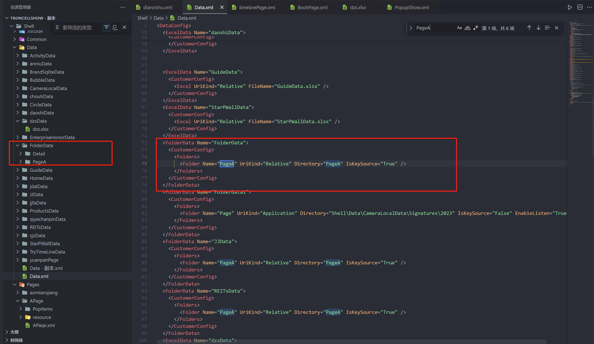

# FolderData 数据源

## 数据源用途

主要用于配置文件夹中的文件作为数据源，这种方式简单明了，比较直观。同时监听文件夹内的文件变化也可以拿到动态的文件，本配置用于文件夹的数据显示。

## 数据的配置

1.在文件 Data.xml 里添加，添加后同时需要在 Data 文件夹下有对应文件夹和子文件夹

```xml
<FolderData Name="FolderData">
 <CustomerConfig>
  <Folders>
     <Folder Name="Page" UriKind="Relative" Directory="Page" IsKeySource="True" EnableListen="True"/>
     <Folder Name="Detail" UriKind="Relative" Directory="Detail" />
      </Folders>
    </CustomerConfig>
  </FolderData>
```


2.来源为多个文件夹
```
 <FolderData Name="FolderData">
    <CustomerConfig>
	   <Folders Name="test" ContainSubFolder="True"  Directory="test" Depth="3" FileExtensions=".jpg;.png" DefaultFolder="1" OrderBy="Asc" UriKind="Relative"  >
        <Folder Name="Detail" UriKind="Relative" Directory="Detail" IsDefault="True"/>
        <Folder Name="Page" UriKind="Relative" Directory="Page" />      
	   </Folders>
		
    </CustomerConfig>
  </FolderData>
```

### Folder 文件夹的配置

1. Name，类似于一个 Table，有一个唯一的名字，用来区分不同的 Table
2. UriKind，文件的路径类型，支持 Relative/Application 等
3. Directory，子文件夹作为目标文件夹
4. EnableListen，是否启动目标文件夹的监听，来更新数据源,用户刷新绑定控件的数据源
5. IsKeySource, 是一个特殊的场景，主要是用于大图和小图的场景，在不同的文件夹，但是文件名又相同的场合，这个时候，所有的文件夹的数据以 Key 的数据作为主，然后 Key 的数据源多扩展出以下三个字段，LargeFullName，LargeExtension，LargeFileName，用于数据绑定
6. ContainSubFolder：是否包含子文件夹
7. Depth：层级深度，3表示子文件test的下面两层
8. FileExtensions：显示的文件后缀名配置
9. DefaultFolder：默认文件夹，第几个。OrderBy：Asc是正数第几个，Desc是倒数第几个

## 配置讲解

这种数据源不能自定义数据列，但是文件也有自己的数据结构，所以系统把文件也转化成一个表，他们有如下的字段，目前仅支持文件夹下的这几种类型的文件"png/jpg/bmp/wmv/mp4",不支持子文件夹下的文件查找

1. FullName, 文件的全名,含路径
2. Extension，文件的扩展名(后缀名)
3. FileName，文件名，不含扩展名
4. TemplateID，虚拟出来的，目前支持三种，Image/Video,Image 为后缀为 PNG/JPG/BMP 后缀结尾，Video 为 wmv/mp4 的视频文件，通过 TemplateID 就可以选择不同的模板，来显示图片或视频的控件，整个配置就是文件夹的的配置，支持配置多个文件夹的数据,可以通过监听文件夹实现动态文件的读取功能

### page 页面中引用图片文件夹配置

```
<UIDisplay Left="289" Top="0" Width="1342" Height="1080" IsShow="True" ZIndex="3" UsePercent="False" />
<DataProvider>FolderData?CSTable=PageA</DataProvider>
<Items>
   <Template Left="0" Top="0" Width="671" Height="1080" TemplateID="Image">
	<XYContainerElement TrackingData="{$FileName}">
	   <UIDisplay Left="0" Top="0" Width="300" Height="836" />
		<Controls>
		  <ImageElement>
		   <UIDisplay Left="0" Top="0" Width="671" Height="1080" IsShow="True" ZIndex="1" UsePercent="False" />
		   <ImageSource UriKind="Absolute">{$FullName}</ImageSource>
		  </ImageElement>

		</Controls>
	</XYContainerElement>
    </Template>
</Items>
```

**具体可参考数据一览目录下的 README.md 文件**

1.FolderData 为 Data.xml 文件里文件夹 data 的名称也是对应 Data 文件夹里的文件夹名称，若 Data.xml 或 Data 文件夹下没有，没有需要新建好对应文件夹及数据

2.CSTable 为 FolderData 文件夹下子文件夹的名称
