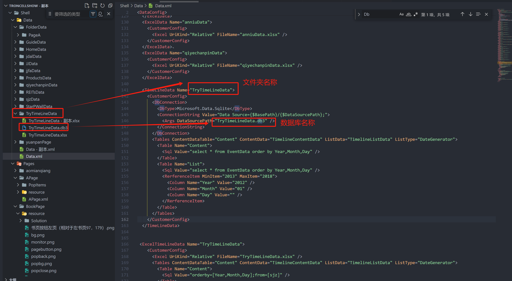

# DbData 数据源

## 数据源用途

主要用于配置数据库中的数据，通过数据库可以拿到动态的数据，目前使用比较多的就是 SQLite 的数据库，这种数据库一般用于双向数据交付，或者数据来源于第三方的数据库，本程序主要用于数据的显示。
TimeLineData 仅作用于配置时间轴控件，配置方法和 DbData 一致。

## 数据的配置

```xml
  <TimeLineData Name="TryTimeLineData">
    <CustomerConfig>
      <DbConnection>
        <DbType>Microsoft.Data.Sqlite</DbType>
        <ConnectionString Value="Data Source={$BasePath}/{$DataSourcePath};">
          <Args DataSourcePath="TryTimeLineData.db3" />
        </ConnectionString>
      </DbConnection>
      <Tables ContentDataTable="Content" ContentData="TimelineContentData" ListData="TimelineListData" ListType="DateGenerator">
        <Table Name="Content">
          <Sql Value="select * from EventData order by Year,Month,Day" />
        </Table>
        <Table Name="List">
          <Sql Value="select * from EventData order by Year,Month,Day" />
          <RerferenceItem MinItem="2013" MaxItem="2018">
            <Column Name="Year" Value="2012" />
            <Column Name="Month" Value="01" />
            <Column Name="Day" Value="" />
          </RerferenceItem>
        </Table>
      </Tables>
    </CustomerConfig>
  </TimeLineData>
```



## 配置讲解

这种数据源以每个表中的第一行为 Table 的字段名，每个表下可有多个字段。

### Excel 文件的配置

1. DbType，支持 System.Data.SQLite.EF6， System.Data.SqlClient，Microsoft.Data.Sqlite，如有需要其它的数据类型，请联系平台开发者。
2. Args，引用数据库的文件名
3. Table Name，表名
4. Sql Value，sql 查询方式
5. MinItem，时间轴开始的年份
6. MaxItem，时间轴结束的年份

## page 页面中引用时间轴 DbData 的数据源的配置

```
<SequenceItemsElement Name="Items">
  <UIDisplay Left="0" Top="12" Width="1920" Height="1056" IsShow="True" ZIndex="2" UsePercent="False" />
  <Items>
    <Template Left="0" Top="0" Width="1920" Height="1080" TemplateID="10001">
      <XYContainerElement>
        <UIDisplay Left="0" Top="0" Width="450" Height="1056" />
          <Controls>
           <SequenceItemsElement>
              <UIDisplay Left="130" Top="850" Width="331" Height="332" IsShow="True" ZIndex="2" UsePercent="False" />
               <Items>
              <Template Left="0" Top="0" Width="331" Height="332" TemplateID="10003">
                <XYContainerElement>
                 <UIDisplay Left="0" Top="0" Width="331" Height="332" />
                   <Controls>
                     <ImageButton>
                     <UIDisplay Left="0" Top="0" Width="288" Height="111" IsShow="True" ZIndex="2" UsePercent="False" />
                     <ImageSource UriKind="Relative">节点.png</ImageSource>
                      <ClickEvent> PopupEvent?TargetPageName=timelinePage&amp;X=0&amp;Y=0&amp;Height=1080&amp;Width=1920&amp;EventID={$Photo}&amp;UriKind=Application&amp;EventPath=Shell\Pages\timelinePage\Items\PopupItems&amp;EventText={$EventText}</ClickEvent>
                     </ImageButton>
                    <TextElement>
                    <UIDisplay Left="45" Top="0" Width="240" Height="150" IsShow="True" IsHitTestVisible="False" ZIndex="2" UsePercent="False" />
                    <TextSource ForegroundColor="black" Family="黑体" Size="25" CultureInfo="en-US" Alignment="Left">{$EventText}</TextSource>
                    </TextElement>
                  </Controls>
               </XYContainerElement>
             </Template>
              </Items>
             <CustomerConfig>
          <LayoutManager LayoutType="VerticalListLayout" Margin="0" Align="Top" />
                <Data DataName="TryTimeLineData" ListDataName="TimelineContentData">
                         <QueryParameters>
                             <Parameter Name="Year" Value="{$Year}" />
                             <Parameter Name="Month" Value="{$Month}" />
                             <Parameter Name="Day" Value="{$Day}" />
                         </QueryParameters>
                 </Data>
                   <SequenceConfig IsCacheUI="True" IsCombineTemplate="False" IsAutoSweep="False" SweepInterval="15" MaxEllapsedTime="30000" SweepDelta.X="0" SweepDelta.Y="40" />
               </CustomerConfig>
              </SequenceItemsElement>
            <TextElement>
           <UIDisplay Left="200" Top="516" Width="300" Height="300" IsShow="true" ZIndex="3" UsePercent="False" />
         <TextSource ForegroundColor="BLACK" Family="黑体" Size="60" CultureInfo="en-US" Alignment="left">{$Year} {$Month} {$Day}</TextSource>
       </TextElement>
      <ImageElement>
        <UIDisplay Left="100" Top="360" Width="395" Height="369" IsShow="True" ZIndex="2" UsePercent="False" />
       <ImageSource UriKind="Application">
              Shell\Pages\timelinePage\img\{$Year}.png</ImageSource>
       </ImageElement>


     </Controls>
  </XYContainerElement>
 </Template>

```
